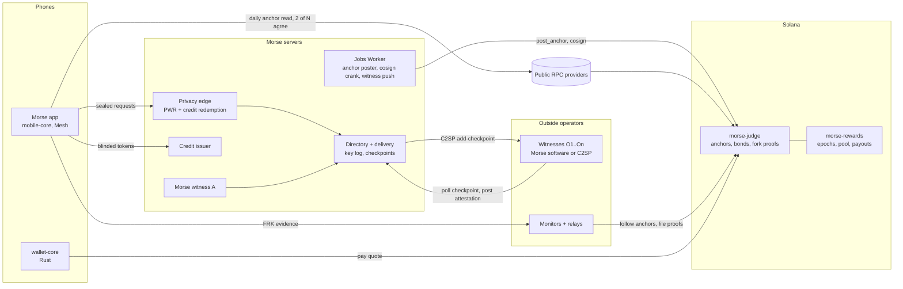

# Witness Network and Crypto Expansion: Complete Plan

Status: plan, revised 2026-09-25; §22 (security and privacy gaps found by the
2026-09-26 review) added 2026-09-26; the bond counter, the phone bounty,
checkpoint gossip and plaintext types (§6.16–6.18, Phases 0.6 and 6) added
2026-09-27. Nothing in it is built unless §2 says so. The
protocol design it implements is
[protocol/witness-network-v1.md](mesh-private-messenger/protocol/witness-network-v1.md)
(status: proposed). This file is the build plan: what exists, what gets built,
in what order, with which formats and numbers, how each piece is tested, and how
production keeps running at every step, including with **no outside witnesses at
all**.

All dollar figures assume SOL at $150 and USDC at $1. They are starting points,
revisited at each phase gate.

**Contents**

1. Goals, non-goals and invariants
2. Where things stand today (verified in code)
3. Architecture
4. Trust profiles and bootstrap: production with no outside witnesses
5. Design decisions
6. Specifications
7. Numbers
8. Phases
9. The operator program
10. What users see
11. Environments, feature flags and testing in production
12. Observability and alerting
13. Security
14. Incidents and runbooks
15. Testing strategy
16. Rollout and migration
17. Documents, landing page and pitch deck
18. Budget and staffing
19. Timeline
20. Risks
21. Decisions
22. Security and privacy gaps outside the witness network

---

## 1. Goals, non-goals and invariants

### Goals

1. Make it **publicly detectable** when anyone, Morse included, shows one person
   a different key log from everyone else.
2. Make it **expensive**: every party able to sign such a log has a bond that an
   on-chain proof slashes.
3. Move the witnesses that phones trust to **operators outside Morse**, with a
   strict-majority threshold Morse can't reach.
4. **Pay** witnesses from a Morse-funded floor, then from anonymous credit sales.
5. Add **anonymous credits** for extras, paid in USDC, SOL or BTC, that the
   servers can't link to a buyer.
6. Launch the **Morse token** as the bond and the thing credit purchases burn.
7. Keep production **fully working at every step**, including before any outside
   witness exists.
8. **Pay the person a fork targets.** The phone that catches a fork names a
   one-time address in its proof and receives the finder's share (§6.3, §6.9).
9. Make every phone a **witness for its contacts**: each message carries the
   sender's view of the key log, so a split view has to fool everyone a person
   talks to (§6.16).
10. **Show the money.** The bonds, the slashes and the age of the last public
    checkpoint are shown live from the chain, in the app and on the site (§6.17).
11. Make sending plaintext anywhere but a seal **a compile error** in Mesh (§6.18,
    Phase 6).

### Non-goals

- Wallet addresses as identities, username NFTs, or anything that ties a wallet
  to an account.
- Rewards for in-app activity, airdrops by usage, or any measurement of it.
- Anything on-chain per message, per contact or per account.
- Token governance over security: pinning, thresholds, cryptography or the
  judge program.
- Replacing safety numbers. They remain the check that works even if everything
  else colludes.

### Invariants (hold in every phase and profile)

| # | Invariant | Enforced by |
|---|---|---|
| I1 | The phone verifies. Security never depends on the chain being up or the token having value | Phone code: chain reads can only add warnings or remove trust |
| I2 | The chain can take trust away (a slashed key), never grant it | Phones read `service_slashed` and witness status only to refuse |
| I3 | Releases pin trust: witness keys, threshold and issuer origin ship in the native security config | Security config v2 (§6.1); OTA can't change it |
| I4 | Threshold is a strict majority, `k = ⌊n/2⌋ + 1` | Config parser rejects anything else |
| I5 | Privacy is unchanged: witnesses, chain, monitors and relays see checkpoints and proofs only | Wire formats (§6) carry nothing else; privacy-contract tests |
| I6 | Messaging never needs a wallet, credits or the token | Proof of work (`PWR`) stays the free path; credits are only ever an alternative |
| I7 | Morse never receives slashed funds | Judge program: 10% to submitter, 90% locked or burned |
| I8 | Morse's own witness is never paid from the pool | Rewards program `excluded` flag |
| I9 | Nothing claims more independence than exists | Trust profile shown in-app and on the site (§4.4) |

---

## 2. Where things stand today (verified in code)

| Area | Today | Where |
|---|---|---|
| Checkpoint | 188-byte `KTK` wire form. The service signs a 146-byte statement: `"mesh-key-transparency-v1"`, version u16, sequence u64, tree size u64, root, previous checkpoint hash, timestamp u64, service key. `checkpoint_hash = SHA-256("mesh-msg/v1/transparency-checkpoint" ‖ statement ‖ signature)` | `packages/messenger-protocol/transparency/merkle.mpl:182`, `wire.mpl:416` |
| Witness signature | Ed25519 over `"mesh-msg/v1/transparency-witness" ‖ witness_id ‖ checkpoint_hash`; ID 1–64 bytes, pinned to one key | `merkle.mpl:276` |
| Witness logic | Run-once job: fetch checkpoint, verify the service signature, refuse rollback, refuse a same-sequence conflict, require a consistency proof from its last signed checkpoint, persist, then sign and post. It does **not** check the checkpoint's timestamp or its previous-checkpoint hash (§22.1 W1) | `services/transparency-witness/main.mpl:89,140` |
| Witness hosting | Two Cloudflare Workers, same operator. Delivery's scheduled job (`kind: witness`) calls each one's `/attest` with a bearer token Morse holds. State lives in a Durable Object with compare-and-swap writes; continuity is carried over with `WITNESS_INITIAL_CHECKPOINT_HEX` (376 hex characters) | `ops/cloudflare/witness.mjs`, `jobs.mjs:77` |
| Directory's witness list | Hard-coded `witness-a` and `witness-b`, keys from `MESSENGER_WITNESS_{A,B}_PUBLIC_KEY_HEX`. Submissions carry exactly one attestation | `services/directory-delivery/api/binary.mpl:185-215` |
| Attestation storage | `witness_signatures(checkpoint_sequence, witness_id, checkpoint_hash, …)`, primary key (sequence, witness_id) | `migrations/004_transparency.sql:30` |
| Phone threshold | Exactly `witness-a` and `witness-b`, **threshold 2 of 2**: either one offline stops new lookups | `packages/mobile-core/mobile/transparency.mpl:529-541` |
| Phone pinning | Security config v1: a 263–264-byte text frame of six lines (`1`, service key, witness A, witness B, delivery key, PoW difficulty 1–24), canonical form enforced, A ≠ B. Baked into native builds; OTA can't change it | `mobile-core/mobile/platform.mpl:238-262`, `ops/cloudflare/README.md` |
| Groups | Group policy hard-codes `witness_threshold: 2` and checks `witness_count == 2` | `mobile-core/mobile/groups.mpl:133,476`, `groups/welcome_wire.mpl:319` |
| Limits | `verify_witnesses` accepts at most 16 pinned keys and 16 attestations | `merkle.mpl:388` |
| Proof size | Proofs carry the full leaf list. The log stops at 4,096 entries (3,584 for new accounts) | `merkle.mpl:171`, `key-transparency-v1.md` |
| Freshness | Phones reject evidence more than 5 minutes old; the directory re-signs an unchanged tree after 4 minutes | `transparency/client.mpl`, `directory-delivery/storage/transparency.mpl:211` |
| Conflict detection | Only same sequence, same size, different root | `merkle.mpl:397` |
| Abuse control | Proof of work at the privacy edge, `MESSENGER_ABUSE_DIFFICULTY` 1–24 (default 16) | `services/privacy-edge/main.mpl:27,50` |
| Crypto available in Mesh | Ed25519, X25519, SHA-256, HPKE, ML-KEM. **No RSA, no big-integer arithmetic** | mesh-lang docs |
| Health | `/health` runs both witness checks | `ops/cloudflare/routing.mjs:31`, `README.md` |
| Operator recruiting | Landing page `witnesses.html` (terms, lifecycle, FAQ) and a public GitHub issue form | `apps/landing/witnesses.html`, `.github/ISSUE_TEMPLATE/witness-application.yml` |
| Missing entirely | No public record, monitors, relays, fork-proof format, N-of-M sets, chain programs, credits, payments or token, and no comparison of a phone's view with anyone else's | |

---

## 3. Architecture



| Component | Runs where | Language | New or changed |
|---|---|---|---|
| Mesh runtime (`mesh-lang`) | Everywhere Mesh runs | Rust runtime behind a Mesh API | New primitive: `Crypto.BlindRsa` (§6.14). New type-checker rule: `Plaintext` (§6.18) |
| mobile-core | Phones, desktop | Mesh | Changed: N-of-M, anchor check, fork evidence with a finder address, checkpoint gossip (§6.16), credits client (blinding through `Crypto.BlindRsa`), all networking moved in from the app (Phase 6) |
| wallet-core | Phones, desktop | Rust (approved exception, wallet signing only) | New (not in the repository yet, §6.13): signs credit purchases, makes one-time bounty addresses |
| Privacy edge | Cloudflare | Mesh + JS front | Changed: forwards `CRD` frames with envelope submissions |
| Directory + delivery | Containers + Worker | Mesh | Changed: witness registry, C2SP note, attestation fan-in, the credit spent set and internal redeem route |
| Credit issuer | Container | Mesh (`services/credit-issuer`) | New |
| Jobs Worker | Cloudflare | JS | Changed: N witnesses, C2SP push, anchor poster, cosign crank, burn crank, bond counter snapshot (§6.17) |
| Witness | Anywhere | Mesh (or third-party C2SP) | Changed: pull mode, file state, evidence capture |
| Monitor | Anywhere | Mesh (`mesh-cli monitor`) | New |
| Relay | Anywhere | JavaScript (`ops/relay`, a chain writer) | New. Passes a phone's finder address through to the judge |
| `morse-judge` | Solana | Rust, Pinocchio | New, immutable after review |
| `morse-rewards` | Solana | Rust | New, upgradeable behind the timelock |

---

## 4. Trust profiles and bootstrap: production with no outside witnesses

Production must run, and be testable end to end, before a single outside
operator signs up. The network moves through three **trust profiles**, defined
only by `m`, the number of pinned witnesses Morse runs, against the threshold `k`.

| Profile | Condition | What it guarantees | What it doesn't |
|---|---|---|---|
| **Bootstrap** | `m ≥ k` (every pinned witness may be Morse's) | Everything in the product works: lookups, public anchors, phone checks, monitors, credits, bonds and fork proofs against any bonded key | Morse could still fork the log with its own witnesses. The public anchor and the monitors would make that visible, but no outsider's signature is required |
| **Transitional** | `1 < m < k` | Forking needs at least `k − m` outside witnesses to collude | Morse still runs more than one witness |
| **Open** | `m = 1` | The target: Morse runs exactly one witness, bonded and slashable, and can't reach a majority alone or with the directory | — |

### 4.1 The bootstrap set

| Step | Pinned set | `k` | Profile | When |
|---|---|---|---|---|
| B0 (today) | witness-a, witness-b (Cloudflare) | 2 | Bootstrap | now |
| B1 | witness-a, witness-b (Cloudflare), witness-c (non-Cloudflare VPS, pull mode) | 2 | Bootstrap | Phase 0 exit |
| T1 | a, b, c, O1, O2 | 3 | Bootstrap (m = 3 = k) | first two outside witnesses |
| T2 | a, b, O1, O2, O3 | 3 | Transitional (m = 2) | third outside witness |
| O1 | a, O1, O2, O3, O4 | 3 | **Open** | Phase 2 exit |
| O2 | a, O1 … O8 | 5 | Open | target |

B1 exists so that production stops depending on two Workers under one account.
One Morse witness can go down without stopping lookups, and the pull-mode witness
software runs in production before any outsider uses it.

### 4.2 What runs in production with zero outside witnesses

| Capability | Works in Bootstrap? | How |
|---|---|---|
| Lookups and new sessions | Yes | Phones verify `k` of the Morse-run set |
| Surviving one witness outage | Yes, from B1 | 2 of 3 |
| Public checkpoints on Solana | Yes | Anchor poster doesn't care who the witnesses are |
| Cosignatures and attendance on-chain | Yes | Morse's witnesses cosign; attendance is recorded |
| Phone check against the public record | Yes | Independent of the witness set |
| Monitors and relays | Yes | Morse runs one of each; anyone else can |
| Bonds | Yes | Morse bonds the directory ($50,000) and its witnesses ($10,000 each) |
| Fork proofs and slashing | Yes | Any bonded key is slashable. Rehearsed in production on the canary log (§11.3) |
| Witness pay | Accrues, nobody is paid | Morse's witnesses are excluded (I8); the pool carries over |
| Credits and payments | Yes | Independent of witnesses |
| Token | Yes, if launched | Independent of witnesses |
| Onboarding an outside witness | Yes | Registry entry → shadow week → next release pins it. No code change |
| Checkpoint gossip between contacts | Yes, from Phase 0.6 | Independent of the witness set and the chain |
| Bond counter | Checkpoint age from Phase 1; bonds and slashes from Phase 3 | Reads `morse-main` only; canary bonds are never counted |
| Bounty paid to the phone that found the fork | From Phase 4, when `wallet-core` ships | The judge accepts a finder address from Phase 3. Rehearsed by the canary drill (§11.3) |

**Requirement on every phase:** nothing may assume an outside witness exists.
Empty push lists, empty payout lists and a registry holding only Morse's
witnesses are normal states, and each is covered by a test (§15).

### 4.3 Bootstrap acceptance suite (run against production)

Each check below runs on a schedule against the live system with only Morse's
witnesses. Any failure pages the on-call.

1. **Lookup:** a canary device looks up canary accounts `morse-canary-1…3`. Evidence
   verifies under the pinned set.
2. **Outage tolerance (from B1):** in a weekly drill, one Morse witness is stopped for
   15 minutes. Lookups keep succeeding and the stopped witness catches up without
   a fork.
3. **Anchoring:** every root change reaches the ring within 60 s, and heartbeats land
   at least hourly.
4. **Phone check:** the canary device's daily check reports `ok` against two RPC
   providers.
5. **Monitor:** zero inconsistencies. The consistency proof for every anchor pair
   verifies.
6. **Fork drill:** monthly on the canary log (§11.3). The proof is filed by a relay,
   slashing executes, and the finder is paid.
7. **Rewards:** `settle_epoch` runs each week with zero payable witnesses. The pool
   carries over and nothing is paid to excluded witnesses.
8. **Credits (Phase 4+):** a $1 live purchase and one redemption of each extra,
   weekly.

### 4.4 Saying which profile we're in

- **In the app:** Settings → Network shows the profile. For example, "Bootstrap: all
  3 witnesses are run by Morse" or "Open: 4 of 5 witnesses are independent". Each
  pinned witness is listed with its operator label from the security config.
- **On the site:** `witnesses.html` gets a "Current witnesses" list with the same
  profile line. The "Launching in stages" marker stays on the landing page until
  the Phase 3 exit.
- **Pitch deck:** the "Next" statuses stay until the matching phase exits.

---

## 5. Design decisions

### 5.1 Threshold is a strict majority

Phones require `k = ⌊n/2⌋ + 1`. Any two conflicting versions that both reach the
threshold share at least `2k − n ≥ 1` witness who signed both. So every
successful split view leaves a provable, slashable double-signer as soon as both
versions are seen.

### 5.2 What counts as a lie

| Kind | Evidence | Who is slashed |
|---|---|---|
| **F1 same size** | Two service-signed checkpoints with equal tree size and different roots | The log's directory bond, plus every witness that cosigned both |
| **F2 contradiction** | Two service-signed checkpoints C1 (size n1) and C2 (size n2), an index `i < min(n1, n2)`, and compact inclusion proofs showing different leaf hashes at `i` in each | Same. This covers forks that never share a tree size, which F1 misses |
| **F3 rollback** | Two service-signed checkpoints whose sequence order and tree-size order disagree, or equal sequence with different content | The directory, plus any witness that cosigned both |

F1 reveals only two roots. F2 reveals which leaf index was forked, which can hint
at the targeted account, so relays prefer F1 whenever both are available.

**10% of each slash goes to the finder: the address the proof names, or, when it
names none, whoever submitted it. The other 90% is locked forever (USDC) or
burned (token).** Because the finder's share is below 100%, reporting yourself
always loses money.

### 5.3 Chain: Solana (confirmed)

- A native Ed25519 program verifies service and witness signatures without new
  cryptography, and the `sol_sha256` syscall handles Merkle paths.
- Base fees are 5,000 lamports per signature, so anchoring every checkpoint is
  cheap.
- USDC is native there, for the bond phase before the token.
- Known pitfall: Ed25519 verification through instruction introspection. The
  program must check that the Ed25519 instruction is in the same transaction and
  that its offsets point at exactly the expected key, message and signature
  bytes. This is tested explicitly (§15).

### 5.4 Languages (approved)

| Where | Language | Why |
|---|---|---|
| On-chain programs | Rust, Pinocchio for `morse-judge` | Mesh has no SBF target; no framework macros in the part that must be immutable |
| Chain writers (anchor poster, cosign crank, burn crank, fork-proof relay) | JavaScript, `@solana/kit`: `ops/cloudflare` for Morse's jobs, `ops/relay` for the standalone relay | Next to the existing ops code |
| Everything phones and witnesses run | Mesh | Phones only *read* the chain, through JSON-RPC, and verify with Mesh's Ed25519 and SHA-256 |
| Blind RSA for credits (issuer, edge, phones) | Mesh, through a new runtime-backed `Crypto.BlindRsa` module added to `mesh-lang` (§6.14, Phase 4A) | Mesh's own dependency policy forbids the messenger adding private Rust crypto, and one implementation then serves every side (decision D6) |

### 5.5 Implementation diversity

If every witness runs the same Mesh binary, one bug, a compiler backdoor or a bad
Morse release breaks the whole threshold at once.

- The directory publishes each checkpoint as a C2SP signed note and accepts C2SP
  cosignatures (`tlog-checkpoint`, `tlog-cosignature`, `tlog-witness`).
- C2SP witnesses use the push model their spec defines: the jobs Worker calls
  each one's `add-checkpoint` endpoint with the checkpoint and a consistency
  proof. Morse's own witness software uses pull mode (§5.6).
- At least one pinned witness must run software not written by Morse before the
  network may enter the Open profile.
- The Mesh witness ships as a reproducible build (pinned `meshc`, `SHA256SUMS`).

### 5.6 Pull mode for Morse's witness software

Outside operators shouldn't expose an endpoint that Morse's scheduler calls with
a Morse-held token.

- The witness polls `GET /v1/transparency/checkpoint` every 15 s and posts to
  `POST /v1/transparency/witnesses`.
- `/attest` push stays for Morse's Cloudflare witnesses until they retire.

### 5.7 Shadow mode

A new witness is added to the directory's **registry** as `shadow` before any
release pins it.

- The directory accepts and stores its attestations, and the on-chain program
  records its cosignatures.
- Phones already ignore IDs they don't pin (`count_valid_witnesses` skips
  untrusted IDs), so a shadow witness can't affect a lookup.
- Pinning requires a clean shadow week (§9.4).

### 5.8 One judge, many logs

`morse-judge` keeps a registry of logs, each with its own service key and
directory bond. Production registers two:

- **`morse-main`:** the real log, with a $50,000 bond.
- **`morse-canary`:** a second log instance that release builds never pin. It
  exists so the full slash path can be rehearsed in production with small bonds
  (§11.3).

### 5.9 Phones read the chain themselves

Phones read from public RPC providers, never through Morse. A Morse proxy could
hand a victim a forged "public" record. Solana has no practical light client, so
two of at least three pinned providers must agree.

The cost: those providers learn the phone's IP address and that it reads the
anchor account, about once a day. This goes into the privacy contract.

---

## 6. Specifications

### 6.1 Security config v2

A UTF-8 text frame of at most 4,096 bytes. Lines are separated by `\n`, with no
trailing newline, and the canonical form is enforced exactly as v1 does.

```text
2
<transparency service key, 64 hex>
<delivery key, 64 hex>
<PoW difficulty, 1-24>
<threshold k>
<n, 1-16>
<witness_id> <public key, 64 hex> <operator label>        ← n lines, sorted by witness_id
<anchor ring address, base58 | "-">
<RPC count r, 0 or 3-8>
<https RPC URL>                                            ← r lines
<credit issuer origin | "-">
```

Parser rules:

- `witness_id` matches `[a-z0-9-]{1,64}`.
- The operator label is 1–48 printable characters with no leading or trailing
  space.
- IDs and keys are unique.
- `k` equals `⌊n/2⌋ + 1`.
- `-` disables the anchor check or credits for that build.

`set_id = SHA-256("morse-witness-set-v1" ‖ lines 5 to 6+n)`.

v1 frames stay accepted and map to `{witness-a, witness-b}`, `k = 2`, anchors
off, credits off.

Files touched:

- `mobile-core/mobile/platform.mpl`: the parser.
- The Kotlin, Swift and desktop `config.json` writers.
- `ops/cloudflare` generation of `.morse/cloudflare/client.env`.
- `clients/mesh-cli/main.mpl:214`.

### 6.2 Directory: witness registry and API

**Migration 017:**

```sql
CREATE TABLE transparency_witness_registry (
  witness_id TEXT PRIMARY KEY CHECK (witness_id ~ '^[a-z0-9-]{1,64}$'),
  public_key BYTEA NOT NULL UNIQUE CHECK (octet_length(public_key) = 32),
  operator TEXT NOT NULL CHECK (length(operator) BETWEEN 1 AND 48),
  status TEXT NOT NULL CHECK (status IN ('shadow', 'pinned', 'retired')),
  software TEXT NOT NULL CHECK (software IN ('mesh', 'c2sp')),
  push_url TEXT,                                   -- C2SP add-checkpoint endpoint
  morse_run BOOLEAN NOT NULL,
  added_at TIMESTAMPTZ NOT NULL DEFAULT now(),
  retired_at TIMESTAMPTZ
);
CREATE TABLE transparency_anchors (
  checkpoint_sequence BIGINT PRIMARY KEY,
  tree_size BIGINT NOT NULL,
  checkpoint_hash BYTEA NOT NULL CHECK (octet_length(checkpoint_hash) = 32),
  ring_index INTEGER NOT NULL,
  tx_signature TEXT NOT NULL,
  slot BIGINT NOT NULL,
  posted_at TIMESTAMPTZ NOT NULL DEFAULT now()
);
```

`witness_signatures` stays as is. Its key already allows any number of
witnesses per checkpoint.

**API changes:**

| Route | Change |
|---|---|
| `POST /v1/transparency/witnesses` | Accept one attestation from any non-retired registry entry (replaces the hard-coded pair in `binary.mpl:185`). Still one per request. Content type `application/x-morse-attestation` or `text/x-c2sp-cosignature` |
| `GET /v1/transparency/witnesses` | Return at most 16 attestations for the current checkpoint: pinned witnesses first, then shadow witnesses, newest set first |
| `GET /v1/transparency/checkpoint.note` | New: the checkpoint as a C2SP signed note |
| `GET /v1/transparency/registry` | New: the public registry (ID, key, operator, status, software) |
| `GET /v1/transparency/anchor/{sequence}` | New: the anchoring transaction and ring index, for monitors |
| `/health` | Now reports "threshold met for current checkpoint", per-witness last signature age, and anchor lag |

### 6.3 Fork evidence `FRK` v1

```text
byte    version = 1
"FRK"
byte    kind: 1 same-size | 2 contradiction | 3 rollback
32      finder address (a Solana address; 32 zero bytes = none)
32      log service public key
188     checkpoint C1 (KTK)
188     checkpoint C2 (KTK)
u8      attestation count a (0-16), then a × {u8 id length, id, 32 checkpoint hash, 64 signature}
kind 2 only:
u64     leaf index i
u8      path length p1, p1 × 32  audit path of i in C1
32      leaf hash at i in C1
u8      path length p2, p2 × 32  audit path of i in C2
32      leaf hash at i in C2
```

**Anchor reference.** C2 may instead be a reference to a ring entry: a flag byte
`1` followed by a u32 ring index, in place of the second 188-byte checkpoint.

- An anchored entry had its service signature verified by `post_anchor`, so it
  counts as service-signed.
- Its cosign bitmap counts as those witnesses' signatures on it, because each
  bit was verified by `cosign`.

So a phone can build a complete proof from what it already holds: the version
it was shown, with the attestations that came with it, plus the index of the
public version that contradicts it.

**Finder address.** The phone that builds the proof puts a one-time address from
`wallet-core` here (§6.13), made for this proof and never reused. It
isn't tied to the account and never reaches a Morse server. With no wallet, or
with the bounty setting off (§10), the field is zeros. The **proof hash**, which
keys the judge's pay-once PDA, covers every byte except this field. One fork
therefore pays out once, whatever address is named.

Module `Transparency.Fork` provides `fork_same_size`, `fork_contradiction` and
`fork_rollback` (each returns the implicated keys), plus `encode_fork` and
`decode_fork`. The same vectors test Mesh and the judge program.

### 6.4 C2SP mapping

- **Origin line:** `morseapp.io/log/main`.
- **Body:** tree size and base64 root.
- **Extension line:** `morse-checkpoint <base64 KTK>`, so a cosignature on the note
  binds the full Morse checkpoint.

A C2SP cosignature counts for a witness when three things hold:

- its key is pinned;
- its timestamp is within the 5-minute freshness window;
- the note's KTK extension decodes to the checkpoint being verified.

Verify these details against the published C2SP specs before implementing.

### 6.5 Anchor ring account

A program-derived address (seeds `["ring", log_id]`) with a 64-byte header:

- log ID;
- head index;
- count;
- last sequence;
- last size;
- last slot;
- padding.

It is followed by 4,096 entries of 104 bytes:

| Offset | Size | Field |
|---|---|---|
| 0 | 8 | sequence |
| 8 | 8 | tree size |
| 16 | 32 | root |
| 48 | 32 | checkpoint hash |
| 80 | 8 | checkpoint timestamp |
| 88 | 8 | slot posted |
| 96 | 2 | cosign bitmap (bit = index in the log's witness list) |
| 98 | 6 | padding |

The total is about 426 KB, which is about 3 SOL of refundable rent. The account
is grown with 10 KB reallocs at setup.

Phones read the header, then only the entries they need, with
`getAccountInfo` + `dataSlice`.

### 6.6 On-chain programs

**`morse-judge`** (Pinocchio). It becomes immutable after review.

| Account | Holds |
|---|---|
| `Log` | log ID, service key, anchor authority, directory bond vault, `service_slashed` |
| `AnchorRing` | §6.5 |
| `Witness` | witness ID, signing key, payout address, operator hash, status (`Registered`, `Active`, `Unbonding`, `Slashed`, `Withdrawn`), bond vault, unbond-at, excluded flag |
| `Stage` | a staged fork proof and its submitter, whose rent is refunded |
| `Config` | USDC mint, later the token mint, the minimum bond for *new* bonds, and the rewards program ID. The unbonding delay (30 days), proof window (28 days), cosign window (1,500 slots) and finder's share (10%) are **constants compiled into the immutable judge**, not settings |

| Instruction | Checks |
|---|---|
| `register_log`, `bond_directory` | Parameter authority (§6.6 governance) |
| `post_anchor(checkpoint)` | Anchor authority signer. The Ed25519 instruction verifies the service signature over the 146-byte statement, which the program rebuilds and compares byte for byte. Sequence and size are non-decreasing (otherwise the entry is stored as F3 evidence) |
| `cosign(ring_index, witness, sig)` | Ed25519 over the witness statement for that entry's checkpoint hash, within 1,500 slots of posting. Anyone may pay |
| `register_witness`, `bond`, `request_unbond`, `withdraw` | Minimum bond. Withdraw only 30 days after `request_unbond` |
| `prove_same_size`, `stage_proof` + `prove_contradiction`, `prove_rollback` | Take either two checkpoints, or one checkpoint and a ring index (§6.3). Signature introspection per §5.3, and the proof window: 28 days from the older checkpoint's timestamp. Each proof pays out once (a PDA keyed by the proof hash). A nonzero finder address must match the token account passed as the finder, which is that address's associated token account; the submitter creates it idempotently when missing |

A slash takes 100% of each implicated bond: 10% to the finder (§5.2) and 90% to
the locked vault (USDC) or burned (token). It sets `Slashed` or
`service_slashed`. The finder account is part of the judge before its review,
because nothing can be added once it is immutable.

**Bond custody**

- **Two keys per witness.** The witness signing key (Ed25519, ideally in an HSM)
  only signs checkpoints. The operator's Solana wallet owns the bond and
  receives pay. The witness key is never used as a wallet.
- **Registering.** `register_witness` is signed by the operator's wallet and
  carries an Ed25519 instruction proving control of the witness key over
  `"morse-witness-register-v1" ‖ witness_id ‖ operator wallet ‖ payout address`.
  Nobody can register someone else's witness key.
- **Bonding.** `bond` transfers USDC (later the token) from the operator's token
  account into a vault token account whose authority is a PDA of `morse-judge`
  (seeds `["bond", log_id, witness_id]`). The directory bond uses
  `["bond", log_id, "directory"]`.
- **Money leaves a vault only three ways, all enforced by program code:**
  1. `withdraw`, only to the bond owner's wallet, only 30 days after
     `request_unbond`, and never after a slash.
  2. A slash, triggered by anyone with a valid proof, paying 10% to the
     submitter's token account and 90% into `["locked", log_id]`, a vault with no
     withdraw instruction (or burned, for the token).
  3. Nothing else. There is no admin transfer, emergency drain or upgrade path.
- **Governance can't touch vaults.** The multisig and timelock can only register
  logs, set the minimum for new bonds, and point at the rewards program.
- **Pay is separate.** `morse-rewards` owns its own pool vault (`["pool"]`) and pays
  only to registered payout addresses. A bug in the pay logic can't reach a bond,
  because the two programs never share a vault.

**`morse-rewards`** (upgradeable behind the timelock).

| Instruction | Does |
|---|---|
| `fund_pool` | Receives the witness share of credit revenue |
| `settle_epoch` | Every 7 days. For each non-excluded `Active` witness, pay factor = clamp((attendance − 0.80) / 0.15, 0, 1). The pool splits by pay factor, never below the floor while the floor lasts. Unpaid remainder carries over |
| `claim_reward` | Pays out to the witness's payout address |

**Governance:** parameter changes need a Squads multisig of 3 of 5 signers, at
least 2 of them outside Morse, plus a 14-day timelock. `morse-judge` has no
upgrade authority after its review.

### 6.7 Phone anchor check

```text
every 24 h, and on a contact key change (at most hourly):
  if config.anchor_ring == "-": return OFF
  pick 2 random RPC URLs from config; read ring header from both
  if headers disagree: retry with a third; still disagree -> WARN("rpc_disagree")
  if header.last_slot is more than 2 h old -> STALE (quiet notice, no blocking)
  find newest entry with tree_size >= local cached checkpoint size
  if log.service_slashed -> REFUSE service key (fail closed for new lookups)
  fetch consistency proof local -> entry from the directory
  verify against entry.root, and entry.checkpoint_hash against the served checkpoint
  ok -> OK
  proof refused or invalid -> MISMATCH: fail closed for new sessions and key changes,
     keep the evidence, build FRK (a ring reference stands in for the public version,
     and a fresh finder address goes in when the bounty setting is on),
     post it to every pinned relay
```

All state stays on the device. Nothing is reported to Morse.

### 6.8 Monitor

`mesh-cli monitor --log morse-main`:

- follows the ring;
- checks each consecutive anchor pair with a consistency proof;
- checks that every anchored checkpoint carries a threshold of pinned
  cosignatures for at least one supported set;
- watches the registry for unannounced key changes;
- builds `FRK` proofs and serves a status page.

Morse runs one, and every operator is asked to run one.

### 6.9 Relays

A relay exposes `POST /v1/fork-evidence` (an `FRK` body, at most 8 KB). It is a
chain writer, so it's JavaScript: `ops/relay`, a small standalone tool on
`@solana/kit`, shipped with the witness package.

**What it does:**

1. Verifies the evidence off-chain first, which is cheap and so resists spam.
2. Completes it where needed. For a contradiction proof against an anchored
   version, it fetches the public version's inclusion proof from the directory
   or from its own monitor's copy of the log.
3. Submits the proof on-chain from its own funded wallet, staging it across
   transactions when it exceeds 1,232 bytes.
   - It passes a nonzero finder address through unchanged, and creates that
     address's token account when needed (about 0.002 SOL of rent, paid by the
     relay).
   - It keeps the finder's share only when the address is zero.
   - Forwarding costs the relay a few cents and earns it nothing. Morse funds its
     own relay, and operators accept the cost as part of running one (§9).
4. Retries until the proof lands or another submitter's lands first. The proof
   PDA makes the second one a no-op.

**Who runs it, and where to find it:**

- Relay URLs are pinned in the security config next to the RPC list, as a v2.1
  field.
- Phones post evidence to every pinned relay automatically.
- Operators and monitors run the relays, not only Morse.

**Manual fallback:** `morse-relay submit evidence.frk --wallet <keypair>` does
the same from any machine. A phone's "Details" screen can export the evidence
file for this.

**Who can take a phone's bounty.** A targeted fork's evidence exists only on the
victim's phone until the phone sends it, and it goes only to pinned relays. A
pinned relay could therefore land the proof with its own address in place of the
phone's. The slash happens either way; only who gets paid is at stake.

- A phone sends to every pinned relay at once, so a substituting relay has to
  beat every honest one on-chain.
- The phone watches the proof land. If a proof it filed pays some other address,
  it says so on "Details". That can also happen honestly, when a monitor or a
  contact's phone (§6.16) proved the same fork first.
- A relay whose operator is shown to substitute addresses is unpinned in the next
  release. Relay terms (§9) forbid substitution.

### 6.10 Credits

Credits use Privacy Pass (architecture RFC 9576, HTTP auth RFC 9577, issuance
RFC 9578). They are **Type 2 publicly verifiable tokens: blind RSA (RFC 9474),
the RSABSSA-SHA384-PSS-Deterministic variant that RFC 9578 specifies for token
type `0x0002`, with 2,048-bit keys**. All of it runs through Mesh's
`Crypto.BlindRsa` (§6.14).

**Why Type 2 over VOPRF (Type 1):**

- Verifying needs only the issuer's *public* key. A compromised verifier can't
  mint credits; with VOPRF every verifier would hold the issuer's secret.
- Issuer key consistency is easy to check.

**Unit and keys:**

- One token = one credit. Tokens have one fixed denomination, so an amount never
  fingerprints a buyer.
- A new issuer key every 30 days. The edge accepts the current and previous key.
- Each issuer key is announced as a new leaf kind in the transparency log
  (`issuer-key-v1`: key, epoch, purpose `live` or `test`). Phones accept a key
  only if it is in the log they verified, so the issuer can't hand one user a
  unique key.

**Issuance:**

1. The client asks for a quote through the privacy edge: pack and asset.
2. The issuer returns `{quote_id, deposit_address (fresh, derived from the
   treasury key), asset, amount, expires_at (15 min), batch}`.
3. The client pays, then submits `{quote_id, tx_signature, batch × blinded
   message}`.
4. The issuer verifies the payment, blind-signs and returns the signatures.
5. The client unblinds and stores the tokens sealed under the storage key.

Resubmitting the same quote returns the same signatures (the blinded batch hash
is stored with the quote).

**Redemption:**

- The client attaches tokens to the request that uses the extra, in a new `CRD`
  frame beside or instead of `PWR`. The frame holds the tokens plus a binding:
  `SHA-256` of the request body without the frame.
- Whichever service receives it forwards the `CRD` frame and binding to one
  internal route, `POST /internal/credits/redeem`, on the directory-delivery
  core. The services are the privacy edge (postage, storage), the object store
  (large files) and the directory (priority sign-up). The call is authenticated
  with the existing internal tokens.
- The core verifies each token with `Crypto.blind_rsa_verify` against an issuer
  key in the verified log. It then inserts every nullifier, `SHA-256(token_input)`,
  into `credit_spent` (migration 018), in one transaction with the entitled
  action or a hold on it.
- One duplicate rejects the whole frame. A single spent set in one database
  makes double spending impossible across services.
- The spent set is kept for two key epochs plus 7 days, then pruned.

**Linkability controls:**

- Packs come in fixed sizes.
- Clients spend tokens in random order, and no sooner than 10 minutes after a
  purchase.
- The issuer stores quotes and payments, never redemptions, in its own database.
  The core stores nullifiers, never quotes. No column joins the two.

**Extras at launch (starting prices; 1 credit = $0.05):**

| Extra | Price | Server change needed |
|---|---|---|
| Files over 16 MB | 1 credit per extra 16 MB, up to 512 MB | Attachment manifest and object-store limits (`attachment-wire-v1.md` caps plaintext at 16 MiB) |
| Longer storage | 10 credits per mailbox per extra 30 days, up to 180 days | Relax the 31-day parking limit for entitled mailboxes only (`delivery-wire-v1.md`) |
| A price on your inbox | Recipient sets 1, 5 or 25 credits for message requests | The published record carries the postage level. Delivery requires an entitlement on the public address. Postage goes to the network (20% to witnesses), not to the recipient, in v1 |
| Priority sign-up | 20 credits when PoW difficulty is raised above its base | Dynamic difficulty at the edge, with a credit bypass |

**Packs:** 100 credits for $5, 500 for $25, 2,000 for $100.

### 6.11 Payments

| Asset | Rail | Confirmation | Phase |
|---|---|---|---|
| USDC | Solana SPL transfer to the quote's deposit address | `finalized` | 4 |
| SOL | Solana transfer, priced from a 1-minute oracle quote with 1% tolerance | `finalized` | 4 |
| BTC | Lightning invoice per quote | settled | 4b |

- **How to pay:** the in-app wallet (`wallet-core`) or an external wallet via a
  Solana Pay request (the reference key is the quote ID).
- **Deposits:** swept to the treasury in batches with random delays. Sweeps are
  public, like any transfer.
- **Underpayment** issues nothing and is refunded on request to the payer.
- **Overpayment** within 1% is kept.
- **Weekly settlement:**
  - before the token: 20% of the week's credit revenue to `morse-rewards`
    (`fund_pool`), 80% to operations;
  - after the token: 20% pool, 30% buy-and-burn, 50% operations.
- **Privacy:** the purchase is as public as any on-chain payment. The app says so
  on the buy screen and suggests buying in batches from a wallet you don't mind
  being seen.

### 6.12 Token

| Property | Value |
|---|---|
| Standard | SPL token on Solana, 6 decimals, no freeze authority |
| Supply | 1,000,000,000, fixed. The mint authority is revoked at creation. No emissions |
| Jobs | The witness bond, and burned by credit purchases |
| Burn | Weekly, 30% of credit revenue buys the token through an aggregator. Each order is split into at least 24 randomized chunks over the week, with slippage of at most 1%. The token is burned from a program-owned account. Every burn is logged and shown on a public page |
| Bonds in token | Target USD values from §7, converted at a 7-day TWAP from an oracle. If a bond falls below 80% of target, the witness has 7 days to top up or becomes ineligible (not slashed). USDC bonds are still accepted |
| Witness pay | Stays in USDC from the pool. The witness reserve tops pay up in tokens only when the pool is below the floor, capped per epoch |

**Allocation (starting point):**

| Allocation | Share | Terms |
|---|---|---|
| Treasury | 25% | Multisig, unlocks over 4 years |
| Ecosystem and grants | 20% | Operator grants, bug bounties, integrations; no usage airdrops |
| Team | 18% | 1-year cliff, 4-year vesting |
| Early backers | 15% | 1-year cliff, 3-year vesting |
| Witness reserve | 15% | Pay top-ups only, at most 0.05% of supply per epoch |
| Liquidity | 5% | Paired from treasury at launch |
| Advisors | 2% | 1-year cliff, 2-year vesting |

### 6.13 Wallet integration

This follows the in-app wallet direction already agreed.

- The wallet is non-custodial, and a Rust `wallet-core` holds the seed and signs.
- Wallet addresses never reach the directory, delivery core or privacy edge.
- For credits, `wallet-core` only signs the purchase to the quote's one-time
  deposit address. Blinding and unblinding happen in mobile-core through
  `Crypto.BlindRsa`, so the wallet never sees a token.
- In-app swaps (and their small integrator fee) are a separate revenue line from
  credits. They share `wallet-core` but no server state.
- **Bounty addresses** (§6.3). `wallet-core` derives a fresh address for each
  fork proof, from a derivation path reserved for bounties, and never reuses it.
  The bounty sits there until the user moves it, and a move is as public as any
  transfer. The app says so before the first move.
- `wallet-core` doesn't exist in the repository yet. It arrives with Phase 4, and
  bounty addresses with it.

### 6.14 Mesh primitive: `Crypto.BlindRsa`

Credits need blind RSA. Mesh has none, and its rules decide where it goes:

- `mesh-lang/docs/security/dependency-policy.md` says "the messenger must not add
  a private Rust protocol or cryptographic crate".
- `constant-time-policy.md` forbids writing algorithms in Mesh source.

So blind RSA becomes a **runtime-backed primitive in `mesh-rt`**, behind a public
Mesh API with affine secret resources, exactly like ML-KEM and Ed25519. Morse
then calls it from Mesh on the phone, the edge, the core and the issuer.
Everything below was checked against `mesh-lang` at `ee8e45c` (latest tag
`v0.1.6`).

**Profile BR1**

| Item | Value |
|---|---|
| Scheme | RSABSSA-SHA384-PSS-Deterministic (RFC 9474 §5), as RFC 9578 uses for token type `0x0002` |
| Modulus | 2,048 bits exactly for keys the public API accepts or generates |
| Exponent | 65,537 only |
| Encoding | EMSA-PSS with SHA-384, MGF1-SHA-384, salt length 48 |
| Public key encoding | The canonical SPKI with the RSASSA-PSS OID and SHA-384 parameters from RFC 9578. Parsed against an exact byte template, not a general DER parser. `token_key_id = SHA-256(SPKI)` |
| Private key import/export | PKCS#8 DER inside `SecretBytes` (import), and a new storage-sealing purpose (persistence). Never as `Bytes` |
| Unsupported | The randomized RFC 9474 variants, other sizes and exponents. All fail with a typed error; nothing falls back |

**Mesh API**

Every function returns `T!CryptoError`.

| Function | Ownership | Targets |
|---|---|---|
| `Crypto.blind_rsa_generate() -> BlindRsaSecretKey` | — | servers |
| `Crypto.blind_rsa_from_secret(consume SecretBytes) -> BlindRsaSecretKey` | consume | servers |
| `Crypto.blind_rsa_public(borrow BlindRsaSecretKey) -> BlindRsaPublicKey` | borrow | servers |
| `Crypto.blind_rsa_public_from_spki(Bytes) -> BlindRsaPublicKey` | — | all |
| `Crypto.blind_rsa_blind(BlindRsaPublicKey, Bytes) -> BlindRsaBlinded` | — | all |
| `Crypto.blind_rsa_sign(borrow BlindRsaSecretKey, Bytes) -> Bytes` | borrow, move | servers |
| `Crypto.blind_rsa_finalize(BlindRsaPublicKey, Bytes, Bytes, consume BlindRsaBlindingState) -> Bytes` | move, move, move, consume | all |
| `Crypto.blind_rsa_verify(BlindRsaPublicKey, Bytes, Bytes) -> Bool` | — | all |
| `BlindRsaSecretKey.seal_for_storage` / `.unseal_from_storage` | as the other private-key storage functions | servers |

**New types:**

- `BlindRsaSecretKey`: a resource, kind **9**.
- `BlindRsaBlindingState`: a resource, kind **10**. It holds the inverse of the
  blinding factor, which must stay secret for purchases to stay unlinkable.
- `BlindRsaPublicKey { bytes :: Bytes }`.
- `BlindRsaBlinded { blinded :: Bytes, state :: BlindRsaBlindingState }`, which
  is affine because it contains a resource.

Kinds 9 and 10 are used because `ResourceKind` has no 7: storage value-kind 7
means plain `Bytes`.

`CryptoError` gains `UnsupportedTarget`, **appended after the existing
variants** so their order is unchanged. Server-only functions return it on iOS,
Android and Windows.

**Providers**

| Operation | Provider | Why |
|---|---|---|
| Verify, and the check inside finalize | `ring 0.17.14`: `RSA_PSS_2048_8192_SHA384` with key components parsed from the SPKI | Already the runtime's pinned provider. Its salt rule (salt = hash length) matches the profile. The new reliance gets recorded in the dependency table |
| EMSA-PSS encode, blind, finalize | `crypto-bigint`, exact-pinned, `default-features = false`: constant-time Montgomery exponentiation for `r^e mod n`, constant-time inversion (`r⁻¹ mod n`). Hashing through ring's SHA-384. Randomness (`r`, salt) from `CryptoProvider::fill_random` | Pure Rust, so it builds for every target, and the deterministic test provider reproduces the RFC vectors |
| Sign, generate, PKCS#8 import | AWS-LC through `aws-lc-sys`, exact-pinned, **linked only for Linux and macOS targets**: `RSA_sign_raw` with `RSA_NO_PADDING` (RSA blinding on, constant-time bignum), `RSA_check_key` on import. The runtime then checks `RSAVP1(s) = m` before returning, as RFC 9474 requires, so a fault can't leak the key | The private key is applied to buyer-chosen input, which is exactly the Marvin-style timing case. `ring` has no raw RSA. The pure-Rust `rsa` crate has an open RustSec timing advisory, and Mesh's release audit fails on any warning |

AWS-LC is a C library. `mesh-rt` is linked into the phone and desktop apps as a
static library, so it is gated by target in `Cargo.toml`. Phones and Windows
desktop never compile it, and their server-only functions return
`UnsupportedTarget`.

**Limits:**

- Messages are at most 64 KiB, the existing `MAX_INPUT_BYTES`.
- Blinded messages and signatures are exactly 256 bytes, and a blinded message
  numerically ≥ n is rejected.
- An SPKI must match the template exactly.
- A PKCS#8 key fits well inside the 64 KiB secret cap.

**Where the code goes (all paths in `mesh-lang`):**

| # | Change | Place |
|---|---|---|
| 1 | Dependencies and the target-gated AWS-LC block | `compiler/mesh-rt/Cargo.toml` |
| 2 | The primitive: EMSA-PSS, SPKI template, blind and finalize over `crypto-bigint`, verify over ring, sign/generate/import over AWS-LC behind `cfg`. Zeroize every temporary | New `compiler/mesh-rt/src/crypto/blind_rsa.rs` |
| 3 | Provider default methods that route randomness through `fill_random` | `compiler/mesh-rt/src/crypto/provider.rs:42-257` |
| 4 | `mesh_crypto_blind_rsa_*` extern functions, `#[repr(C)]` wrappers, length constants, error mapping | `compiler/mesh-rt/src/crypto.rs` (wrappers 57-125, constants 39-55, results 127-155) |
| 5 | Resource kinds 9 and 10 plus `from_raw`; `CryptoErrorTag::UnsupportedTarget` appended | `compiler/mesh-rt/src/secret.rs:26-40, 418-443` |
| 6 | A storage purpose for `BlindRsaSecretKey` with a length rule for 2,048-bit PKCS#8 (sealing only accepts 32- or 64-byte keys today) | `compiler/mesh-rt/src/storage_wrapping.rs:26-27, 106-112, 179-204`, macros 966-1036 |
| 7 | Re-exports | `compiler/mesh-rt/src/lib.rs:320-329` |
| 8 | Function schemes and flat `crypto_*` names | `compiler/mesh-typeck/src/builtins.rs:46-270, 917-921` |
| 9 | Type constructors | `compiler/mesh-typeck/src/ty.rs:153-215` |
| 10 | Resource types, public structs, the `CryptoError` variant, the `BlindRsaSecretKey` storage module | `compiler/mesh-typeck/src/infer.rs:863-895, 3800-3853, 4566-4616, 4689-4740` |
| 11 | Borrow, move and consume modes for every function (mandatory: unregistered resource arguments are rejected) | `compiler/mesh-typeck/src/ownership.rs:217-260, 318-475, 592-604` |
| 12 | Runtime symbol names, MIR function types, mode copying, struct layouts, storage prefixes | `compiler/mesh-codegen/src/mir/lower.rs:582-665, 2593-2763, 3003-3019, 10486-10490, 16280-16403, 17962-17989` |
| 13 | Opaque resources lower to `Ptr` | `compiler/mesh-codegen/src/mir/types.rs:65-86` |
| 14 | LLVM extern declarations | `compiler/mesh-codegen/src/codegen/intrinsics.rs:623-822` |
| 15 | REPL/JIT symbol table (a test fails if one is missing) | `compiler/mesh-repl/src/jit.rs:426-530` |
| 16 | LSP type completions | `compiler/mesh-lsp/src/completion.rs:75-97` |
| 17 | User docs: a Blind RSA section, key types, error table, cheatsheet | `website/docs/docs/stdlib/index.md` (after ML-KEM, 468-533), `cheatsheet/index.md:731-737` |
| 18 | Policy records: provider table and change review, current baseline, resource kinds, fuzz coverage | `docs/security/dependency-policy.md:75-112`, `cryptographic-release-gates.md:98-134`, `secret-memory-model.md`, `fuzzing.md` |

**Evidence Mesh's release gates require:**

| Gate | Evidence for BR1 |
|---|---|
| Known answers | RFC 9578 Appendix A Type 2 vectors through the **public Mesh API** in compiled Mesh (new `tests/e2e/blind_rsa.mpl`, run from `compiler/meshc/tests/e2e_crypto_v2.rs`, vector file `tests/vectors/blind-rsa/rfc9578-type2.json`). RFC 9474 Appendix A vectors through the Rust helpers, at whatever modulus size they use |
| Negative and bounds | Wrong lengths, blinded value ≥ n, non-template SPKI, e ≠ 65,537, sizes other than 2,048, tampered signature, stale, destroyed and wrong-owner handles, finalize with a consumed state (compile error), `UnsupportedTarget` on each gated target |
| Differential (a new kind of test for Mesh) | Keys from Mesh exported as SPKI and checked by the OpenSSL CLI (`openssl dgst -sha384 -sigopt rsa_padding_mode:pss -sigopt rsa_pss_saltlen:48 -verify`). Raw signing compared with `openssl pkeyutl -sign -pkeyopt rsa_padding_mode:none` |
| Fuzzing | SPKI parsing, blind, finalize, verify and sign rejection added to `fuzz_crypto_boundaries` (`crypto.rs:2105-2178`), with corpus seeds |
| Secret leaks | Sentinel tests for PKCS#8 import errors, sign failures and blinding-state destruction, in the style of `secret.rs:2291-2318` |
| Constant time | A `blind_rsa_sign` timing-distribution check added to `scripts/verify-crypto-timing.sh`, run on release builds |
| Type system | `mesh-typeck/tests/crypto_v2.rs` (schemes, modes, affine `BlindRsaBlinded`, `CryptoError` order); MIR and intrinsic-arity tests; the 64-bit ABI layout test (`crypto.rs:2201-2318`) |
| Targets | `scripts/verify-crypto-mobile.sh` extended to `aarch64-apple-ios` and `aarch64-linux-android`, proving AWS-LC isn't linked; the Windows `e2e_library` job exercises the client functions |
| Supply chain | Clean `cargo audit` (no ignores exist), CycloneDX SBOM, license review of `crypto-bigint` and AWS-LC, and reproducible `meshc` builds, all through `scripts/generate-crypto-release-evidence.sh` |

**CI gaps to close first.** `e2e_crypto_v2` and `e2e_secret` don't run in PR CI
today (`.github/workflows/authoritative-verification.yml:107-124`). Add them,
plus the new blind RSA tests, before this work lands.

### 6.15 Log growth and storage

The key log is append-only: its list of leaf hashes must be kept forever, or
consistency proofs would break. That's cheap. What grows in cost is everything
stored *around* the hashes, and none of that has to be kept forever.

**Who stores what**

| Party | Keeps | Grows with the log? |
|---|---|---|
| Phones | Contacts' current device sets, recent checkpoints, small proofs | No |
| Witnesses | The last checkpoint they signed (188 bytes) | No |
| Solana | The fixed 4,096-entry anchor ring (§6.5) | No |
| Monitors | Whatever they choose; hashes at most | Optional |
| The directory | Entries, tree nodes, checkpoints, witness signatures | **Yes** |

**Size today**

These figures are measured from the dev database on 2026-09-25.

- A one-device entry is **3,038 bytes**. Multi-device entries are larger, because
  each entry holds the whole device set, including 1,184-byte ML-KEM keys.
- The tree costs about 64 bytes per leaf as raw hashes. It is roughly 150 bytes
  in Postgres with row and index overhead.

**Projected growth**, assuming about 4 entries per account over its life
(signup, a linked device, a removal, deletion):

| Accounts | Leaves | Tree of hashes | Full entries kept forever | After this section's fixes |
|---|---|---|---|---|
| 25,000 | 100k | ~15 MB | ~300 MB | ~90 MB |
| 600,000 | 2.4M | ~350 MB | ~7 GB | ~2 GB |
| 10 million | 40M | ~6 GB | ~120 GB | ~35 GB |
| 100 million | 400M | ~60 GB | ~1.2 TB | ~350 GB |

The tree is never the problem. The bulk is superseded full entries, which
nothing needs once the proof and self-monitoring windows have passed.

**Measures, in order**

| # | Measure | Effect | When |
|---|---|---|---|
| G1 | **Incremental tree with compact proofs.** Store interior nodes (the existing `transparency_nodes` table) and update them on append. Build proofs from them instead of loading every leaf (today `all_hashes_on_connection` reads the whole log for each checkpoint). Drop the `tree_size <= 4096` check | Append and proofs cost O(log n). A proof at a billion leaves is about 1 KB | Phase 0.1 |
| G2 | **Prune superseded entry bytes.** Keep full `entry_bytes` for each account's current entry, and for superseded entries for **90 days** (more than the 28-day proof window, with room for self-monitoring). Then set `entry_bytes` to NULL, keeping `leaf_hash`, `account_commitment` and `sequence` | The large column is capped at about one entry per live account. Less retained history of device keys, which is also a privacy gain | Phase 0.1 |
| G3 | **Store each device record once.** A content-addressed `transparency_device_records(record_hash PRIMARY KEY, record_bytes)` table. Entries become ordered lists of record hashes plus the transition header, and the directory rebuilds the canonical bytes to serve lookups | Linking a sixth device no longer repeats five devices' keys. Leaf hashes and wire formats are unchanged | Phase 0.1 |
| G4 | **Prune checkpoints and witness signatures.** Keep every anchored checkpoint (a row in `transparency_anchors`) and every checkpoint from the last **35 days**. Delete the rest; `witness_signatures` follows through its existing `ON DELETE CASCADE` | Stops about 30 MB a year of checkpoints, plus a few hundred MB a year of signatures with 9 witnesses, piling up regardless of users | Phase 0.1 |
| G5 | **Tiles.** Publish the tree as immutable C2SP `tlog-tiles` (256 hashes per tile) in R2 behind the CDN. Postgres keeps only recent tiles' worth of nodes. Proofs, witnesses and monitors read tiles | Tree storage becomes cheap object storage (about $0.015/GB-month), cacheable, and readable without touching the database | When the log passes **10 million leaves** |
| G6 | **Epochs or a compacting map.** Freeze the log and start a new one seeded with only current device sets, or move to a verifiable-map design that can compact old versions | For billions of leaves | Only if G1–G5 stop being enough |

**Rules the pruning must keep**

- Nothing needed for a proof is pruned. Fork proofs, consistency proofs and
  inclusion proofs need only hashes, and G2 never removes a hash.
- A device offline for more than 90 days may find that its account's sequence
  moved through transitions whose bytes are gone. It then shows "Your account
  changed while this device was away" and opens Linked devices, instead of
  silently accepting the change.
- Pruned entries may be archived to R2 as immutable daily batches for auditors.
  They hold only public keys.
- Pruning runs as a scheduled job with a dry-run mode and a daily cap. It never
  touches an account's current entry or anything inside the 90-day window.

**Migrations**

- **019:** drop the 4,096 check on `transparency_checkpoints.tree_size`; add
  `transparency_device_records`; add `pruned_at` to `transparency_entries`.
- **020:** backfill device records from existing entries, verifying each rebuilt
  entry hashes to its stored `leaf_hash` before the old bytes are replaced.

### 6.16 Checkpoint gossip

Every message a phone sends carries its view of the key log, and every phone
compares what it receives with its own. To fool one person, a split view then has
to fool everyone that person talks to, and everyone they talk to.

**What travels.** Inner-envelope extension `2` (optional, never mandatory; `1` is
the contact address) holds 40 bytes: `u64 tree size ‖ root[32]` of the newest
checkpoint the sender verified. It rides inside end-to-end encryption, so no
server sees it. Direct messages carry it from Phase 0.6, and group application
messages from the next group wire version.

**What the receiver does.**

1. It skips any tree size and root it has already verified.
2. For a new pair it checks consistency against its own verified view. Today it
   does this locally, by re-slicing its cached leaf list. After Phase 0.1 it
   fetches one consistency proof, at most once an hour per conversation, and
   through the edge once §22 M3 lands.
3. Consistent: nothing happens.
4. Inconsistent, or no proof served: the receiver still has only an unsigned
   hint, which a hostile contact could invent. So it asks the sender, with an
   encrypted control message, for the full signed checkpoint and its
   attestations. It asks at most once a day per contact.
5. The sender's phone answers with its checkpoint and attestations, and asks for
   the receiver's in the same message.
6. **Both phones now hold two service-signed checkpoints.** Each verifies the
   other's service signature. If the two can't both be true (§5.2), each builds
   `FRK` with its own finder address and posts it to the relays (§6.9). The
   phone whose view also disagrees with the anchor ring (§6.7) was the one
   targeted. It shows the blocking banner and fails closed for new sessions, as
   §6.7 does.
7. A checkpoint that fails its service signature is dropped, and the contact is
   not asked again that day. An invented hint therefore costs the receiver one
   control message and never blocks anything.

**What it reveals.** A contact learns the size of the log when you last
refreshed. That is public data, and the timing matches when you sent the message.

**Limits.** It only compares people who message each other. A person who talks
to nobody is covered by the chain check alone. Gossip adds evidence; it never
replaces §6.7.

### 6.17 Bond counter

A canary with teeth: the bonds, the slashes and how fresh the public record is,
shown as live numbers read from the chain.

> $50,000 bonded. Slashed: never. Last public checkpoint: 40 seconds ago.

| Line | Read from | From |
|---|---|---|
| Bonded | `morse-main`'s directory bond vault: Morse's own money. Settings → Network and `witnesses.html` also list each pinned witness's bond. Token bonds are shown in USD at the §6.12 TWAP | Phase 3 |
| Slashed | `service_slashed` on `morse-main`, and the count of its witnesses in `Slashed` | Phase 3 |
| Last public checkpoint | `last_slot` in the `morse-main` ring header, as a time | Phase 1 |

- **In the app:** Settings → Network reads these numbers from the pinned RPC
  providers, like the anchor check (§5.9), with no Morse server in the path.
- **On the site:** the landing page and `witnesses.html` read a JSON snapshot.
  The jobs Worker writes it every minute from two RPC providers that must agree.
  Every number links to its account on a public explorer, so nobody has to trust
  Morse's copy.
- **Only `morse-main` counts.** The canary log is slashed every month by design
  (§11.3) and is never included, because "Slashed: never" must stay literally
  true.
- **A slash is never hidden.** After one, the counter shows it, with a link to
  the transaction, for as long as the page exists. Removing or freezing the
  counter would itself be the signal, so the status page (§12) keeps the same
  history.
- Before Phase 3 only the last line is shown. The bond lines appear when the
  bonds are real.

### 6.18 Plaintext types

The claim: in the Mesh core, message content can leave only through a seal, and
the compiler proves it.

**The rule.** A new labeled type, `Plaintext`, marks message bodies, captions,
attachment names and MIME types, contact names, and profile text.

- Anything computed from a `Plaintext` value is `Plaintext`: slices,
  concatenations, the records that contain it.
- The type checker follows it the way `ownership.rs` follows secret resources.
- Unlike secrets, `Plaintext` can be copied. A fan-out encrypts the same body once
  per device.

**Allowed exits.** Nothing else accepts a `Plaintext` value.

| Exit | Why |
|---|---|
| The ratchet, group and attachment seals (AEAD) | Encryption |
| `seal_for_storage` | Local history, sealed under the storage key |
| Exports marked `@display` | The UI has to show the text. The export list is fixed and reviewed |
| `declassify(value, reason)` | Deliberate disclosures, such as the padding bucket that a length selects, or a notification preview the user allowed. Each call names a reason |

**Refused.** HTTP and WebSocket bodies, headers and URLs; logs and panics; push
payloads; string interpolation into non-`Plaintext` values; JSON and other
serialization; actor messages to anything outside the core's own actors.

**Evidence.**

- The compiler writes every `declassify` and `@display` site, with its reason,
  to a build report.
- CI fails when the list changes without review.
- Release notes publish the list.

**The UI gap.** `@display` hands text to React Native, which can use the
network. Phase 6 closes this:

- Move every network call the app makes into the core (today `network.ts` calls
  `fetch`).
- Remove `fetch`, `XMLHttpRequest` and `WebSocket` from the JS runtime at
  start-up.
- Inventory the native modules that open connections, with a CI check that fails
  on a new one.
- Desktop already routes requests through an allowlist in Rust
  (`apps/desktop/src-tauri/src/request.rs`); its content security policy adds
  `connect-src 'none'`.

**What it doesn't claim.**

- The claim holds for the build that was checked. Knowing the installed build
  *is* that build needs build transparency, which this plan leaves out (D15).
  Every claim therefore names the source revision it was checked at.
- Rust, native and third-party code outside Mesh isn't covered. The inventory
  above is the control for it.
- It doesn't stop a compromised phone.

---

## 7. Numbers

| Parameter | Value | Why |
|---|---|---|
| Bootstrap set (B1) | 3 Morse witnesses, 2 must sign | Survives one outage; runs pull-mode software in production before outsiders do |
| Open-profile launch set | 5 pinned, 3 must sign, Morse runs 1 | Up to 2 can be offline; forking needs the directory plus 3 witnesses, so Morse needs 2 outsiders to collude |
| Target set | 9 pinned, 5 must sign, Morse runs 1 | Up to 4 can be offline; collusion needs 4 outsiders. Code limit is 16 |
| Witness poll interval | 15 s | Inside the 5-minute freshness window |
| Witness signing deadline | 60 s after a new checkpoint | |
| Anchor cadence | Every root change, at most 1 per minute, plus an hourly heartbeat | A stalled anchor is told apart from a quiet log |
| Anchor ring | 4,096 × 104 B ≈ 426 KB, about 3 SOL refundable rent | 2.8 days at worst-case rate, weeks at typical rates |
| Cosign window | 1,500 slots (about 10 min) | Attendance only counts if on time |
| Anchor fees | Worst case 0.0072 SOL/day (about $33/month); typical about $2/month | |
| Cosign crank fees | Batched 4 per transaction; Morse pays | The witness page promises Morse pays signature fees |
| Phone anchor check | Every 24 h, plus on contact key change (at most hourly) | |
| Stale warning | 2 h without an anchor | Never blocks messaging |
| Epoch | 7 days | |
| Pay factor | clamp((attendance − 0.80) / 0.15, 0, 1) | Full at ≥ 95%, none at ≤ 80% |
| Removal | < 95% two epochs running: unpinned next release. Any fork proof: hotfix unpin | |
| Pay floor | $300/month per outside witness for the network's first 12 months | |
| Witness pool | 20% of credit revenue | About $400/month each at 10,000 buyers × $2 across 10 witnesses |
| Witness bond | $10,000 USDC at Phase 3; later `max($10,000, 24 × average monthly pay)` | A lie always costs at least 2 years of pay |
| Directory bond (`morse-main`) | $50,000 at Phase 3, rising to $250,000, never below the sum of all witness bonds | |
| Canary bonds | $100 per canary witness, $100 canary directory | Real money, small enough to slash monthly |
| Money at risk to fork one person (guaranteed minimum) | Open launch: $50k + 1 × $10k = $60k. Target: $250k + 1 × $25k = $275k | A fork slashes the directory plus only the witnesses that cosigned both versions, at least `2k − n` = 1 (§5.1, §5.2). If every colluder signs both: $80k and $375k |
| Finder's share | 10% | Paid to the phone's one-time address when it names one: at least $6,000 at the Open launch ($5,000 of the directory bond plus $1,000 per implicated witness), $27,500 at the target |
| Checkpoint gossip | 40 bytes per message; at most 1 consistency proof per conversation per hour; at most 1 checkpoint request per contact per day | Fits inside the existing padding buckets |
| Bond counter snapshot | Every 60 s, from 2 agreeing RPC providers | Site display only; the app reads the chain itself |
| Proof window | 28 days from the older checkpoint | |
| Unbonding | 30 days | Longer than the proof window |
| Shadow week | 7 days at ≥ 99% attendance, including one planned failover | |
| Parameter governance | 3-of-5 multisig, at least 2 outside Morse, 14-day timelock | Can register logs, set the minimum for new bonds and point at the rewards program. Can't change windows or shares, and can't move any vault |
| Credit price | $0.05; packs 100 / 500 / 2,000 | |
| Issuer key epoch | 30 days; accept current + previous | |
| Superseded entry bytes kept | 90 days, then pruned to the hash | More than the 28-day proof window, with room for self-monitoring |
| Checkpoints and witness signatures kept | 35 days, plus every anchored checkpoint for good | |
| Move the tree to R2 tiles | At 10 million leaves | |
| Spent set retention | 2 epochs + 7 days | |
| Credit revenue split | Before the token 20 / 80; after 20 pool / 30 burn / 50 operations | |
| Operator costs | $10–40/month for servers | |
| Program review | $40,000–80,000 before mainnet bonds | |
| Credits crypto review | $20,000–40,000 before live credits | |

---

## 8. Phases

| Phase | What | Rough time | Depends on | Ends in profile |
|---|---|---|---|---|
| 0 | Foundations: compact proofs, N-of-M, pull mode, registry, fork evidence, C2SP, bootstrap witness C, checkpoint gossip | 8–12 weeks (Q4 2026) | — | Bootstrap (B1) |
| 1 | Public checkpoints: judge anchor subset, poster, phone check, monitor, relays, canary log | 4–6 weeks (Q1 2027) | 0.1, 0.2, 0.5 | Bootstrap |
| 2 | Independent witnesses, paid from the floor | 4–8 weeks (Q1 2027), recruiting from Phase 0 | 0.2–0.4, 1 | **Open** |
| 3 | Bonds and slashing (USDC) | 6–10 weeks incl. review (Q2 2027) | 1, 2 | Open |
| 4A | `Crypto.BlindRsa` in Mesh, released | 4–6 weeks (any time before Phase 4; Q1–Q2 2027) | — | (no change) |
| 4 | Credits and payments | 6–8 weeks (Q3 2027) | 1 (issuer keys in the log), 3 for pool payouts, 4A | Open |
| 5 | The token | 6–8 weeks (Q3 2027) | 3, 4 | Open |
| 6 | Plaintext types in Mesh; the app's networking moved into the core | 10–14 weeks (any time; Q1–Q2 2027) | — | (no change) |

Every phase ships behind the flags in §11.2, leaves Bootstrap working, and adds
its checks to the acceptance suite (§4.3).

**Where the work lands**

| Repository | Work | Phase |
|---|---|---|
| `mesh-lang` (the language) | `File.rename` (atomic replace) and `File.sync` (flush to disk), for the witness's crash-safe state file. Released before Phase 0.3 needs them | 0 |
| `mesh-lang` (the language) | `Crypto.BlindRsa` (§6.14) | 4A |
| `mesh-lang` (the language) | The `Plaintext` label, its checker pass, `@display`, `declassify` and the build report (§6.18) | 6 |
| `whatsdown` (the app and its servers) | Everything else: protocol, mobile-core, directory, delivery, edge, witness, issuer, jobs, the native config writers, apps, landing, docs | 0–5 |
| `whatsdown` (new on-chain code) | `morse-judge` and `morse-rewards` (Rust); chain writers (JavaScript in `ops/cloudflare`) | 1, 3, 5 |

Mesh already provides everything else the app side needs: HTTP, `Json.parse`,
Base58, Base64, SHA-256 and Ed25519. Each language change ships in a published
Mesh release before the app code that uses it, and Morse pins that release.

### Phase 0: Foundations

**0.1 Compact proofs, lifting the 4,096 ceiling**

- `transparency/merkle.mpl`: RFC 6962 audit paths and consistency proofs. The tree
  shape and hashes are unchanged, so roots and signatures are unaffected.
- `transparency/wire.mpl`: new proof encodings with a version bump. Old full-list
  proofs stay accepted for one release.
- `directory-delivery/storage/transparency.mpl`: store interior node hashes and
  build proofs from them (§6.15 G1). Lay nodes out by tile, so G5 can later move
  them to R2 without changing any proof.
- Storage measures G2–G4 (§6.15): entry-byte pruning after 90 days, the
  device-record table, and checkpoint pruning after 35 days. Migrations 019–020,
  as a scheduled job with dry-run mode.
- `mobile-core/mobile/transparency.mpl`: redesign `transparency_checkpoint_in_view`
  so it fetches and caches one proof per group anchor.
- Tests: RFC 6962 vectors; a property test over every (old, new) prefix pair;
  `transparency_capacity.test.mpl` raised to 1,000,000 entries.
- Tests for storage:
  - pruning never touches a current entry, anything inside 90 days, or any hash;
  - every rebuilt entry hashes to its `leaf_hash`;
  - proofs still verify after pruning;
  - the "changed while away" path triggers;
  - checkpoint pruning keeps every anchored checkpoint.
- Exit: the log grows past 4,096 entries; proofs are O(log n); pruning runs
  daily in production.

**0.2 N-of-M witness sets**

- Security config v2 (§6.1) in the parser, native writers, `client.env` and CLI.
- `mobile-core/mobile/transparency.mpl`: the pinned set replaces `witness_a/b`. The
  cached view is invalidated when `set_id` changes.
- `mobile-core/mobile/groups.mpl`: the policy carries `set_id` and `k`. Remove
  `witness_count == 2`; a group welcome wire version bump.
- Tests: `k − 1` fails and `k` passes; non-majority `k` refused; duplicate or unknown
  IDs ignored; a v1 frame maps to 2-of-2; group welcomes across a set change.

**0.3 Registry, pull mode and bootstrap witness C**

- Migration 017 and the API changes (§6.2). Replace the hard-coded pair in
  `binary.mpl`.
- `jobs.mjs` / `attestWitnesses`: iterate the registry's Morse-run push witnesses
  instead of A and B.
- Witness: a pull loop (15 s) and file state written crash-safely: write a
  temporary file, `File.sync`, then `File.rename` over the old one, with a
  compare-and-swap check first. This needs the two Mesh additions in "Where the
  work lands". Continuity bootstrap is unchanged, and evidence is captured when
  `verify_history` fails.
- Witness history checks (§22.1 W1): refuse a checkpoint whose timestamp is more
  than 60 s from the witness's clock or not later than its last signed one, and,
  when the sequence is the next one, whose previous-checkpoint hash isn't the
  hash of that last checkpoint. The tests use a future timestamp, a stale one
  and a broken link, and each must be refused.
- Package the witness: a reproducible OCI image, `SHA256SUMS`, operator runbook.
- Deploy **witness-c** on a Hetzner VPS in Germany (D10), in pull mode. Ship a release pinning
  B1 (a, b, c; 2 must sign).
- Exit: B1 in production for 7 days; a stale backup refuses to sign; weekly
  outage drill passes.

**0.4 Fork evidence**

- The `Transparency.Fork` module and the `FRK` wire format (§6.3).
- Test vectors are shared with Phase 3.

**0.5 C2SP**

- The checkpoint note endpoint and cosignature acceptance (§6.4).
- Push to C2SP witnesses from `jobs.mjs`.
- Exit: one third-party witness implementation cosigns the development log.

**0.6 Checkpoint gossip** (§6.16)

- Protocol: inner-envelope extension `2` in `canonical-codecs-v1.md`, and the two
  control messages (checkpoint request, checkpoint answer). Write them into a
  new `protocol/checkpoint-gossip-v1.md`.
- `mobile-core`:
  - attach extension 2 to every direct send (in `fanout.mpl`, beside the contact
    address);
  - compare on receive, with the per-conversation and per-contact limits;
  - on a signed conflict, build `FRK` (0.4) and keep it.
- Until Phase 1 brings relays, a conflict blocks new sessions and key changes and
  keeps the evidence for "Details". Filing starts when relays exist.
- Tests:
  - two phones on consistent views stay quiet;
  - two phones on forked views both build a valid `FRK`;
  - an invented hint never blocks and is asked about only once a day;
  - a checkpoint with a bad service signature is dropped;
  - an old client ignores extension 2.
- Exit: the canary gossip drill (§11.3) passes in staging.

**Exit for Phase 0:** production on B1, all Phase 0 tests green, and acceptance
checks 1, 2 and 5 running.

### Phase 1: Public checkpoints

- `morse-judge` anchor subset:
  - `Log`, `AnchorRing`, `post_anchor`, `cosign`;
  - devnet first, then mainnet with `morse-main` and `morse-canary` registered.
- Anchor poster and cosign crank in `jobs.mjs`:
  - a fee payer holding at most 1 SOL (alert at 0.2 SOL), and a separate anchor
    authority;
  - the anchor is written to `transparency_anchors`.
- Phone check (§6.7):
  - a `Mobile.Anchor` module;
  - a security config release with the ring address and 3 RPC URLs.
- Monitor (§6.8) and relay (§6.9); Morse runs one of each. The relay passes a
  finder address through from the start (§6.9 step 3).
- Bond counter, first line only (§6.17): "Last public checkpoint" in Settings →
  Network, the snapshot job, and the landing page and `witnesses.html`.
- Checkpoint gossip (0.6) starts filing through the relays.
- Canary log: a second directory log instance with its own service key, and
  canary witnesses T1–T3 run by Morse on separate hosts.
- Privacy contract and threat model updated for RPC reads.
- **Exit:**
  - 30 days of mainnet anchors with no gap over 1 hour;
  - the canary device's daily check green;
  - the monitor green.

### Phase 2: Independent witnesses

- Recruit through `witnesses.html` and the GitHub form (§9).
- Shadow weeks, then releases stepping T1 → T2 → O1 (§4.1).
- Morse's extra witnesses (b, c) are unpinned as outsiders are pinned. witness-a
  stays for good.
- Pay: the $300/month floor in USDC from the multisig, computed from on-chain
  attendance. This happens before the rewards program exists.
- **Exit:**
  - Open profile reached: m = 1, at least 4 outside witnesses, at least one on
    non-Morse software;
  - threshold met on at least 99.9% of checkpoints for 30 days.
- Only after this may any Morse copy call the witnesses independent.

### Phase 3: Bonds and slashing

- `morse-judge` complete:
  - bonds, unbonding, all three proof kinds, slashing;
  - the finder account and the proof hash that excludes the finder address
    (§6.3, §6.6). They must be in before the review, because the judge can't
    change afterwards;
  - an outside review, then the upgrade authority is removed.
- Bond counter complete (§6.17): the bond and slash lines, in the app and on the
  site.
- `morse-rewards`: epochs, pool, floor, carry-over, excluded witnesses.
- Bonds posted:
  - `morse-main` directory $50,000;
  - Morse's witness $10,000;
  - each outside witness $10,000;
  - canary bonds $100 each.
- A witness must be `Active` (bonded) for one full epoch before a release may pin
  it.
- **Exit:**
  - the canary fork drill slashes in production;
  - every pinned witness is bonded;
  - the landing page's "Launching in stages" marker comes off.

### Phase 4A: Blind RSA in Mesh

Work happens in `mesh-lang`, test first, to the specification in §6.14. It is
independent of every other phase, so it can start whenever an engineer is free.

**Steps:**

1. **CI gap.** Add `e2e_crypto_v2` and `e2e_secret` to PR CI.
2. **Dependency review.** Write the change review that `dependency-policy.md`
   requires for `crypto-bigint`, AWS-LC and the new reliance on ring's RSA-PSS
   verification. Confirm `cargo audit` is clean for the exact pinned versions,
   and confirm `crypto-bigint`'s inversion is constant-time in that version.
   D7 already chose AWS-LC; this review confirms it.
3. **Failing tests first:** the RFC 9578 vector e2e test, typeck scheme and mode
   tests, intrinsic arity, JIT symbols, the ABI layout.
4. **Runtime** (§6.14 rows 1–7):
   - client functions first (public-key parsing, blind, finalize, verify);
   - then the server functions behind the target gate;
   - then the storage purpose.
5. **Compiler plumbing** (rows 8–16) until every test from step 3 passes.
6. **Evidence** (the gate table in §6.14):
   - negative tests, fuzz additions, leak sentinels, the timing check;
   - the OpenSSL differential test;
   - the iOS and Android target proofs.
7. **Docs and records** (rows 17–18).
8. **Outside review** of the primitive. It is part of the credits review budget
   in §13.3.
9. **Release.** Cut a Mesh release with `[minor]` in the commit subject (new
   public API, so `v0.2.0` from today's `v0.1.6`) by pushing `main` to
   `release`. `release.yml` gates on the crypto evidence and fuzz jobs.

**Effort:** about 4–6 weeks for one engineer:

- about 1.5 weeks for the runtime and providers;
- about 1 week for compiler plumbing;
- about 1.5 weeks for vectors, fuzzing, differential and timing tests;
- about 1 week for CI, targets, docs and release.

**Exit:**

- A published Mesh release with BR1 and all gate evidence.
- A spike in Morse proves one full issue-and-redeem round trip through compiled
  Mesh on macOS, then on iOS and Android.

Morse CI currently builds with the newest published Mesh release. Gate 6 asks
the messenger to pin the exact release, so from Phase 4 Morse pins the release
that first ships BR1.

### Phase 4: Credits and payments

- Requires Phase 4A: a published Mesh release with `Crypto.BlindRsa`. Morse CI
  pins that exact release for credits code, as Mesh's Gate 6 asks.
- `services/credit-issuer` (Mesh): quote, issue, monthly key rotation (keys
  sealed with the storage-wrapping key), payment checks over Solana JSON-RPC, and
  its own database.
- Issuer-key leaves (`issuer-key-v1`) in the transparency log, submitted through
  a new internal directory route.
- The `CRD` frame; `POST /internal/credits/redeem` and `credit_spent` (migration
  018) in the core; forwarding from the edge, object store and directory.
- mobile-core credit exports (quote, blind, finalize, store, spend), with their
  Kotlin, Swift and desktop dispatch entries.
- Server changes for each extra (§6.10), then the credits UI (§10).
- Payments: USDC and SOL on Solana, then Lightning (4b).
- Weekly settlement into `morse-rewards`.
- Phone bounty: `wallet-core` makes one-time bounty addresses (§6.13). The
  "Collect fork bounties" setting (§10), the finder address in every `FRK` the
  phone files, and "Details" showing where the bounty landed. The canary drill
  then pays the canary phone's address instead of the relay.
- **Exit:**
  - the credits crypto review is done;
  - acceptance check 8 passes weekly;
  - the pool pays outside witnesses from revenue;
  - a canary fork drill pays the finder's share to the canary phone's one-time
    address.

### Phase 5: The token

- Mint per §6.12, then the allocation transfers and vesting accounts.
- Burn crank; token bonds with the TWAP oracle and top-up rule.
- Public page of burns, bonds and slashes.
- **Exit:** the first four weekly burns are executed and published.

### Phase 6: Plaintext types

Independent of every chain phase. It can start whenever a Mesh compiler engineer
is free. It follows §6.18, test first.

**Steps:**

1. **`mesh-lang`: failing tests first.** Each refused exit (HTTP, log,
   interpolation, JSON, push, outside actor messages) is a compile error. Each
   allowed exit compiles. A value derived from `Plaintext` stays `Plaintext`.
   `declassify` without a reason is refused.
2. **`mesh-lang`: the checker pass**, beside `ownership.rs`, the labeled type,
   the `@display` export marker and the build report. Released in a published
   Mesh release before Morse uses it, as with 4A.
3. **Morse core:** label the fields listed in §6.18 in `messenger-protocol` and
   `mobile-core`, mark the display exports, and add each `declassify` with its
   reason. The build must pass with a reviewed report.
4. **Move the app's networking into the core.** Every `fetch` in
   `apps/mobile/src` becomes a core export. Then remove `fetch`,
   `XMLHttpRequest` and `WebSocket` from the JS runtime at start-up, with a
   test that a call from JS fails.
5. **Native inventory.** List every native module and dependency that opens a
   connection (Expo push registration, the updater), add a CI check that fails
   on a new one, and set `connect-src 'none'` on desktop.
6. **Evidence and docs.** The report is published with each release, and
   `protocol/plaintext-types-v1.md` states the claim and its limits.

**Effort:** about 10–14 weeks: about 6–8 in `mesh-lang`, about 4–6 in the app.

**Exit:**

- A release built with the checker, a reviewed declassification report, and no
  network access from JS on iOS, Android and desktop.
- Only then may the site say that leaking plaintext is a compile error, worded as
  §6.18's limits require.

---

## 9. The operator program

### 9.1 Who we look for

- A separate legal entity with a named contact; one witness per entity.
- At least two jurisdictions across the set.
- Nothing shared with Morse's cloud accounts.
- 99.5% uptime.
- A hardware security module or a KMS with Ed25519 support, preferred.
- Good fits: transparency-log witness operators, Solana validators, privacy
  organisations and universities.

### 9.2 Lifecycle

| Step | Who | Output |
|---|---|---|
| Apply | Operator | Public GitHub issue from `witness-application.yml` |
| Review | Morse | Criteria check and a call within 10 working days |
| Key ceremony | Operator | Ed25519 key made on the operator's hardware. Morse never sees it |
| Pinning statement | Operator | The text below, signed by the witness key, published in `protocol/witnesses.md` |
| Register | Operator | Registry entry (`shadow`), plus `register_witness` and `bond` on-chain (Phase 3+) |
| Shadow week | Both | 7 days at ≥ 99% attendance, including one planned failover |
| Pinned | Morse | The next release includes the witness in the security config |
| Operate | Operator | Paged after 10 minutes of silence. Attendance published per epoch |
| Leave | Operator | `request_unbond`; unpinned in the next release; bond back after 30 days |
| Removal | Morse | Below 95% two epochs running: unpinned next release. Fork proof: hotfix |

Pinning statement:

```text
morse-witness-pin-v1
witness_id: <id>
public_key: <64 hex>
operator: <label>
jurisdiction: <country>
software: mesh <version> | c2sp <implementation> <version>
payout: <Solana address>
date: <YYYY-MM-DD>
signature: <Ed25519 over the lines above, hex>
```

### 9.3 Support

- A private operator channel for coordination.
- Upgrade notices at least 14 days before any breaking witness change.
- A quarterly failover drill.
- A published operator runbook covering install, key custody, backups,
  upgrades, monitoring and incident contact.

### 9.4 Shadow week pass criteria

1. At least 99% of checkpoints are signed within 60 s.
2. One planned failover: primary stopped, standby takes over, no fork, no missed
   window over 5 minutes.
3. A restart from backup refuses to sign until continuity is restored.
4. The monitor sees no inconsistency involving the witness.

---

## 10. What users see

| Place | What |
|---|---|
| Safety number screen | "Key checked by 4 of 5 witnesses" with the list. Morse's witness is tagged "Run by Morse" |
| Settings → Network | Profile line (§4.4), pinned witnesses with operator labels, which ones signed the latest version, time of the last public checkpoint, the phone's last check result, and the bond counter (§6.17) with each pinned witness's bond |
| Settings → Network → Collect fork bounties (Phase 4) | Off until the user turns it on. Needs the in-app wallet. "If your phone ever catches Morse showing you a forked key log, the bounty goes to a new address in your wallet, never linked to your account." Evidence is filed either way; the setting only decides whether the phone names an address |
| Notice (Phase 4) | "Your phone caught a forked key log. The proof was filed; the bounty is on its way to your wallet." Then, once it lands, the amount and a link to the transaction. If another address was paid, "Details" says so (§6.9) |
| Quiet notice | "Public record is behind" after 2 h without an anchor. Messaging unaffected |
| Blocking banner | "Morse's key log doesn't match the public record." New chats and key changes paused; existing chats keep working; "Details" shows the evidence and whether it was sent to relays |
| Blocking banner | "Morse's key log was caught signing two versions." Shown when `service_slashed` is true; same pause |
| Blocking banner | "A contact's phone was shown a different key log." Shown after checkpoint gossip (§6.16) finds two signed checkpoints that can't both be true; same pause, and "Details" shows the evidence and where it was filed |
| Notice | "Your account changed while this device was away." Shown when the account's sequence moved through transitions pruned before this device saw them (§6.15); opens Linked devices |
| Credits (Phase 4) | Balance, Buy (pack, asset, wallet), a public-purchase notice, local-only history. Spend prompts only where a credit is used ("Sending this 40 MB video uses 2 credits") |
| Inbox price (Phase 4) | Settings → Privacy → Message requests from strangers: Free / 1 / 5 / 25 credits |

There is no client telemetry. Every state above is computed and kept on the
device.

---

## 11. Environments, feature flags and testing in production

### 11.1 Environments

| Environment | Chain | Log(s) | Witnesses | Credits |
|---|---|---|---|---|
| Local (`./run.sh`) | Local validator (Surfpool or `solana-test-validator`) | dev log | 2–3 local | `test` issuer, local USDC mint |
| Staging | Devnet | staging log | Morse-run, plus volunteers in shadow | `test` issuer, devnet USDC |
| Production | Mainnet | `morse-main` + `morse-canary` | Profile per §4 | `live` issuer (plus a `test` issuer that release builds ignore) |

### 11.2 Flags and kill switches

All server flags are Worker or container environment variables. Changing one
needs no release.

| Flag | Values | Effect of the safe value |
|---|---|---|
| `MORSE_ANCHOR_MODE` | `off`, `devnet`, `mainnet` | `off`: no anchors; phones show "stale" after 2 h, nothing blocks |
| `MORSE_COSIGN_CRANK` | `on`, `off` | `off`: witnesses may still self-submit |
| `MORSE_C2SP_PUSH` | `on`, `off` | `off`: C2SP witnesses stop receiving checkpoints |
| `MORSE_REGISTRY_WRITES` | `on`, `off` | `off`: registry frozen |
| `MORSE_CREDITS_MODE` | `off`, `test`, `live` | `off`: issuer refuses quotes; edge still accepts unspent tokens for 7 days |
| `MORSE_CREDIT_ASSETS` | `usdc,sol,btc` | Removes a rail |
| `MORSE_BURN_MODE` | `off`, `on` | `off`: burn share accumulates in the treasury |
| `MESSENGER_ABUSE_DIFFICULTY` | 1–24 | Existing |

Client-side switches can't change without a release (I3): the witness set, the
ring address, the RPC list and the issuer origin. A build with `-` in a field
simply doesn't use that feature.

### 11.3 Testing in production without outside witnesses

- **Canary accounts** `morse-canary-1…3` exist in `morse-main` for lookup checks.
  They are the only synthetic leaves in the real log.
- **Canary log** `morse-canary`:
  - its own service key and witnesses T1–T3, all Morse-run on separate hosts,
    bonded $100 each, with a $100 directory bond;
  - release builds never pin its key.
- **Monthly fork drill on the canary log:**
  1. Sign two conflicting checkpoints with the canary service key.
  2. Have T3 cosign both.
  3. A canary phone in a test build detects the mismatch against the canary ring
     and posts `FRK` to a relay, naming a one-time finder address from Phase 4.
  4. The relay submits it and the judge slashes T3 and the canary directory.
  5. The finder's share lands at the phone's address (at the relay before
     Phase 4), and the drill re-bonds.
- **Gossip drill (from Phase 0.6), monthly with the fork drill:** two canary
  phones are shown the two conflicting canary checkpoints and message each
  other. Both must build a valid `FRK` from gossip alone, with the anchor check
  switched off in their test build.
- **Rewards drill:** `settle_epoch` runs weekly with no payable witness; carry-over
  is checked.
- **Credits drill (Phase 4+):** a weekly $1 purchase with the live issuer, and one
  redemption per extra.

This gives the full acceptance suite in §4.3.

---

## 12. Observability and alerting

Server-side and monitor metrics only. Nothing is collected from phones.

| Signal | Alert |
|---|---|
| Threshold not met for the current checkpoint | Page Morse after 2 minutes |
| A witness silent | Page its operator after 10 minutes, Morse after 30 |
| Anchor gap | Page Morse after 60 minutes |
| Fee payer balance | Warn at 0.2 SOL, page at 0.05 SOL |
| Monitor inconsistency | Page Morse and every operator immediately (P0) |
| Fork evidence received by any relay | P0 |
| Credits: issuer errors, spent-set write failures, redemption latency p95 > 500 ms | Page Morse |
| Burn crank slippage > 1% or a failed chunk | Warn |
| `settle_epoch` not run within 1 hour of the epoch boundary | Warn |
| Bond counter snapshot older than 5 minutes, or its two RPC providers disagree | Warn |
| A landed proof paid an address other than the one in the evidence a relay received | P0 for that relay's operator; unpin it next release (§6.9) |
| Pruning job skipped or failed for 2 days, or directory database growth over 20% in a month | Warn |
| Log size crosses 8 million leaves | Warn: plan the G5 tile move before 10 million |

Public status page: current profile, pinned set, per-witness attendance per
epoch, last anchor, burns, bonds and slashes.

---

## 13. Security

### 13.1 What a cheating witness host can do, and what stops it

| Attempt | Effect | Stopped by | Phase |
|---|---|---|---|
| Change the witness code, `meshc` or the runtime | Equivalent to signing anything; affects only their own witness | Phones check signatures, not code | — |
| Sign a fake version alone | Nothing: also needs the directory's signature and a majority | Strict-majority threshold | 0.2 |
| Sign without checking (lazy) | Harmless alone; slashed like a liar if it ever signs a fork | Fork proofs punish the outcome | 3 |
| Collude with the directory to fork one person | The real attack | Phone check against the public record; the majority guarantees a double-signer; bonds; safety numbers | 1, 3 |
| Fork at sizes that never overlap | Escapes F1 | F2 contradiction proofs | 0.4, 3 |
| Farm the finder's reward | Impossible: needs the directory's signature on two versions | Two service signatures required; finder's share below 100% | 3 |
| Go offline or sign late | Lookups fail if more than `n − k` are down | Spare witnesses, pay factor, removal | 2 |
| Lose state and re-sign from an old backup | Could accidentally double-sign | Continuity rule refuses to start | 0.3 |
| Get its key stolen | The attacker can double-sign; the operator's bond is still slashed | HSM custody, hotfix unpinning, 30-day unbonding | 2, 3 |
| One bug or backdoor shared by every witness | Could break the threshold at once | C2SP diversity, reproducible builds, Open-profile entry rule | 0.5, 2 |
| Sybil: one entity runs several witnesses | Fewer parties to collude | Vetting, published operator list, one per legal entity | 2 |
| Attack the slashing program | Slash honest witnesses or drain bonds | Minimal immutable judge, outside review, timelocked multisig, bug bounty | 3 |
| Touch user data | Nothing to touch | Witnesses receive checkpoints only | — |

### 13.2 Other threats

| Threat | Mitigation |
|---|---|
| RPC providers lie to a phone | Two of at least three must agree; an honest provider exposes a liar; the phone only ever adds a warning or refuses |
| RPC providers profile users | Reads are daily and tiny; disclosed in the privacy contract; providers are rotated |
| Anchor authority key stolen | Can only post genuinely signed checkpoints; rotated with `register_log` under the timelock |
| Fee payer drained | Holds at most 1 SOL; separate from every authority |
| Issuer tags a user with a unique key | Issuer keys are transparency-log leaves; phones reject unlogged keys |
| Credit double spend | One spent set in the core's database, written in the same transaction as the entitled action |
| Linking a purchase to a redemption | Blind signatures; fixed packs; spending delayed and randomized; issuer and core store disjoint data |
| Timing leak of the issuer's RSA key | Signing uses a constant-time provider with RSA blinding and a verify-after-sign check (§6.14); release-mode timing check in Mesh's evidence |
| Issuer key compromise | Epoch keys; revocation leaf in the log; edge rejects immediately; affected tokens re-issued against purchase proofs |
| Oracle manipulation (token bonds, SOL pricing) | 7-day TWAP; 1% tolerance on quotes; USDC bonds as fallback |
| MEV against the burn | At least 24 randomized chunks per week, 1% slippage cap |
| Relay spam | Proofs are verified off-chain before submission; 8 KB cap; per-IP rate limits at relays |
| Multisig capture | At least 2 outside signers; 14-day timelock; judge not upgradeable at all |
| A pinned relay takes a phone's bounty | Only the payout is at stake, never the slash. Phones send to every relay at once, the phone shows where the bounty went, and a substituting relay is unpinned (§6.9) |
| An insider holding the service key forks on purpose to collect the finder's share | Morse loses 100% of the bond to gain 10%, and the fork is public. This was already possible through a relay before bounties went to phones. Control: the service key is held in an HSM and needs two people |
| A hostile contact sends invented gossip to block a user | An unsigned hint never blocks anything. Only a service-signed checkpoint that conflicts does, and only Morse can sign one (§6.16 step 7) |
| Gossip used to probe when a user was last online | The tree size in a message shows when the sender last refreshed, which matches the send time anyway |
| The counter shows a lie | The app reads the chain itself; every number on the site links to its account on an explorer (§6.17) |
| A `declassify` added to leak plaintext quietly | The build report lists every site with its reason; CI fails on an unreviewed change; release notes publish it (§6.18) |

### 13.3 Reviews and bounty

- `morse-judge`: outside review ($40,000–80,000) before mainnet bonds.
  `morse-rewards` is reviewed with it.
- Credits crypto and issuer: outside review ($20,000–40,000) before `live`. It
  covers the Mesh `Crypto.BlindRsa` primitive (Phase 4A) and the Morse issuer and
  redeem code that use it.
- Bug bounty: up to $50,000 for a judge or credits break, paid from the ecosystem
  allocation or treasury.
- The messaging core (transport, handshake, groups, storage wrapping): outside
  audit ($80,000–150,000) in S3 (§22 C10, D14). Unlike the two reviews above,
  it gates nothing.

---

## 14. Incidents and runbooks

| Incident | Response |
|---|---|
| Witness offline | No action below `n − k` down. Operator paged at 10 minutes; attendance falls; removal rules apply |
| Threshold not met | P1. Restart Morse's witness; contact operators. If it lasts more than 30 minutes, ship a release with spare witnesses pinned |
| Witness key compromised or lost | Operator reports; hotfix release unpins that ID; rotation always means a new ID. The old one stays bonded until unbonding ends |
| Fork proof lands (`morse-main`) | P0. The implicated witness is unpinned by hotfix. If the service key is implicated, phones fail closed for new key lookups at their next check while existing chats continue. Morse publishes a post-mortem within 72 hours, then ships a new service key and log with continuity evidence |
| Monitor inconsistency without a proof | P0 investigation. Freeze registry writes; compare views from several vantage points |
| Solana outage or censorship | Anchoring pauses; phones show "stale" after 2 hours; the backlog is anchored on recovery. Messaging unaffected |
| RPC providers disagree | Retry others; persistent disagreement is a warning, never a silent pass. Rotate the provider in the next release |
| Issuer key compromise | Flip `MORSE_CREDITS_MODE` to `off`; publish a revocation leaf; rotate; re-issue against purchase proofs |
| Spent set loss | Refuse redemptions (fail closed) until restored from its replicated store |
| Burn crank failure | `MORSE_BURN_MODE=off`; the share accumulates; resume with the backlog split over the next two weeks |

---

## 15. Testing strategy

Everything here is TDD: each change lands with a test that fails without it.

| Layer | Tests |
|---|---|
| Mesh protocol | RFC 6962 vectors; consistency property tests; `FRK` encode/decode and each fork kind (accept a real fork, reject an honest pair, reject tampering); v1 → v2 config mapping; majority rule |
| Mesh mobile-core | Threshold boundaries; set rotation and cache invalidation; group welcome across sets; anchor check with fake RPC servers that agree, disagree, lag or lie; each UI state reachable through the existing error paths; checkpoint gossip (Phase 0.6 list); a finder address present only when the setting is on, and fresh for every proof |
| `FRK` and judge finder | The proof hash is identical with and without a finder address; one fork pays once whatever address is named; a finder token account that doesn't match the address is refused; a missing token account is created |
| Bond counter | Canary vaults excluded; a slash on `morse-main` shown and kept; RPC disagreement shown as "unavailable", never as a number |
| Plaintext types (`mesh-lang`) | Each refused exit is a compile error; derived values stay labeled; `declassify` needs a reason; the report lists every site; JS network calls fail after start-up |
| Directory | Registry transitions; attestation fan-in from 16 witnesses; C2SP cosignature acceptance; `/health` with 0, k − 1 and k signatures; migration 017 up on a copy of production's schema |
| Witness | Pull loop; file compare-and-swap; stale-backup refusal; evidence capture; failover without a fork |
| Jobs (JS) | Registry iteration with **zero outside witnesses**; C2SP push with an empty list; anchor poster idempotency; fee payer low balance; cosign batching |
| Programs (LiteSVM or Mollusk, then a local validator) | Every instruction's happy path and refusals; Ed25519 introspection attacks (instruction missing, in another transaction, offsets pointing elsewhere, different message); cosign outside the window; double slash; slash during unbonding (succeeds) and after withdrawal (fails); staging abuse; excluded witness never paid; settle with no payable witness; Mesh fork vectors replayed on-chain |
| Mesh `Crypto.BlindRsa` | See §6.14: RFC 9474 and RFC 9578 vectors through the public Mesh API, negative and bounds tests, fuzz targets, differential tests against OpenSSL, secret-leak sentinels, timing check, and iOS, Android, macOS, Windows and Linux builds |
| Credits | Issuance idempotency; double spend across two services at once; key rotation overlap; unlogged issuer key refused; linkability: issuer and core databases share no column that joins |
| End to end | Local and staging: full phase flows. Production: the bootstrap acceptance suite (§4.3) and monthly canary drill (§11.3) |
| Landing | `node check.mjs`; claims gated per §17 |

---

## 16. Rollout and migration

1. **v2 config everywhere, first with the same set.** Ship a release whose v2
   frame pins exactly today's `witness-a` and `witness-b` (2 must sign). This
   proves the parser and group migration with no trust change.
2. **B1.** A release pins a, b and c (2 must sign).
3. **Every later set change:**
   - the directory serves attestations for every set still pinned by a supported
     release (at most 16 in total);
   - an old witness stays online until the builds that pin it fall below 2% of
     lookups (measured by directory request versions only, no identifiers), or 60
     days, whichever is later.
4. **Groups:**
   - policies created under 2-of-2 keep verifying under their `set_id`;
   - the next group commit by any member moves the group to the current set;
   - members on builds that don't know the new set are told to update.
5. **Desktop** updates itself. **Mobile** ships through the stores and TestFlight
   or EAS. Plan set changes one release ahead so both platforms carry them.
6. **Compatibility:** update `protocol/compatibility-matrix.md` for:
   - config v1/v2;
   - group welcome versions;
   - proof encodings;
   - the `CRD` frame.

---

## 17. Documents, landing page and pitch deck

| Document | Update | When |
|---|---|---|
| `protocol/witness-network-v1.md` | Trust profiles, fork proofs, status per phase; the finder address, the phone bounty and the bond counter | Now, then each phase |
| `protocol/key-transparency-v1.md` | N-of-M, majority, compact proofs, pruning rules (§6.15), anchors, issuer-key leaves | Phases 0, 1, 4 |
| `protocol/privacy-contract.md` | Superseded device keys are kept for 90 days, then only as hashes; RPC reads; credit issuance and redemption data | Phases 0, 1, 4 |
| `protocol/threat-model.md` | Collusion model, chain and RPC assumptions, credits | Phases 1, 3, 4 |
| `protocol/compatibility-matrix.md` | §16 | Each release |
| `protocol/witnesses.md` | New: pinned and shadow witnesses with pinning statements | Phase 2 |
| `ops/cloudflare/README.md` | Registry, flags, poster, crank, canary | Phases 0–1 |
| Landing `index.html` | Keep the "Launching in stages" pill until the Phase 3 exit; token lines true only at Phase 5 | Phases 3, 5 |
| Landing `witnesses.html` | Add "Current witnesses" with the profile line (§4.4). "Could Morse outvote the witnesses? No" is only true from the Open profile, so the list must show Bootstrap honestly until then | Phase 0 |
| Landing `how-it-works.html` | Outside witnesses and the chain node | Phases 1–2 |
| `protocol/checkpoint-gossip-v1.md` | New: extension 2, the two control messages, limits, what a contact learns | Phase 0.6 |
| `protocol/plaintext-types-v1.md` | New: the claim, the allowed exits, the published report, the limits (§6.18) | Phase 6 |
| Landing bond counter | "Last public checkpoint" from Phase 1; bond and slash lines only from Phase 3, when the bonds are real | Phases 1, 3 |
| Landing bounty and gossip copy | "Your phone catches it and you get paid" only once Phase 4 ships the bounty. "To fool you, Morse would have to fool everyone you talk to" only once 0.6 is in a release | Phases 0.6, 4 |
| Landing plaintext claim | Only after the Phase 6 exit, and worded to its limits | Phase 6 |
| Pitch deck | Statuses flip from "Next" as phases exit | Each phase |

---

## 18. Budget and staffing

| Item | Cost |
|---|---|
| Directory bond `morse-main` (locked, not spent) | $50,000 |
| Morse's witness bond (locked) | $10,000 |
| Canary bonds (locked, recycled by drills) | $400 |
| Pay floor, 4 outside witnesses × $300 × 12 | $14,400 |
| Bootstrap witness C and canary witnesses, hosting | about $150/month |
| `morse-judge` and `morse-rewards` review | $40,000–80,000 |
| Credits crypto and issuer review | $20,000–40,000 |
| Bug bounty reserve | up to $50,000 |
| Outside audit of the core (§22 C10, D14) | $80,000–150,000, in S3 |
| Chain fees and rent | under $1,000 a year (about 6 SOL of refundable rent for two rings) |

| Role | Owns |
|---|---|
| Protocol engineer (Mesh) | Phase 0, phone check, monitor, fork evidence |
| Mesh runtime and compiler engineer (Rust) | Phase 4A: `Crypto.BlindRsa` in `mesh-lang`; Phase 6: the `Plaintext` checker |
| Solana program engineer (Rust) | `morse-judge`, `morse-rewards`, token |
| Ops engineer (Workers, JS) | Registry, jobs, poster, cranks, issuer deployment, flags, alerting |
| App engineer | Security config writers, Network screen, warnings, credits UI, bounty setting, moving the app's networking into the core (Phase 6) |
| Operator relations | Recruiting, ceremonies, shadow weeks, operator channel |

---

## 19. Timeline

| Quarter | Milestones |
|---|---|
| Q4 2026 | Phase 0 complete, including checkpoint gossip in a release; production on B1; operator recruiting open; security track S1 done, S2 started (§22.6) |
| Q1 2027 | Public checkpoints on mainnet, with the "Last public checkpoint" counter; canary drills monthly; first outside witnesses in shadow; Open profile by quarter end; Phase 6 under way; S2 done |
| Q2 2027 | Judge reviewed and immutable, with the finder account; bonds live; full bond counter; landing marker removed; Mesh release with `Crypto.BlindRsa` (Phase 4A); Phase 6 exit |
| Q3 2027 | Credits live (USDC, SOL, then Lightning); `wallet-core` and phone bounties; pool pays from revenue; token launched with weekly burns; S3 done, including the core audit |

---

## 20. Risks

| Risk | Likelihood | Impact | Mitigation |
|---|---|---|---|
| Too few operators sign up | Medium | Stuck in Bootstrap | Bootstrap is fully functional and honestly labelled; the floor pay; grants; C2SP lowers the effort |
| Compact-proof redesign takes longer | Medium | Delays everything | Phase 0.1 starts first; the ceiling is fail-safe meanwhile |
| Directory storage grows with the append-only log | Certain, slowly | Cost | §6.15: prune superseded entries and old checkpoints, store device records once, move to tiles at 10 million leaves. Nothing else in the system grows |
| Pruning removes something still needed | Low | A lookup or proof fails | Pruning never touches hashes, current entries or anything inside 90 days; rebuilt entries are hash-checked; dry-run first |
| Judge program bug | Low | Loss of bonds | Minimal immutable code, review, canary drills with small bonds first |
| Release adoption lag strands old sets | Medium | Operators run longer | 60-day overlap rule; directory serves the union |
| Solana outage | Low | Stale public record | Never blocks messaging (I1) |
| RPC privacy objections | Medium | Trust | Daily tiny reads, disclosed; rotate providers |
| Credit linkability through timing | Medium | Privacy | Delays, fixed packs, disjoint stores, reviewed design |
| Token price collapse | Medium | Weaker token bonds | USD targets, top-up rule, USDC bonds accepted |
| Mesh compiler bug in all Mesh witnesses | Low | Threshold break | C2SP diversity before the Open profile |
| A pinned dependency for `Crypto.BlindRsa` gains a RustSec advisory | Medium | Blocks every Mesh release (the audit allows no ignores) | Exact pins, and a documented fallback provider (OpenSSL, D7). The advisory is dispositioned before the next release |
| AWS-LC complicates server builds | Medium | Slower Mesh releases | Linked only for Linux and macOS targets; OpenSSL (already vendored for `meshc` on musl) is the fallback |
| Phase 4A slips | Low | Delays credits | It has no dependencies, so start it early |
| A relay keeps bounties that belong to phones | Low | Victims unpaid; the promise weakens | Evidence goes to every relay at once; phones show where the bounty went; unpin the relay (§6.9) |
| The finder account misses the judge's review | Low | Bounties can never reach phones, since the judge is immutable | It's an exit item of Phase 3 before the review starts, with its own tests (§15) |
| Gossip false alarms block chats | Low | Users lose trust in the banner | Only signed conflicts block; the gossip drill runs monthly; the unsigned-hint path is tested (§6.16) |
| `Plaintext` is too strict, and `declassify` spreads to get builds passing | Medium | The claim thins out | Every site is reviewed and published; no numeric ceiling (D19) |
| wallet-core slips | Medium | Bounties to phones wait | Relays keep the share meanwhile; the judge already supports finders |
| Rivals already have outside key-transparency auditors | Certain | Until the Open profile, Morse's key log is weaker than Signal's (audited by Cloudflare and Trail of Bits since August 2026) and WhatsApp's | Label Bootstrap honestly (I9). Morse's additions are per-lookup cosigning within 5 minutes and, from Phase 3, bonds. Reach Open in Q1 2027 |

---

## 21. Decisions

### Made (2026-09-25)

| # | Decision |
|---|---|
| D1 | Chain: Solana |
| D2 | Rust for the on-chain programs; JavaScript for chain writers; Mesh for everything phones and witnesses run |
| D3 | Funding for bonds, pay floor and program review approved at the amounts in §18 |
| D4 | Morse keeps exactly one pinned witness for good in the Open profile, bonded and slashable, never able to reach a majority with the directory |
| D5 | Production must run with no outside witnesses: the Bootstrap profile (§4) |
| D6 | Blind RSA goes into Mesh as a runtime-backed primitive, `Crypto.BlindRsa` (§6.14, Phase 4A). Morse adds no Rust for credits; `wallet-core` stays wallet signing only |

### Made (2026-09-27)

| # | Decision |
|---|---|
| D7 | The server signing provider for `Crypto.BlindRsa` is AWS-LC through `aws-lc-sys`, exact-pinned, with OpenSSL as the documented fallback (§6.14) |
| D8 | Credit prices and packs start as listed in §6.10 and are revisited 90 days after credits go live |
| D9 | BTC is accepted through Lightning, as Phase 4b |
| D10 | Bootstrap witness C and the canary witnesses run on Hetzner in Germany, off Cloudflare and in a second jurisdiction |
| D11 | Token supply and allocation start as listed in §6.12 |
| D12 | Postage never pays the recipient in v1. Revisit with credits data |
| D13 | "Collect fork bounties" is opt-in, off by default, and offered once when the in-app wallet is set up (§10) |
| D14 | An outside audit of the core (transport, handshake, groups, storage wrapping) is budgeted at $80,000–150,000 in track S3. It gates nothing, as `SECURITY.md` says (§22 C10) |
| D15 | No build transparency. The plaintext claim names the source revision that was checked (§6.18) |
| D16 | Push stays on Expo, and the privacy contract states what Expo sees (§22 M10) |
| D17 | The open choices in §22: M2 a client certificate held only by the edge; M3 OHTTP (RFC 9458) with the edge as relay; M7 `received_at` rounded to the minute; C3's floor 90 days after the renewal release; C4 header encryption; C6 `libcrux-ml-kem`; C9 legacy formats removed in the first release at least 60 days after every supported build seals |
| D18 | §22 runs as three tracks, S1–S3, with owners (§22.6) |
| D19 | No numeric ceiling on `declassify` sites. Every site is reviewed and published (§6.18) |
| D20 | An independent privacy-edge operator is recruited through the operator program (§9) after Phase 2 |

### Needed

Nothing is open. A new question goes here with a recommendation, and moves to
"Made" once answered.

---

## 22. Security and privacy gaps outside the witness network

On 2026-09-26 a review compared Morse's encryption and privacy with Signal,
Telegram, SimpleX and Session, and checked the protocol documents against the
code. This section lists every gap it found. Gaps that touch witnesses are also
folded into the phases above. Everything else is listed here so it isn't lost,
even though it isn't witness work. Renewing device credentials, signed prekeys
and ML-KEM prekeys before their one-year expiry was built on 2026-09-26: a logged
renewal 90 days into each credential. It isn't repeated here, and it closes C2.
The schedule and owners are in §22.6; the choices left open here were made on
2026-09-27 (§21, D14–D20).

**Where Morse stands.** Key transparency and "no phone number" no longer set
Morse apart:

- Signal shipped key transparency with outside auditors in August 2026, and
  phone-less sign-up in beta in September 2026.
- Signal has also run a post-quantum ratchet (SPQR) since October 2025.

What still sets Morse apart is metadata: the split between the privacy edge
and the delivery core, envelopes that all look alike, contact addresses, and
secrets enforced by the compiler. The gaps in §22.2 therefore matter most for
anything the site or the pitch claims.

**Priority:**

- **P1:** a document, the site or the app already claims the property.
- **P2:** behind Signal on something users compare, or a real exposure.
- **P3:** hardening or a missing feature.

Every fix follows §15: a test that fails without it.

### 22.1 Transparency and witnesses

| # | Gap | Where | Fix | Priority |
|---|---|---|---|---|
| W1 | The witness cosigns without checking the checkpoint's timestamp or its previous-checkpoint hash. A directory could have checkpoints stamped hours ahead cosigned now, then later serve one to hold a phone on an old view, for example one that hides a revocation, and it would still pass the phone's 5-minute rule | `services/transparency-witness/main.mpl:89-116` | Phase 0.3 bullet "Witness history checks" | P1 |

The 2-of-2 set, the group policy that hard-codes 2, the 4,096 ceiling and the
shared witness operator are already Phases 0.1, 0.2 and 2.

### 22.2 Metadata and deployment

| # | Gap | Where | Fix | Priority |
|---|---|---|---|---|
| M1 | The edge/core split isn't live. One operator and one Cloudflare account run both, the isolation checks haven't run, and there has been no cutover | `ops/cloudflare/README.md:100-109` | Cut over to the isolated build and run the permission-denial and account-isolation checks. Put the edge under a separate account with separately held credentials. After Phase 2, recruit an independent edge operator through the operator program (D20). Claim nothing about the split until the cutover | P1 |
| M2 | The backend's `POST /v1/ingress/sealed` is publicly routable and guarded only by the bearer credential. `sealed-delivery-v1.md` promises network policy as well | `ops/cloudflare/routing.mjs:21` | Require a client certificate (mTLS) that only the edge Worker holds, in addition to the bearer. A service binding can't reach across the separate accounts that M1 needs (D17) | P1 |
| M3 | Only sends use the edge. Lookups, prekey claims, mailbox fetch/stream/ACK, object transfers and push registration reach the backend directly. Because `messenger_devices` keeps `account_id` beside `mailbox_token`, the operator can link a recipient's IP to their account | `protocol/privacy-contract.md` "Paths and correlation"; `migrations/003` | Send stateless requests (lookup, prekey claim, transparency proofs) as OHTTP (RFC 9458), with the edge as relay and the backend as gateway, so the responses are encrypted too (D17). Fetching the mailbox through the edge with the signed `FET` follows in S3 | P2 |
| M4 | The push broker and its token-unsealing key run in the backend deployment. One deployment therefore holds both the mailbox→push-binding link and the key that opens provider tokens | `ops/cloudflare/prepare-build.mjs:25-26` | Deploy the broker on its own, as the witnesses and the edge are | P2 |
| M5 | The object store records exact attachment sizes. The privacy contract says "approximate" | `services/object-store/store/database.mpl:35-41`; `packages/messenger-protocol/attachments/protocol.mpl:319-326` | Pad the last chunk so an object's total is a size bucket. Until then, correct the contract | P1 |
| M6 | Consumed one-time prekeys keep `consumed_at` and the claim hashes until the device is revoked. That is a lasting per-device record of when sessions started | `services/directory-delivery/storage/prekeys.mpl:451`; `migrations/006` | Delete consumed rows once the claim-retry window of migration 009 has passed | P2 |
| M7 | Envelopes keep an exact `received_at`. Acknowledged rows stay for an hour, and per-mailbox rate buckets last up to a day | `migrations/001`; `runtime/workers.mpl:35`; `storage/delivery.mpl:52-61` | Round `received_at` to the minute (D17). Keep the one-hour retention of acknowledged rows and say in the privacy contract why it exists, along with the rate buckets | P3 |
| M8 | Lookups answer 200 or 404, so they show whether a username exists. Only proof of work limits probing | `storage/devices.mpl:195` | State it in the privacy contract; per-endpoint difficulty (M9) | P3 |
| M9 | At difficulty 16, proof of work costs about 65,000 SHA-256 hashes, nothing for a GPU. It paces abuse; it doesn't stop it | `services/privacy-edge/main.mpl:27` | Measure real mining cost on phones. Tune difficulty per endpoint. Credits (Phase 4) are the paid path | P2 |
| M10 | The phone sends its raw APNs/FCM token and installation ID straight to Expo, which sees the IP and the token | `packages/mobile-core/mobile/platform.mpl:107-160` | Push stays on Expo (D16). State in the privacy contract what Expo, and through it Apple and Google, sees | P3 |

### 22.3 Cryptography

| # | Gap | Where | Fix | Priority |
|---|---|---|---|---|
| C1 | There is no post-quantum ratchet: ML-KEM protects only the first handshake. Signal (SPQR), iMessage (PQ3) and SimpleX re-key with a post-quantum KEM as the conversation goes on | `protocol/hybrid-handshake-v1.md`; `packages/messenger-protocol/session/ratchet.mpl` | Add a sparse ML-KEM ratchet mixed into the root key, chunked to fit the padding buckets | P2 |
| C2 | Signed prekeys and the ML-KEM prekey never rotated | `packages/mobile-core/mobile/renewal.mpl` | **Closed 2026-09-26.** Both are renewed with the credential, 90 days into its year | — |
| C3 | There is no global suite floor: a new peer whose bundle offers only suite 1 gets a classical session. (Renewal now upgrades classical devices to hybrid, so the upgrade path exists) | `packages/messenger-protocol/session/handshake.mpl:102-119`; `packages/mobile-core/mobile/fanout.mpl:189-191` | Put a minimum suite in the security config and refuse suite 1 for new sessions, starting 90 days after the renewal release, once every active device has renewed into a hybrid credential (D17) | P2 |
| C4 | Ratchet headers (session ID, ratchet key, counters) are hidden only by the recipient seal, which uses a long-lived key. Later theft of a device's identity DH key exposes the headers of captured envelopes | `protocol/recipient-transport-v1.md`; `session/ratchet.mpl:40-49` | Encrypt the headers with the header key (storage purpose 4 is already reserved), as in the Double Ratchet's header-encryption variant (D17) | P2 |
| C5 | Group messages were signed with the long-term device signing key, so they were not deniable | `protocol/mls-groups-v1.md` | **Closed 2026-09-29.** Group message 6 is signed with a per-sender, per-epoch key announced over the pairwise sessions (inner type 9, session feature 8); commits and welcomes stay long-term signed ("Deniable sender authentication") | — |
| C6 | The group protocol is custom and MLS-inspired, not RFC 9420. HPKE is hand-written, and `ml-kem` 0.3.2 has no audit. Signal uses formally verified ML-KEM | `mesh-lang` `mesh-rt/src/crypto.rs:860-1048`, `mesh-rt/Cargo.toml` | Replace `ml-kem` in the runtime with the formally verified `libcrux-ml-kem` (D17), keeping the OpenSSL cross-check. The outside review is C10 | P2 |
| C7 | The runtime's secret table has no `mlock` or `MADV_DONTDUMP`, so secrets can reach swap and core dumps | `mesh-lang` `mesh-rt/src/secret.rs` | Lock and exclude its pages from dumps; turn off core dumps in release builds | P2 |
| C8 | A device that stays offline until more than 64 consecutive messages from one sender expire loses that session silently. There is no session healing | `protocol/crypto-profile-v1.md` | A receiver-initiated session-reset message | P2 |
| C9 | Receivers still accept bare legacy packets at outer suites 1–3 | `packages/messenger-protocol/protocol/envelope_wire.mpl:117`; `packages/mobile-core/mobile/groups.mpl:760` | **Implemented 2026-09-29.** Every receive path refuses them from 2026-11-20T00:00:00Z, 60 days after the first all-sealed releases, by the device's own clock (`protocol_legacy_packet_cutoff_ms`), so no release is needed that day | — |
| C10 | Nothing has had an independent audit | `SECURITY.md` | An outside audit of the transport, handshake, groups and storage wrapping, budgeted at $80,000–150,000 in S3. It gates nothing, as `SECURITY.md` says (D14) | P2 |

### 22.4 Devices and local storage

| # | Gap | Where | Fix | Priority |
|---|---|---|---|---|
| D1 | Local records are keyed by unkeyed SHA-256 of guessable labels, and `updated_at` is stored in the clear. Someone holding the database can test whether a known account is stored and see when records changed | `packages/mobile-core/storage/blobs.mpl:34,96-120` | Key the labels with HMAC under a key from the platform `StorageKey`, and drop `updated_at` | P2 |
| D2 | Some state is in the clear: the `read-receipts-<account>` and `notification-preview-<account>` files and `appearance`. Decrypted attachment previews also sit in the cache for the session | `apps/mobile/src/read-state-store.ts:33-54`; `apps/mobile/src/attachment-io.ts:57-68` | Move the two settings into the sealed journal. Remove previews when the conversation closes | P2 |
| D3 | Disappearing messages work in direct chats only. An expired message is hidden when its chat's history loads, not deleted on a timer | `packages/mobile-core/mobile/history.mpl:330-337,408-413` | Delete expired messages at each sync. Add them to groups | P2 |
| D4 | Encrypted backups exist only as a wire format; no core export or UI uses it | `packages/messenger-protocol/backups/protocol.mpl` | Wire it into the core and the app, with the recovery secret shown to the user once | P2 |
| D5 | Verification is a manual "Mark as verified". There is no QR code for safety numbers | `apps/mobile/src/App.tsx:3966` | A QR code carrying the safety number; scanning a match verifies | P3 |
| D6 | There is no app lock and no view-once | — | Build both (app lock needs native dependencies and a device) | P3 |

### 22.5 Documents to correct now

- `protocol/privacy-contract.md`: attachment sizes are exact (M5). Also list M7, M8 and M10.
- `protocol/sealed-delivery-v1.md`: the ingress route has no network policy (M2).
- `protocol/key-transparency-v1.md`: witnesses don't check timestamps yet (W1).

(`protocol/hybrid-handshake-v1.md` already describes renewal as the upgrade path.)

### 22.6 Schedule and owners

Decided 2026-09-27 (D18). The tracks run beside the phases in §8, and each item
leaves its test behind (§15).

| Track | When | Items | Gate |
|---|---|---|---|
| **S1** | Q4 2026, with Phase 0 | M1 (cutover, separate account), M2, M5, D1, D2, §22.5's document corrections. W1 is in Phase 0.3 | The site and the pitch make no metadata claim about the edge/core split until S1 is done |
| **S2** | Q4 2026 – Q1 2027, with Phases 0–1 | M3, M4, M6, M7, C3 (the floor starts 90 days after the renewal release), C4, C7, C8, D3, D4, and the privacy-contract lines for M8 and M10 | None |
| **S3** | Q2 – Q3 2027 | C1, C5, C6, C9, C10 (the audit, D14), D5, D6, M9 tuning, the mailbox fetch through the edge (M3's second step), recruiting an independent edge operator after Phase 2 (D20) | None |

| Owner (§18) | Items |
|---|---|
| Protocol engineer (Mesh) | W1, C1, C3, C4, C5, C8, C9 |
| Mesh runtime and compiler engineer (Rust) | C6, C7 |
| Ops engineer (Workers, JS) | M1, M2, M3, M4, M6, M7, M9 |
| App engineer | M5, D1–D6 |
| Whoever owns the privacy contract | §22.5, M8, M10 |
| Outside auditor | C10 |
