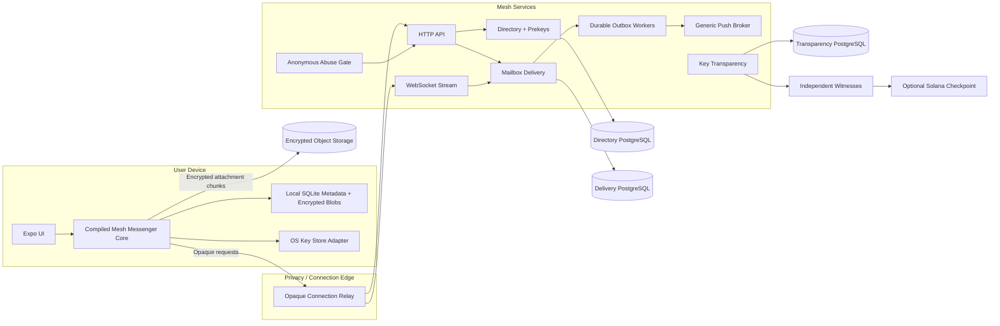
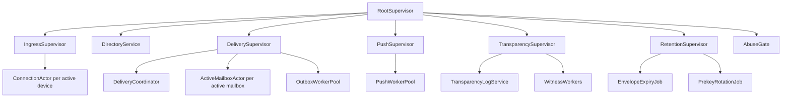
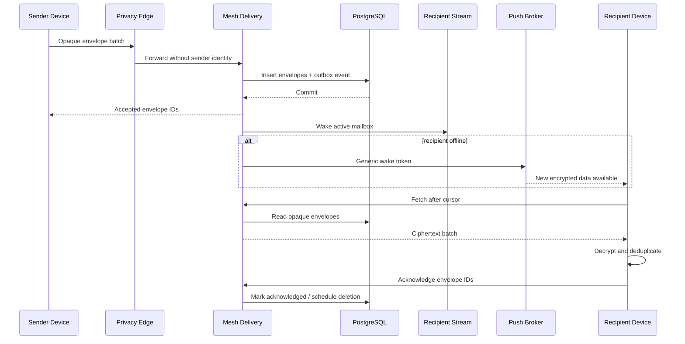

# Mesh Private Messenger

## Complete Dogfooding, Language-Improvement, Security, and Implementation Plan

**Working title:** Mesh Private Messenger  
**Primary objective:** Build a WhatsApp-like private messenger while using the project as a forcing function to improve Mesh into a language capable of implementing secure, concurrent, networked, mobile software.  
**Repository reviewed:** `snowdamiz/mesh-lang`  
**Repository snapshot used for this plan:** `625dbc38af627385b53ca5a0dd37402847cdbd96` from July 30, 2026  
**Plan status:** Architecture and implementation roadmap  
**Security status:** Not a claim of production readiness. Production use requires independent cryptographic and implementation review.

---

## Table of Contents

1. [Executive Summary](#1-executive-summary)
2. [Project Goals](#2-project-goals)
3. [Non-Goals](#3-non-goals)
4. [Core Architectural Decisions](#4-core-architectural-decisions)
5. [What It Means to Build the Primitives Into Mesh](#5-what-it-means-to-build-the-primitives-into-mesh)
6. [Current Mesh Assessment](#6-current-mesh-assessment)
7. [Dogfooding Rules](#7-dogfooding-rules)
8. [Product Concept](#8-product-concept)
9. [Privacy Contract](#9-privacy-contract)
10. [Threat Model](#10-threat-model)
11. [High-Level System Architecture](#11-high-level-system-architecture)
12. [Mesh Language and Runtime Improvement Program](#12-mesh-language-and-runtime-improvement-program)
13. [Mesh Crypto V2](#13-mesh-crypto-v2)
14. [First-Class Secret and Resource Types](#14-first-class-secret-and-resource-types)
15. [Binary Data and Canonical Encoding](#15-binary-data-and-canonical-encoding)
16. [Constant-Time Mesh Research Track](#16-constant-time-mesh-research-track)
17. [Messenger Cryptographic Profile](#17-messenger-cryptographic-profile)
18. [Account, Device, and Identity Model](#18-account-device-and-identity-model)
19. [One-to-One Session Protocol](#19-one-to-one-session-protocol)
20. [Multi-Device Messaging](#20-multi-device-messaging)
21. [Message Envelope Format](#21-message-envelope-format)
22. [Attachments](#22-attachments)
23. [Push Notifications](#23-push-notifications)
24. [Metadata Protection and Sealed Delivery](#24-metadata-protection-and-sealed-delivery)
25. [Key Transparency](#25-key-transparency)
26. [Optional Blockchain Integration](#26-optional-blockchain-integration)
27. [Groups](#27-groups)
28. [Backups and Recovery](#28-backups-and-recovery)
29. [Mesh Backend Architecture](#29-mesh-backend-architecture)
30. [Actor and Supervision Topology](#30-actor-and-supervision-topology)
31. [Durable Delivery Semantics](#31-durable-delivery-semantics)
32. [Database Design](#32-database-design)
33. [HTTP and WebSocket API Plan](#33-http-and-websocket-api-plan)
34. [Mobile Architecture](#34-mobile-architecture)
35. [Mesh Mobile Compilation and Embedding](#35-mesh-mobile-compilation-and-embedding)
36. [User-Facing MVP Scope](#36-user-facing-mvp-scope)
37. [Milestone Roadmap](#37-milestone-roadmap)
38. [Testing and Verification Strategy](#38-testing-and-verification-strategy)
39. [Security Review and Release Gates](#39-security-review-and-release-gates)
40. [Performance and Scalability Plan](#40-performance-and-scalability-plan)
41. [Privacy-Safe Observability](#41-privacy-safe-observability)
42. [Deployment and Operations](#42-deployment-and-operations)
43. [Repository Structure](#43-repository-structure)
44. [Proposed Mesh Issue Backlog](#44-proposed-mesh-issue-backlog)
45. [Risks and Mitigations](#45-risks-and-mitigations)
46. [Definition of Done](#46-definition-of-done)
47. [Recommended First Vertical Slice](#47-recommended-first-vertical-slice)
48. [References](#48-references)

---

# 1. Executive Summary

The project should be built as a **Mesh-first private messenger**, not as a conventional messenger with a small Mesh service attached to it.

The intended ownership model is:

| Layer | Implementation |
|---|---|
| Delivery backend | Mesh |
| Directory and prekey service | Mesh |
| Key-transparency service | Mesh |
| Messenger protocol state machines | Mesh |
| Double Ratchet or successor ratchet | Mesh |
| Multi-device session management | Mesh |
| Canonical message codecs | Mesh |
| Attachment manifest logic | Mesh |
| Optional Solana checkpoint logic | Mesh |
| Mobile protocol and synchronization core | Compiled Mesh |
| Cryptographic primitives exposed to applications | Official Mesh standard library and runtime |
| Secret memory and key lifecycle | Official Mesh runtime |
| Mobile UI | Expo and React Native |
| iOS Keychain and APNs integration | Thin Swift adapter |
| Android Keystore and FCM integration | Thin Kotlin adapter |
| Application-level Rust protocol code | None |

Rust remains an implementation language inside `mesh-rt`, just as it already implements the compiler, actor scheduler, TLS support, WebSocket support, databases, and other runtime facilities. The messenger itself must not contain a separate Rust protocol core.

The project should improve Mesh in several reusable areas:

- Binary-first cryptography
- Cryptographically secure random data
- Key agreement, signatures, HKDF, AEAD, and post-quantum KEMs
- First-class secret values
- Affine or move-only resource types
- Canonical binary encoding
- Binary PostgreSQL and SQLite values
- Bounded actor mailboxes and backpressure
- Reliable observable distributed sends
- A shared nonblocking network reactor
- Mobile static-library and dynamic-library output
- Stable exported C ABI functions
- Host callbacks for platform capabilities
- Fuzzing, known-answer vectors, security tests, and release proofs
- Privacy-safe observability and deployment tooling

The first complete proof should be:

> Two command-line clients written in Mesh exchange an end-to-end encrypted message through a Mesh server. The recipient may be offline, the server may restart, messages may be duplicated or reordered, and the server must still never receive plaintext or private-key material.

Only after this proof succeeds should the project move into Expo and mobile embedding.

---

# 2. Project Goals

## 2.1 Product goals

The product should eventually provide:

- End-to-end encrypted one-to-one messaging
- Offline delivery
- Usernames and QR-based contact exchange
- No mandatory phone number
- Independent device identities
- Multi-device support
- Device linking and revocation
- Safety-number or QR verification
- Key-change warnings
- Message requests and blocking
- Encrypted attachments
- Generic push wakeups
- Disappearing messages
- Key transparency
- Metadata-reduction modes
- Groups after one-to-one messaging is stable
- Optional blockchain-backed transparency checkpoints
- Client-encrypted backup as an explicit opt-in

## 2.2 Mesh goals

The project should prove that Mesh can support:

- Security-sensitive binary protocols
- Long-lived state machines
- Lightweight concurrent processes
- Backpressure and resource limits
- Durable network services
- Mobile embedding
- Host-platform integration
- Secret-key lifecycle management
- Cross-platform native releases
- Fuzzing and hostile-input handling
- Large real-world applications without private escape hatches

## 2.3 Ecosystem goals

Every reusable capability should become part of one of these:

- The Mesh language
- The Mesh compiler
- `mesh-rt`
- The Mesh standard library
- An official Mesh source package
- The Mesh package manager
- Mesh testing and release tooling

The messenger should consume public Mesh functionality exactly as another application would.

---

# 3. Non-Goals

The initial project is not intended to provide:

- Full WhatsApp feature parity
- Voice or video calls in the MVP
- Federation in the MVP
- Permanent decentralized storage
- On-chain messages or message hashes
- Wallet addresses as user identities
- Public feeds
- Server-side content scanning
- Contact-book upload in plaintext
- A server-readable social graph
- A browser client before the mobile model is stable
- A custom cryptographic algorithm
- A claim of anonymity against a global passive adversary
- Protection from a fully compromised endpoint
- Prevention of screenshots, forwarding, or recipient disclosure
- Pure-Mesh implementations of every cryptographic primitive before the first product proof

The cryptographic primitives will initially be official Mesh runtime capabilities implemented behind stable Mesh APIs. Selected implementations may move into Mesh source after the language gains enforceable constant-time semantics.

---

# 4. Core Architectural Decisions

## 4.1 Mesh owns protocol behavior

The following must be implemented in Mesh source:

- Device identity models
- Prekey models
- Session-establishment state machines
- Ratchet state transitions
- Message-number progression
- Skipped-key handling
- Replay detection
- Multi-device fanout
- Session replacement
- Device revocation
- Protocol-version negotiation
- Envelope encoding and decoding
- Attachment manifests
- Key-transparency proofs
- Group state later

A function like the following should be Mesh code:

```mesh
fn encrypt_message(
  session :: consume RatchetState,
  plaintext :: Bytes,
  associated_data :: Bytes
) -> (RatchetState, EncryptedEnvelope) ! ProtocolError do
  # Mesh implementation
end
```

The runtime may perform primitive mathematical operations, but it must not decide protocol state transitions.

## 4.2 Cryptographic primitives are official Mesh APIs

The messenger must call APIs such as:

```mesh
Crypto.x25519_shared(...)
Crypto.hkdf_sha256(...)
Crypto.aead_seal(...)
Crypto.verify(...)
Secret.random(...)
```

It must not import a private native package called `messenger_crypto` that exposes a single `encrypt_session_message` operation.

## 4.3 PostgreSQL owns durability

Actor messages and distributed sends are not committed delivery.

The source of truth is:

```text
PostgreSQL transaction
├── opaque encrypted envelope
└── durable outbox event
```

Actors notify active connections after commit. A lost notification causes a retry or poll, not message loss.

## 4.4 Devices are the security boundary

The server must not have the keys needed to decrypt:

- Messages
- Attachments
- Profiles
- Group metadata
- Delivery receipts
- Read receipts
- Backups
- Session state

## 4.5 Blockchain is optional verification infrastructure

A blockchain may anchor a key-transparency checkpoint. It must not store:

- Messages
- Encrypted messages
- Message hashes
- Usernames
- Device keys
- Contact relationships
- Mailbox tokens
- Group identifiers
- Receipts
- Attachment identifiers

## 4.6 Centralized ciphertext delivery comes before decentralization

A centralized, ciphertext-only delivery service may reveal less information than direct peer-to-peer delivery, which exposes participants' IP addresses and online status to each other.

Decentralization is not automatically privacy.

---

# 5. What It Means to Build the Primitives Into Mesh

A primitive is considered part of Mesh only after all of these exist:

1. A public Mesh type-safe API
2. Type-checker registration
3. MIR representation
4. LLVM intrinsic declaration or ordinary Mesh lowering
5. Runtime implementation
6. Mesh-level end-to-end tests
7. Known-answer and negative tests
8. Documentation
9. Formatter and LSP support where relevant
10. Cross-platform release verification
11. Stable ownership and error semantics
12. Use by the messenger without a private fallback

For example, X25519 support is not complete merely because `mesh-rt` contains a Rust function. It must be usable as:

```mesh
let pair = Crypto.x25519_generate()?
let shared = Crypto.x25519_shared(pair.private_key, remote_public_key)?
```

It must also have:

- Exact key-length validation
- Invalid-key tests
- Known-answer vectors
- Resource cleanup
- Mobile target verification
- Documentation
- Fuzz coverage at the public boundary

---

# 6. Current Mesh Assessment

This section is based on the repository implementation at the snapshot named above, not only the README.

## 6.1 Existing strengths

Mesh already contains useful foundations:

- A Rust workspace with compiler, lexer, parser, type checker, runtime, codegen, CLI, package manager, LSP, formatter, and REPL
- LLVM native code generation
- Typed actors and `Pid<M>`
- M:N scheduling
- Supervision
- Services
- Timers and jobs
- HTTP and WebSocket support
- Binary-safe `Bytes`
- PostgreSQL and SQLite support
- Distributed actors and cluster machinery
- Native packages with checksummed exact-target static libraries
- Wide checked integers
- Package locking
- Solana, Anchor, and Borsh packages
- Runtime security work around cluster identity and control

These features make Mesh unusually suitable for a messaging backend and protocol implementation.

## 6.2 Current cryptographic limitations

The current `Crypto` implementation focuses on:

- SHA-256
- SHA-512
- HMAC-SHA256
- HMAC-SHA512
- UUID generation
- Base64
- Hex
- A custom string comparison

It does not yet expose:

- CSPRNG-backed arbitrary `Bytes`
- HKDF
- X25519
- Ed25519 or XEdDSA
- AEAD
- ML-KEM
- Argon2id
- Secret-memory types
- Key handles
- Secure destruction
- Constant-time compiler guarantees

The current API also accepts and returns `String` for many binary cryptographic values. The messenger requires a binary-first API.

## 6.3 Existing secure comparison bug

The current `Crypto.secure_compare` implementation mixes the length difference into a `u8`:

```rust
diff |= (a_bytes.len() ^ b_bytes.len()) as u8;
```

Length differences that are multiples of 256 can be truncated to zero. With specially shaped data, unequal strings may compare equal.

Required response:

- Do not use the current function for authentication.
- Remove string-based secret comparison.
- Standardize on a corrected `Bytes.secure_equals`.
- Use the runtime's constant-time dependency rather than a custom loop.
- Add regression tests at length boundaries.

## 6.4 Secret memory is missing

`Bytes` is GC-managed binary data. It does not guarantee:

- Timely erasure
- Non-copyability
- Non-serialization
- Redacted debug output
- Protection from accidental logging
- Automatic destruction on actor exit
- Use-after-destroy detection

Private keys and ratchet keys require dedicated semantics.

## 6.5 Actor mailboxes are unbounded

The current mailbox uses an unbounded `VecDeque`.

For a public messaging service this creates denial-of-service risk. Mesh needs:

- Item limits
- Byte limits
- Overflow policy
- Producer feedback
- Per-actor telemetry
- Compile-time rejection of secret resources as messages

## 6.6 WebSocket architecture needs a shared reactor

The current server uses a dedicated OS reader thread per WebSocket connection.

That is acceptable for a proof but not the desired architecture for a large persistent-connection service.

The messenger should drive:

- A shared nonblocking I/O reactor
- Actor wakeups
- Bounded inbound queues
- Bounded outbound queues
- Partial writes
- Connection-level quotas
- Configurable frame limits
- Idle and handshake deadlines
- Fairness across connections

## 6.7 Distributed sends can silently drop

Remote actor sends currently may silently drop when:

- A node is unknown
- A session is unavailable
- A write fails

This is acceptable for hints and wakeups. It is not acceptable for durable message delivery.

## 6.8 PostgreSQL parameters are text-oriented

The existing PostgreSQL surface largely consumes string parameter lists. The messenger requires:

- `BYTEA`
- Typed binary parameters
- Typed results
- Prepared statements
- Pooling
- Deadlines
- Reconnect behavior
- Bounded result cells
- Scheduler-aware I/O

## 6.9 Mobile library output is not yet established

The current build and link flow is primarily executable-oriented.

The project needs:

- Static-library output
- Dynamic-library output
- Stable exported functions
- iOS targets
- Android targets
- Host callbacks
- Runtime lifecycle APIs
- Mobile release proofs

---

# 7. Dogfooding Rules

These rules should be written into the project contribution guide.

## Rule 1: No private application-level Rust protocol

The product must not contain a Rust ratchet, session manager, envelope codec, or key-transparency implementation.

## Rule 2: Generic capabilities go into Mesh first

When the messenger needs binary PostgreSQL parameters, bounded mailboxes, or mobile library output, implement the reusable Mesh feature before writing an application workaround.

## Rule 3: No messenger-specific compiler magic

Do not add an intrinsic called `mesh_messenger_encrypt`. Add reusable primitives such as `Crypto.aead_seal`.

## Rule 4: No secret keys in ordinary `Bytes`

Private-key and ratchet material must use secret or resource types.

## Rule 5: No binary values disguised as UTF-8

Use `Bytes` and typed wrappers for keys, nonces, signatures, ciphertext, and protocol frames.

## Rule 6: No silent failure on durable paths

Every durable operation must return a typed result and have retry or recovery semantics.

## Rule 7: Every language change needs repository-wide completion

A change includes:

- Parser or type system where relevant
- Runtime
- Codegen
- Tests
- Docs
- Tooling
- Release proof

## Rule 8: The messenger pins Mesh

The messenger must build against an exact Mesh commit or release and record it in CI.

## Rule 9: No production-only hidden path

The same public API used by tests and examples must be used in production.

## Rule 10: Every security assumption is documented

No undocumented key derivation, nonce generation, or fallback algorithm is allowed.

---

# 8. Product Concept

The product is a private messenger based on:

- Random account identifiers
- Optional human-readable usernames
- QR contact exchange
- Independent per-device cryptographic identities
- End-to-end encryption
- Store-and-forward delivery
- Ciphertext-only server storage
- Local conversation history
- Key transparency
- Optional privacy relay
- Optional public checkpoint anchoring

A user account consists of:

1. An account identifier
2. An account authorization key or equivalent device-authorization authority
3. One or more authorized devices
4. A current device set
5. An optional username
6. A key-transparency history
7. An optional encrypted backup identity

A device consists of:

- Device identifier
- Signing identity
- DH identity
- Signed prekey
- One-time prekeys
- Optional post-quantum prekeys
- Mailbox capability
- Push wakeup binding
- Local storage key
- Session database

---

# 9. Privacy Contract

The product should publish a precise privacy contract.

| Data | Server visibility |
|---|---|
| Message plaintext | Never |
| Attachment plaintext | Never |
| Attachment filename and MIME type | Never |
| Session keys | Never |
| Ratchet state | Never |
| Local contact names | Never |
| Conversation identifier | Never in clear delivery records |
| Sender identity | Hidden in sealed-delivery mode |
| Destination | Opaque mailbox token visible to delivery service |
| Username | Visible to directory service in the initial design |
| Device public keys | Visible to directory and transparency services |
| IP address | Visible to connection edge |
| Message timing | Visible in reduced form |
| Message size | Approximate size visible; padding reduces precision |
| Push timing | Visible to push provider |
| Social graph | Reduced, not fully eliminated |
| Local history | Visible on a compromised endpoint |
| Screenshots or forwarding | Not preventable |

## 9.1 Explicit residual risks

The product must not claim to prevent:

- Global traffic analysis
- Endpoint malware
- Recipient disclosure
- Screenshots
- Compelled access to an unlocked device
- Push-provider timing correlation
- Long-term metadata correlation without cover traffic

---

# 10. Threat Model

## 10.1 Adversaries in scope

- A curious or compromised delivery server
- A compromised database
- A compromised object-storage provider
- A network attacker
- A malicious sender
- A malicious recipient
- A malicious unauthenticated client
- A compromised cluster node
- A supply-chain attacker targeting a dependency
- An operator accidentally logging secrets
- A server attempting silent device-key substitution
- A replaying or reordering delivery service
- A denial-of-service attacker

## 10.2 Adversaries partly in scope

- A compromised push provider
- A compromised privacy edge
- A compromised directory service
- A compromised transparency witness
- A regional network observer

Mitigation comes from split trust, generic push payloads, key transparency, and optional relays.

## 10.3 Adversaries out of scope for confidentiality

- A fully compromised recipient device
- A fully compromised sender device
- A user voluntarily exporting content
- A camera pointed at the screen
- A global observer with complete network visibility and no cover traffic

## 10.4 Security properties

The protocol should target:

- Confidentiality
- Integrity
- Sender and recipient authentication
- Forward secrecy
- Post-compromise recovery
- Replay resistance
- Reordering tolerance
- Duplicate tolerance
- Device-revocation visibility
- Key-substitution detectability
- Bounded work under hostile input
- No state mutation after failed authentication
- Downgrade resistance
- Explicit protocol versioning

---

# 11. High-Level System Architecture



## 11.1 MVP simplification

The first deployment may combine services into one Mesh process and one PostgreSQL instance with separate schemas.

The logical boundaries should still exist in code so they can later become separate processes.

---

# 12. Mesh Language and Runtime Improvement Program

The messenger requires several parallel Mesh workstreams.

## 12.1 Workstream A: Crypto V2

Deliver:

- Binary hashes
- CSPRNG
- HMAC
- HKDF
- X25519
- Signature keys
- AEAD
- ML-KEM later
- Argon2id later
- Typed errors
- Known-answer vectors
- Cross-platform proofs

## 12.2 Workstream B: Secret and resource semantics

Deliver:

- `SecretBytes`
- Opaque key types
- Move-only values
- Borrow and consume parameters
- Automatic drop
- Actor-owned resource cleanup
- Use-after-move diagnostics
- Use-after-destroy protection
- Redacted formatting

## 12.3 Workstream C: Binary protocol tooling

Deliver:

- Endian operations
- Binary builders
- Bounded readers
- Canonical encoders
- Trailing-byte rejection
- Property testing
- Later `deriving(Binary)`

## 12.4 Workstream D: Durable binary data

Deliver:

- PostgreSQL `BYTEA`
- SQLite `BLOB`
- Typed database values
- Prepared statements
- Pooling
- Cancellation
- Deadlines
- Binary HTTP bodies

## 12.5 Workstream E: Runtime backpressure

Deliver:

- Bounded mailboxes
- Byte quotas
- Observable send results
- Bounded channels for richer payloads
- Network queue limits
- Connection quotas

## 12.6 Workstream F: Shared network reactor

Deliver:

- Nonblocking socket registration
- Actor wakeups
- Readiness events
- Partial reads and writes
- TLS integration
- WebSocket integration
- Fair scheduling
- Graceful cancellation

## 12.7 Workstream G: Mobile artifacts

Deliver:

- `staticlib`
- `cdylib`
- `@export`
- Stable C ABI
- iOS targets
- Android targets
- Host callbacks
- Runtime init and shutdown
- Swift and Kotlin bindings

## 12.8 Workstream H: Security tooling

Deliver:

- Fuzz harnesses
- Known-answer vector runner
- Machine-readable test reports
- Coverage support
- Dependency audit
- SBOM generation
- Binary reproducibility checks
- Secret-leak tests
- Timing tests where meaningful

---

# 13. Mesh Crypto V2

## 13.1 Public error type

```mesh
type CryptoError do
  InvalidLength(expected :: Int, actual :: Int)
  InvalidKey
  InvalidPublicKey
  InvalidSignature
  AuthenticationFailed
  EntropyUnavailable
  SecretDestroyed
  ResourceLimitExceeded
  UnsupportedOperation
  InternalFailure
end
```

Public error messages must not reveal sensitive detail.

## 13.2 Binary hashes

```mesh
Crypto.sha256(input :: Bytes) -> Bytes
Crypto.sha512(input :: Bytes) -> Bytes

Crypto.sha256_hex(input :: Bytes) -> String
Crypto.sha512_hex(input :: Bytes) -> String
```

Hex is a presentation function, not the primary output.

## 13.3 Secure randomness

```mesh
Crypto.random_bytes(length :: Int) -> Bytes ! CryptoError
Secret.random(length :: Int) -> SecretBytes ! CryptoError
```

Rules:

- Use the operating system CSPRNG.
- Reject negative and excessive lengths.
- Do not expose deterministic seeding.
- Keep the existing `Random` module clearly separate and documented as non-cryptographic.
- Provide test-only deterministic providers behind a test build flag.

## 13.4 HMAC and HKDF

```mesh
Crypto.hmac_sha256(
  key :: borrow SecretBytes,
  message :: Bytes
) -> SecretBytes ! CryptoError

Crypto.hkdf_sha256(
  input_key :: borrow SecretBytes,
  salt :: Bytes,
  info :: Bytes,
  output_length :: Int
) -> SecretBytes ! CryptoError
```

Rules:

- Bound output length.
- Use explicit domain-separation strings.
- Never return secret output as ordinary `Bytes`.
- Provide `Secret.reveal_for_test` only in test builds.

## 13.5 Key agreement

```mesh
resource X25519PrivateKey

struct X25519PublicKey do
  bytes :: Bytes
end

struct X25519KeyPair do
  private_key :: X25519PrivateKey
  public_key :: X25519PublicKey
end

Crypto.x25519_generate() -> X25519KeyPair ! CryptoError

Crypto.x25519_public(
  private_key :: borrow X25519PrivateKey
) -> X25519PublicKey ! CryptoError

Crypto.x25519_shared(
  private_key :: borrow X25519PrivateKey,
  peer_public_key :: X25519PublicKey
) -> SecretBytes ! CryptoError
```

## 13.6 Signatures

```mesh
resource SigningPrivateKey

struct SigningPublicKey do
  bytes :: Bytes
end

struct Signature do
  bytes :: Bytes
end

struct SigningKeyPair do
  private_key :: SigningPrivateKey
  public_key :: SigningPublicKey
end

Crypto.signing_generate() -> SigningKeyPair ! CryptoError

Crypto.sign(
  key :: borrow SigningPrivateKey,
  message :: Bytes
) -> Signature ! CryptoError

Crypto.verify(
  key :: SigningPublicKey,
  message :: Bytes,
  signature :: Signature
) -> Bool ! CryptoError
```

The precise signature profile must be pinned in the messenger cryptographic specification.

## 13.7 Authenticated encryption

```mesh
resource AeadKey

Crypto.aead_key(
  material :: consume SecretBytes
) -> AeadKey ! CryptoError

Crypto.aead_seal(
  key :: borrow AeadKey,
  nonce :: Bytes,
  associated_data :: Bytes,
  plaintext :: Bytes
) -> Bytes ! CryptoError

Crypto.aead_open(
  key :: borrow AeadKey,
  nonce :: Bytes,
  associated_data :: Bytes,
  ciphertext :: Bytes
) -> Bytes ! CryptoError
```

Rules:

- No unauthenticated encryption API
- Exact nonce-length checking
- Exact key-length checking
- No plaintext on authentication failure
- Generic authentication error
- State must remain unchanged on failure

## 13.8 Post-quantum KEM

Add after the classical vertical slice:

```mesh
resource MlKemPrivateKey

struct MlKemPublicKey do
  bytes :: Bytes
end

struct MlKemCiphertext do
  bytes :: Bytes
end

struct MlKemKeyPair do
  private_key :: MlKemPrivateKey
  public_key :: MlKemPublicKey
end

Crypto.mlkem_generate() -> MlKemKeyPair ! CryptoError

Crypto.mlkem_encapsulate(
  public_key :: MlKemPublicKey
) -> (MlKemCiphertext, SecretBytes) ! CryptoError

Crypto.mlkem_decapsulate(
  private_key :: borrow MlKemPrivateKey,
  ciphertext :: MlKemCiphertext
) -> SecretBytes ! CryptoError
```

The exact ML-KEM parameter set and implementation version must be pinned.

## 13.9 Password and recovery KDF

For encrypted backup and recovery:

```mesh
Crypto.argon2id(
  password :: borrow SecretBytes,
  salt :: Bytes,
  memory_kib :: Int,
  iterations :: Int,
  parallelism :: Int,
  output_length :: Int
) -> SecretBytes ! CryptoError
```

The product must use a versioned profile rather than user-selected arbitrary parameters.

## 13.10 Internal provider abstraction

Inside `mesh-rt`, define a provider boundary:

```text
CryptoProvider
├── system RNG
├── hash/HMAC/HKDF
├── X25519
├── signatures
├── AEAD
├── ML-KEM
└── Argon2id
```

Requirements:

- Provider types never cross the Mesh ABI.
- Public Mesh types remain stable.
- The default provider is pinned.
- A test provider is compile-time test-only.
- Unsupported targets fail clearly.
- Dependency versions and licenses are reviewed.

---

# 14. First-Class Secret and Resource Types

## 14.1 Stage 1: compiler-known `SecretBytes`

Introduce:

```mesh
SecretBytes
```

Required properties:

- Opaque
- Move-only
- Non-printable
- Non-debuggable
- Non-JSON
- Non-row
- Non-schema
- Non-hashable
- Not accepted by ordinary equality
- Not accepted as an actor message
- Not serializable
- Explicitly destructible
- Automatically destroyed at scope exit
- Automatically destroyed at actor exit

## 14.2 Proposed parameter ownership syntax

```mesh
fn derive(
  root :: borrow SecretBytes
) -> SecretBytes

fn destroy(
  secret :: consume SecretBytes
) -> Unit
```

Initial borrow semantics may be restricted to the duration of one direct function call. A full lifetime system is not required for the first version.

## 14.3 Stage 2: generalized `resource`

Proposed language syntax:

```mesh
resource X25519PrivateKey
resource AeadKey
resource StorageKey

resource struct RatchetSecrets do
  root_key :: SecretBytes
  sending_chain_key :: SecretBytes?
  receiving_chain_key :: SecretBytes?
end
```

Resource rules:

- Assignment moves by default.
- Function arguments move unless declared `borrow`.
- Use after move is a compile error.
- Resource-containing structs are resources.
- Resource values cannot be sent through actor mailboxes.
- Resource values cannot be serialized.
- Resource values cannot enter ordinary unrestricted collections.
- Closure capture moves ownership.
- Scope exit inserts a drop.
- All control-flow exits insert drops.
- Actor termination drops actor-owned resources.

## 14.4 MIR additions

Add explicit operations:

```text
ResourceMove
ResourceBorrow
ResourceDrop
ResourceDestroy
```

The compiler should track resource state across:

- Branches
- Pattern matches
- Early returns
- Error propagation with `?`
- Loops
- Closure captures
- Actor termination
- Panic or failure paths

## 14.5 Runtime resource table

Use a bounded generational handle table:

```text
Mesh resource value:
    opaque handle { slot, generation, kind }

Runtime entry:
    owner actor
    resource kind
    zeroizing allocation
    live/destroyed state
    byte count
```

Requirements:

- Do not expose the handle as an `Int`.
- Check generation on every use.
- Invalidate on destroy.
- Zeroize secret memory.
- Destroy all resources owned by an exiting actor.
- Bound secret count and total bytes per actor.
- Redact debug output.
- Reject cross-node transfer.
- Make close and cleanup internally idempotent.

## 14.6 Persistent secret state

Ratchet keys must survive application restart without becoming ordinary plaintext bytes.

Introduce:

```mesh
resource StorageKey

Secret.seal_for_storage(
  secret :: borrow SecretBytes,
  wrapping_key :: borrow StorageKey,
  context :: Bytes
) -> Bytes ! CryptoError

Secret.unseal_from_storage(
  blob :: Bytes,
  wrapping_key :: borrow StorageKey,
  context :: Bytes
) -> SecretBytes ! CryptoError
```

The stored blob must include:

- Version
- Algorithm identifier
- Random nonce
- Ciphertext
- Authentication tag
- Context binding

Context should bind:

- Account ID
- Device ID
- Session ID
- Secret purpose
- Snapshot version

The mobile host stores or wraps `StorageKey` through Keychain or Keystore.

---

# 15. Binary Data and Canonical Encoding

## 15.1 Extend `Bytes`

Add:

```mesh
Bytes.from_list(values :: List<Int>) -> Bytes ! BytesError
Bytes.to_list(value :: Bytes) -> List<Int>
Bytes.repeat(byte :: Int, count :: Int) -> Bytes ! BytesError

Bytes.read_u16_be(value, offset) -> Int ! BytesError
Bytes.read_u32_be(value, offset) -> U64 ! BytesError
Bytes.read_u64_be(value, offset) -> U64 ! BytesError

Bytes.read_u16_le(value, offset) -> Int ! BytesError
Bytes.read_u32_le(value, offset) -> U64 ! BytesError
Bytes.read_u64_le(value, offset) -> U64 ! BytesError

Bytes.write_u16_be(value) -> Bytes ! BytesError
Bytes.write_u32_be(value) -> Bytes ! BytesError
Bytes.write_u64_be(value) -> Bytes ! BytesError
```

Also add checked length arithmetic and zero-copy slices where safe.

## 15.2 Binary builder

```mesh
resource BytesBuilder

BytesBuilder.new(max_bytes :: Int) -> BytesBuilder ! BinaryError
BytesBuilder.write_u8(builder, value) -> Unit ! BinaryError
BytesBuilder.write_u16_be(builder, value) -> Unit ! BinaryError
BytesBuilder.write_u32_be(builder, value) -> Unit ! BinaryError
BytesBuilder.write_bytes(builder, value) -> Unit ! BinaryError
BytesBuilder.finish(builder :: consume BytesBuilder) -> Bytes ! BinaryError
```

## 15.3 Binary reader

```mesh
struct BinaryReader do
  input :: Bytes
  offset :: Int
  maximum :: Int
end

Binary.reader(input :: Bytes, maximum :: Int) -> BinaryReader ! BinaryError
Binary.read_u8(reader) -> (BinaryReader, Int) ! BinaryError
Binary.read_u16_be(reader) -> (BinaryReader, Int) ! BinaryError
Binary.read_fixed(reader, length) -> (BinaryReader, Bytes) ! BinaryError
Binary.read_vector(reader, maximum) -> (BinaryReader, Bytes) ! BinaryError
Binary.finish(reader) -> Unit ! BinaryError
```

## 15.4 Canonical rules

All protocol codecs must enforce:

- Version first
- Fixed field order
- Canonical integer width
- Maximum total bytes
- Maximum vector lengths
- Maximum nesting
- No duplicate fields
- No silent truncation
- No trailing bytes
- No implicit UTF-8
- Explicit optional-extension handling
- Unknown mandatory fields cause rejection
- Unknown optional extensions are preserved or ignored only according to the versioned specification

## 15.5 Later compiler feature

After source packages prove the design:

```mesh
struct EncryptedEnvelope do
  version :: Int
  envelope_id :: Bytes
  ciphertext :: Bytes
end deriving(Binary)
```

`deriving(Binary)` should be generated from an explicit canonical schema, not reflection.

---

# 16. Constant-Time Mesh Research Track

Runtime-backed primitives are the production path initially.

A future goal is to support selected cryptographic code directly in Mesh source.

## 16.1 Proposed annotation

```mesh
@constant_time
fn operation(
  secret :: borrow SecretBytes,
  public_input :: Bytes
) -> SecretBytes do
  ...
end
```

## 16.2 Compiler restrictions

Inside `@constant_time` code:

- Secret values cannot control branches.
- Secret values cannot control memory indexes.
- Secret values cannot control loop counts.
- Secret values cannot control allocation sizes.
- Secret values cannot be formatted.
- Secret values cannot enter panic messages.
- Only fixed-width integer operations are allowed.
- Wrapping arithmetic must be explicit.
- Secret-dependent bounds checks are rejected.
- Calls are limited to constant-time-approved functions.

## 16.3 Restricted MIR

Create a constant-time MIR verification pass that rejects:

- Conditional branches from secret values
- Secret-derived pointer arithmetic
- Secret-derived switch tables
- Secret-derived early returns
- Unsupported intrinsics

## 16.4 Release verification

For direct Mesh crypto implementations:

- Compare outputs against reference vectors.
- Differential-test against an independent implementation.
- Inspect generated machine code.
- Run timing-distribution tests.
- Verify all supported optimization levels.
- Verify every supported architecture.
- Obtain external specialist review.

## 16.5 Migration order

Potential order:

1. HKDF composition
2. HMAC composition
3. Constant-time select and compare
4. Selected symmetric primitives
5. AEAD
6. Only much later, curve or lattice arithmetic

This track does not block the messenger MVP.

---

# 17. Messenger Cryptographic Profile

The project must publish a versioned cryptographic profile.

## 17.1 Development profile A

Purpose: complete vertical slice.

Candidate suite:

- SHA-256
- HMAC-SHA256
- HKDF-SHA256
- X25519
- Ed25519-style device credentials
- ChaCha20-Poly1305 AEAD
- Classical asynchronous prekey handshake
- Classical Double Ratchet
- One visible device in the UI
- Multi-device data model already present

## 17.2 Development profile B

Purpose: pre-production security work.

Add:

- Hybrid classical and ML-KEM initial establishment
- Key transparency
- Device-list consistency checks
- Sealed-sender-style delivery capability
- Multi-device linking and revocation
- Independent witness checkpoints

## 17.3 Production-target profile C

Purpose: audited production profile.

Select after external review:

- Exact post-quantum initial key-establishment profile
- Exact ratchet profile
- Exact signature or identity-binding scheme
- Exact AEAD and nonce derivation
- Exact skipped-key limits
- Exact downgrade behavior
- Exact prekey rotation
- Exact backup KDF parameters

## 17.4 Domain separation

Every derivation must use stable labels:

```text
mesh-msg/v1/account-credential
mesh-msg/v1/device-credential
mesh-msg/v1/handshake
mesh-msg/v1/root-key
mesh-msg/v1/sending-chain
mesh-msg/v1/receiving-chain
mesh-msg/v1/message-key
mesh-msg/v1/header-key
mesh-msg/v1/attachment-key
mesh-msg/v1/storage-wrap
mesh-msg/v1/transparency-leaf
```

Labels become part of the published protocol.

## 17.5 Downgrade prevention

- The selected suite is authenticated.
- The selected suite is included in associated data.
- Devices remember the strongest suite previously observed.
- A server cannot silently force a lower suite.
- Unsupported higher suites fail explicitly.
- Compatibility policy is versioned and tested.

---

# 18. Account, Device, and Identity Model

## 18.1 Account identity

An account has:

- `AccountId`: random 128- or 256-bit identifier
- Optional normalized username
- Account authorization public key
- Account creation record
- Current device set
- Transparency-log position

## 18.2 Device identity

Each device has:

- `DeviceId`
- Device signing public key
- Device DH public key
- Optional post-quantum public key
- Device credential signed by account authority
- Mailbox generation
- Creation timestamp
- Revocation timestamp
- Protocol capabilities

## 18.3 Device credential

A device credential binds:

```text
protocol version
account ID
device ID
signing public key
DH public key
post-quantum public key or suite
capability set
creation time
expiration policy
directory sequence
```

The credential is signed by the account authorization key or another authorized device according to the account model.

## 18.4 Device linking

Recommended flow:

1. New device generates keys locally.
2. New device displays a QR linking request.
3. Existing device scans the request.
4. Existing device verifies a short authentication string.
5. Existing device signs the new device credential.
6. Directory verifies the authorization.
7. Transparency log adds the new device.
8. Existing contacts observe the updated device set.
9. Messages fan out to the new device after confirmation.

## 18.5 Device revocation

Revocation must:

- Be signed by account authority or an authorized device.
- Enter the transparency log.
- Stop new prekey publication.
- Stop future fanout.
- Rotate mailbox capability.
- Trigger a visible contact warning.
- Not falsely claim deletion from a device already compromised.

---

# 19. One-to-One Session Protocol

## 19.1 Prekey bundle

A public bundle may include:

- Device credential
- Identity DH public key
- Signing public key
- Signed prekey
- Signed-prekey signature
- One-time prekey
- Optional post-quantum prekey
- Protocol suite list
- Expiry
- Transparency proof

## 19.2 Session-establishment state

```mesh
type SessionState do
  Empty
  AwaitingPrekey(bundle :: PrekeyBundle)
  Established(state :: RatchetState)
  Stale(reason :: StaleReason)
  Revoked(device_id :: DeviceId)
end
```

## 19.3 Ratchet state

```mesh
resource struct RatchetState do
  version :: Int
  suite :: ProtocolSuite
  session_id :: Bytes
  root_key :: SecretBytes
  sending_chain_key :: SecretBytes?
  receiving_chain_key :: SecretBytes?
  local_ratchet_private :: X25519PrivateKey
  local_ratchet_public :: X25519PublicKey
  remote_ratchet_public :: X25519PublicKey?
  previous_chain_length :: Int
  sent_count :: Int
  received_count :: Int
  skipped_keys :: SkippedKeyStore
end
```

## 19.4 Encryption transition

```mesh
Ratchet.encrypt(
  state :: consume RatchetState,
  plaintext :: Bytes,
  associated_data :: Bytes
) -> (RatchetState, EncryptedMessage) ! ProtocolError
```

Required behavior:

- Derive one message key.
- Advance sending chain.
- Destroy superseded secret material.
- Authenticate header and suite.
- Bound output.
- Never reuse nonce/key combinations.
- Return a new state and ciphertext atomically.

## 19.5 Decryption transition

```mesh
Ratchet.decrypt(
  state :: consume RatchetState,
  message :: EncryptedMessage,
  associated_data :: Bytes
) -> (RatchetState, Bytes) ! ProtocolError
```

Required behavior:

- Validate version and limits before expensive work.
- Check replay status.
- Handle bounded message-number jumps.
- Look up bounded skipped keys.
- Attempt ratchet advancement transactionally.
- Do not mutate committed state until authentication succeeds.
- Destroy candidate secrets on failure.
- Return generic authentication failure.

## 19.6 Replay and skipped keys

Define explicit limits:

- Maximum skipped keys per session
- Maximum chain jump
- Maximum previous chains
- Maximum skipped-key age
- Maximum session count per remote device
- Maximum prekey messages per bundle

Exceeding a bound should return a typed error and require session recovery.

---

# 20. Multi-Device Messaging

## 20.1 Per-device sessions

Every sender device maintains an independent session with every recipient device.

A message from Alice to Bob is encrypted separately for:

- Every active Bob device
- Every active Alice device other than the sender, for synchronization

## 20.2 Fanout object

```mesh
struct DeviceEnvelope do
  destination_mailbox :: MailboxToken
  destination_device :: DeviceId
  envelope :: Bytes
end

fn fanout(
  conversation :: ConversationState,
  plaintext :: Bytes
) -> (ConversationState, List<DeviceEnvelope>) ! ProtocolError
```

## 20.3 Device-set changes

When the recipient device set changes:

- Fetch transparency proof.
- Verify consistency.
- Compare with cached device set.
- Show a user-visible warning when required.
- Establish sessions for new devices.
- Stop sending to revoked devices.
- Record acknowledgement state.

## 20.4 Self-sync

Synchronization messages should be end-to-end encrypted like ordinary messages.

They may include:

- Sent message copy
- Read state
- Conversation settings
- Contact changes
- Disappearing-message policy
- Device-management events

The server must not interpret them.

---

# 21. Message Envelope Format

## 21.1 Server-visible outer envelope

```text
magic/version
envelope ID
destination mailbox token
protocol suite ID
expiration
padding bucket
ciphertext length
ciphertext
```

Do not include:

- Sender account ID
- Sender device ID
- Conversation ID
- Message type
- Attachment MIME type
- Reply target
- Read-receipt policy

## 21.2 Encrypted inner payload

```text
payload version
sender account ID
sender device ID
recipient device ID
conversation ID
client message ID
client timestamp
message type
body
reply reference
attachment manifest
receipt policy
disappearing policy
extension list
```

## 21.3 Delivery properties

- Client-generated random envelope ID
- Database uniqueness by mailbox and envelope ID
- At-least-once delivery
- Client deduplication
- Bounded ciphertext
- Padding buckets
- Explicit expiry
- No server-readable conversation identifier

## 21.4 Padding

Initial buckets may be:

```text
256 B
512 B
1 KiB
2 KiB
4 KiB
8 KiB
16 KiB
32 KiB
64 KiB
```

Larger content should use attachments.

Padding policy must be configurable and versioned.

---

# 22. Attachments

## 22.1 Encryption flow

1. Generate random attachment key.
2. Split file into bounded chunks.
3. Encrypt each chunk.
4. Use unique nonce or chunk derivation.
5. Pad final size where practical.
6. Upload opaque chunks.
7. Put key and manifest inside encrypted message.
8. Delete after expiry.

## 22.2 Encrypted manifest

Contains:

- Object identifier
- Attachment key or wrapped key
- Chunk count
- Chunk sizes
- Plaintext total size
- Ciphertext integrity data
- Filename
- MIME type
- Thumbnail
- Expiry

The manifest is inside the message ciphertext.

## 22.3 Storage rules

Object storage sees:

- Random object identifier
- Encrypted bytes
- Approximate size
- Access timing
- Expiry

It must not see:

- File key
- Filename
- MIME type
- Sender identity
- Recipient identity
- Conversation ID

## 22.4 Mesh requirements

Add:

- Streaming file reads
- Streaming AEAD or chunk helper
- Bounded async upload
- Binary HTTP body support
- Progress callbacks
- Cancellation
- No attachment bytes in actor mailboxes

---

# 23. Push Notifications

Push payloads should be generic:

```text
A new encrypted message is available
```

Never include:

- Sender name
- Message body
- Group name
- Reaction
- Conversation ID
- Attachment type

## 23.1 Push-token separation

Keep push bindings in a separate service:

```text
mailbox wake token -> provider token
```

The push service should not receive:

- Username
- Account ID
- Ciphertext
- Sender identity

## 23.2 No-push mode

Offer a privacy mode using:

- Background polling where permitted
- Manual refresh
- Persistent connection
- No APNs/FCM registration

This reduces convenience but improves privacy.

---

# 24. Metadata Protection and Sealed Delivery

## 24.1 Message requests

Unknown senders cannot directly obtain unrestricted delivery access.

Initial contact uses:

- A message request envelope
- A low-rate mailbox path
- Optional anonymous authorization token
- Attachment restrictions
- Local user approval

## 24.2 Delivery capability

After acceptance, the recipient issues an opaque delivery capability.

The sender can submit to the mailbox without identifying its account to the delivery service.

## 24.3 Split privacy edge

Higher-privacy architecture:

| Component | Knows |
|---|---|
| Connection edge | Source IP, connection timing |
| Delivery core | Mailbox token, ciphertext, expiry |
| Directory | Username and public device set |
| Push broker | Wake token and provider token |
| Object store | Random object ID and encrypted size |

No component should automatically possess every field.

## 24.4 OHTTP

Use Oblivious HTTP for stateless requests such as:

- Username directory lookup
- Prekey retrieval
- Transparency proof retrieval
- Abuse-token redemption

It does not replace the persistent real-time connection.

## 24.5 Timing and size reduction

Optional measures:

- Size buckets
- Batched acknowledgements
- Randomized delay for nonurgent messages
- Generic polling intervals
- Relay connections
- No typing indicators by default
- No presence by default

---

# 25. Key Transparency

## 25.1 Purpose

The directory could otherwise substitute a device key for one target while showing the correct key to everyone else.

Key transparency makes inconsistent histories detectable.

## 25.2 Log entry

A transparency entry may contain commitments to:

```text
account ID
normalized username
device set
device credentials
revocations
sequence
previous state
protocol version
```

Avoid placing raw private metadata into public witnesses or blockchain checkpoints.

## 25.3 Client verification

Clients verify:

- Inclusion proof
- Consistency proof
- Current checkpoint signature
- Witness signatures
- Cached previous checkpoint
- Device-set transition validity

## 25.4 Witnesses

Independent witnesses:

1. Fetch checkpoints.
2. Verify append-only consistency.
3. Gossip observed checkpoints.
4. Co-sign valid checkpoints.
5. Publish conflicts.
6. Optionally anchor the checkpoint.

## 25.5 Mesh implementation

Implement in Mesh:

```text
Transparency.Leaf
Transparency.Merkle
Transparency.Proof
Transparency.Checkpoint
Transparency.Witness
Transparency.ClientState
```

This dogfoods:

- Canonical hashing
- Large immutable collections
- Binary codecs
- Signatures
- Database transactions
- Distributed workers
- Protocol versioning

---

# 26. Optional Blockchain Integration

## 26.1 Recommended use

Publish a periodic commitment:

```text
hash(
  "mesh-key-transparency-v1" ||
  tree_size ||
  tree_root ||
  checkpoint_sequence ||
  witness_set_hash ||
  previous_checkpoint_hash
)
```

## 26.2 Solana program state

Potential fields:

```text
protocol version
checkpoint sequence
tree size
tree root
witness threshold
witness set hash
previous checkpoint hash
timestamp slot
```

## 26.3 Rules

Blockchain anchoring:

- Is optional
- Is not required for messaging
- Does not replace witnesses
- Does not replace consistency proofs
- Does not store user data
- Does not store message data
- Does not make the delivery network decentralized

## 26.4 Mesh use

Use the existing Mesh Solana package for:

- Instruction construction
- Unsigned transaction reporting
- Simulation
- Checkpoint payload construction

Signer custody should remain in a separate reviewed boundary.

---

# 27. Groups

Groups are deferred until one-to-one messaging and multi-device behavior are stable.

## 27.1 Target design

Implement MLS in Mesh source.

Runtime primitives supply:

- KEM
- KDF
- AEAD
- Signatures
- HPKE support as reusable Mesh Crypto APIs

Mesh source supplies:

- Tree state
- Proposals
- Commits
- Epoch changes
- Welcome processing
- Group membership
- Persistence
- Delivery fanout
- Extension negotiation

## 27.2 Why later

MLS introduces:

- Large tree state
- Complex update rules
- Membership transitions
- Epoch ordering
- More interoperability requirements
- More persistent secret state
- Larger testing surface

It should not block the first private messenger.

---

# 28. Backups and Recovery

## 28.1 Default behavior

Without an explicit backup or surviving authorized device:

- Lost keys mean lost encrypted history.
- The server cannot reset message-encryption keys.
- Account access and message recovery are separate concepts.

## 28.2 Optional encrypted backup

Backup process:

1. Generate or derive backup key locally.
2. Serialize versioned public state.
3. Seal every secret field.
4. Encrypt message-history snapshot.
5. Upload opaque backup.
6. Verify restore on a fresh client.
7. Never upload recovery secret.

## 28.3 Recovery secret

Use:

- User-held recovery code
- Argon2id profile
- Random salt
- Versioned parameters
- Optional guardian threshold later

## 28.4 No misleading recovery

The UI must distinguish:

- Recover account access
- Authorize a new device
- Recover message history
- Restore device settings

These are not the same operation.

---

# 29. Mesh Backend Architecture

## 29.1 Logical services

- Account service
- Device authorization service
- Directory service
- Prekey service
- Delivery service
- Mailbox stream service
- Durable outbox workers
- Push broker
- Attachment grant service
- Abuse gate
- Key-transparency service
- Witness service
- Retention workers
- Operator and health service

## 29.2 Initial deployment

One Mesh executable may host these modules.

Use clear internal interfaces so they can later become separate services.

## 29.3 No conversation service

The server should not maintain a plaintext conversation table.

It stores:

- Public directory state
- Opaque mailbox envelopes
- Public transparency records
- Push wake bindings
- Opaque attachment grants

Conversation semantics remain on devices.

---

# 30. Actor and Supervision Topology



## 30.1 Actor lifetime rules

- One actor per active connection
- One active mailbox actor only when useful
- No permanent actor per registered account
- Database owns persistent state
- Actors reconstruct from database after restart
- Large ciphertext stays off actor heaps where possible
- Secret resources stay client-side, not on delivery server

## 30.2 Supervision

Use:

- `one_for_one` for independent connection actors
- Worker pools for outbox and push
- Bounded restart intensity
- Graceful shutdown
- Explicit dead-letter and retry queues
- No infinite crash loops

---

# 31. Durable Delivery Semantics

## 31.1 Send transaction



## 31.2 Guarantees

The service promises:

- At-least-once delivery until expiry
- Idempotent envelope insertion
- Cursor-based retrieval
- Duplicate tolerance
- Bounded retention
- No exactly-once claim
- No loss after acknowledged database commit under supported durability settings

## 31.3 Outbox pattern

The envelope and outbox event are committed together.

Worker states:

```text
pending
leased
delivered
retryable_failure
permanent_failure
expired
```

Lease ownership and retry count are stored durably.

## 31.4 Client deduplication

Use:

- Envelope ID
- Client message ID
- Sender device ID inside ciphertext
- Conversation-local ordering data

The client decides display uniqueness.

---

# 32. Database Design

Use separate logical schemas or databases.

## 32.1 Directory schema

### `accounts`

| Field | Type | Notes |
|---|---|---|
| `account_id` | UUID or byte identifier | Primary key |
| `username_normalized` | Text | Unique in initial design |
| `account_auth_public` | BYTEA | Public |
| `created_at` | Timestamp | |
| `disabled_at` | Timestamp nullable | |
| `directory_version` | Bigint | Monotonic |

### `devices`

| Field | Type | Notes |
|---|---|---|
| `device_id` | UUID | Primary key |
| `account_id` | UUID | Foreign key |
| `device_number` | Integer | Per-account |
| `signing_public` | BYTEA | |
| `identity_dh_public` | BYTEA | |
| `pq_public` | BYTEA nullable | |
| `credential` | BYTEA | Signed canonical record |
| `capabilities` | BYTEA | Canonical bitset |
| `created_at` | Timestamp | |
| `revoked_at` | Timestamp nullable | |
| `transparency_sequence` | Bigint | |

### `signed_prekeys`

| Field | Type |
|---|---|
| `device_id` | UUID |
| `prekey_id` | Bigint |
| `dh_public` | BYTEA |
| `pq_public` | BYTEA nullable |
| `signature` | BYTEA |
| `created_at` | Timestamp |
| `expires_at` | Timestamp |

### `one_time_prekeys`

| Field | Type |
|---|---|
| `device_id` | UUID |
| `prekey_id` | Bigint |
| `kind` | Smallint |
| `public_key` | BYTEA |
| `created_at` | Timestamp |
| `consumed_at` | Timestamp nullable |

### `mailbox_bindings`

| Field | Type |
|---|---|
| `device_id` | UUID |
| `mailbox_token_hash` | BYTEA unique |
| `generation` | Integer |
| `created_at` | Timestamp |
| `revoked_at` | Timestamp nullable |

## 32.2 Delivery schema

### `envelopes`

| Field | Type |
|---|---|
| `mailbox_token_hash` | BYTEA |
| `sequence` | Bigserial or per-mailbox sequence |
| `envelope_id` | BYTEA |
| `ciphertext` | BYTEA |
| `size_bucket` | Integer |
| `received_at` | Timestamp |
| `expires_at` | Timestamp |
| `acknowledged_at` | Timestamp nullable |

Indexes:

- Unique `(mailbox_token_hash, envelope_id)`
- Ordered `(mailbox_token_hash, sequence)`
- Expiry index
- Unacknowledged index

### `outbox_events`

| Field | Type |
|---|---|
| `event_id` | UUID |
| `mailbox_token_hash` | BYTEA |
| `event_type` | Smallint |
| `created_at` | Timestamp |
| `lease_owner` | Text nullable |
| `lease_expires_at` | Timestamp nullable |
| `attempts` | Integer |
| `completed_at` | Timestamp nullable |
| `last_error_code` | Text nullable |

## 32.3 Push schema

### `push_bindings`

| Field | Type |
|---|---|
| `wake_token_hash` | BYTEA |
| `provider` | Smallint |
| `provider_token_ciphertext` | BYTEA |
| `created_at` | Timestamp |
| `disabled_at` | Timestamp nullable |

The push service should not have account identifiers.

## 32.4 Transparency schema

### `transparency_entries`

| Field | Type |
|---|---|
| `sequence` | Bigint |
| `account_commitment` | BYTEA |
| `entry_bytes` | BYTEA |
| `leaf_hash` | BYTEA |
| `created_at` | Timestamp |

### `transparency_nodes`

| Field | Type |
|---|---|
| `level` | Integer |
| `index` | Bigint |
| `hash` | BYTEA |

### `checkpoints`

| Field | Type |
|---|---|
| `sequence` | Bigint |
| `tree_size` | Bigint |
| `tree_root` | BYTEA |
| `previous_checkpoint_hash` | BYTEA |
| `service_signature` | BYTEA |
| `created_at` | Timestamp |

### `witness_signatures`

| Field | Type |
|---|---|
| `checkpoint_sequence` | Bigint |
| `witness_id` | Text |
| `signature` | BYTEA |
| `observed_at` | Timestamp |

---

# 33. HTTP and WebSocket API Plan

All application payloads should be canonical binary, even when initial debugging endpoints support JSON.

## 33.1 Account endpoints

```text
POST /v1/accounts/register
POST /v1/accounts/username
POST /v1/accounts/recovery-config
```

## 33.2 Device endpoints

```text
POST /v1/devices/link-request
POST /v1/devices/link-approve
POST /v1/devices/revoke
GET  /v1/devices/current-set
```

## 33.3 Directory and prekey endpoints

```text
GET  /v1/directory/resolve
PUT  /v1/prekeys/signed
POST /v1/prekeys/one-time/batch
GET  /v1/prekeys/bundle
```

Responses include transparency evidence.

## 33.4 Delivery endpoints

```text
POST /v1/envelopes/batch
POST /v1/mailbox/fetch
POST /v1/mailbox/ack
POST /v1/mailbox/rotate
```

Mailbox authentication uses capability tokens, not username/password.

## 33.5 Attachment endpoints

```text
POST /v1/attachments/grant
POST /v1/attachments/complete
POST /v1/attachments/delete
```

Data uploads go directly to object storage when possible.

## 33.6 Transparency endpoints

```text
GET /v1/transparency/inclusion
GET /v1/transparency/consistency
GET /v1/transparency/checkpoint
GET /v1/transparency/witnesses
```

## 33.7 WebSocket events

Client to server:

```text
authenticate mailbox capability
fetch after cursor
acknowledge envelope IDs
heartbeat response
rotate wake state
```

Server to client:

```text
mailbox wake
server cursor
rate-limit status
graceful shutdown
capability-expiring notice
```

Do not transmit message plaintext or interpreted message types.

---

# 34. Mobile Architecture

## 34.1 Layers

```text
Expo UI
  |
  v
TypeScript application coordinator
  |
  v
Expo Module bridge
  |
  v
Compiled Mesh messenger library
  |
  +-- protocol
  +-- sessions
  +-- local storage logic
  +-- sync
  +-- transparency
  +-- attachment encryption
  |
  v
Thin host capability adapters
  +-- Keychain / Keystore
  +-- push token
  +-- background scheduling
  +-- network reachability
```

## 34.2 UI responsibilities

The UI handles:

- Navigation
- Conversation display
- Composer
- QR scanner
- Device-management screens
- Safety-number display
- Settings
- Push-permission prompts
- Local notifications

The UI does not implement:

- Ratchets
- Key derivation
- Envelope parsing
- Device authorization
- Transparency proofs
- Ciphertext delivery rules

## 34.3 Local storage

Use SQLite for:

- Conversation metadata
- Ciphertext history
- Encrypted message bodies
- Encrypted session snapshots
- Device-set cache
- Transparency checkpoints
- Outbox queue
- Attachment state

Sensitive blobs are encrypted by the Mesh core before insertion.

## 34.4 Platform key storage

The platform adapter protects:

- Device storage wrapping key
- Account authorization material when appropriate
- Device unlock policy
- Optional biometric gate

The Mesh core owns protocol semantics.

---

# 35. Mesh Mobile Compilation and Embedding

## 35.1 Artifact modes

Add:

```bash
meshc build . --artifact executable
meshc build . --artifact staticlib
meshc build . --artifact cdylib
```

## 35.2 Export annotation

```mesh
@export("mesh_messenger_initialize")
pub fn initialize(request :: Bytes) -> Bytes ! MessengerError do
  ...
end
```

Compiler requirements:

- Exported name validation
- Concrete parameter types
- Stable ABI-safe values
- Panic containment
- Versioned ABI manifest
- Generated header

## 35.3 Mobile targets

Required:

- `aarch64-apple-ios`
- iOS simulator arm64
- `aarch64-linux-android`
- Android x86-64 emulator
- macOS host
- Linux host

## 35.4 Runtime lifecycle

Expose:

```text
mesh_library_init
mesh_library_shutdown
mesh_library_register_host_callbacks
mesh_library_free_returned_bytes
```

Requirements:

- Idempotent initialization
- Explicit shutdown
- No process exit
- No global unrecoverable panic
- Thread-safe entry
- Reentrant-call policy
- Resource-table cleanup
- Structured error returns

## 35.5 Host callbacks

Host capabilities:

```text
secure_store_put
secure_store_get
secure_store_delete
push_get_token
background_schedule
network_state
monotonic_clock
wall_clock
log_redacted
```

All callbacks receive bounded binary data.

## 35.6 Generated bindings

Generate:

- C header
- Swift wrapper
- Kotlin/JNI wrapper
- TypeScript Expo Module wrapper

The generated wrappers should avoid handwritten ownership mistakes.

---

# 36. User-Facing MVP Scope

## Include

- Create account
- Choose username
- Show account QR
- Scan contact QR
- Send and receive one-to-one text
- Offline delivery
- Message requests
- Block user
- Safety-number verification
- Key-change warning
- Generic push wakeup
- Disappearing messages
- Local encrypted history
- One visible device
- Internal multi-device-compatible schema

## Exclude

- Groups
- Calls
- Stories
- Public profile search beyond exact username
- Contact-book upload
- Wallet login
- Payments
- Cloud backup
- Federation
- Browser client
- Bots
- Blockchain dependency
- Rich public social features

---

# 37. Milestone Roadmap

The milestones are ordered by dependency, not by calendar estimate.

## Milestone 0: Security profile and repository baseline

### Objective

Define what secure Mesh code means before adding primitives.

### Mesh deliverables

- `crypto-profile-v1.md`
- `secret-memory-model.md`
- `constant-time-policy.md`
- `cryptographic-release-gates.md`
- Fix existing secure-comparison bug
- Add secret-redaction tests
- Add dependency policy

### Messenger deliverables

- Threat model
- Privacy contract
- Protocol versioning document
- Initial data-flow diagram

### Exit criteria

- Existing comparison bug fixed
- Binary-first design accepted
- No private protocol crate planned
- Algorithms and profiles have version identifiers

---

## Milestone 1: Binary foundation

### Objective

Make `Bytes` sufficient for protocol work.

### Mesh deliverables

- Endian reads and writes
- Checked byte construction
- Binary builder
- Binary reader
- Better constant-time equality
- Binary test helpers
- Fuzz harness for byte operations

### Messenger deliverables

- Outer-envelope draft codec
- Device-credential draft codec
- Test fixtures

### Exit criteria

- Canonical round trips
- Trailing bytes rejected
- Oversized lengths rejected
- Hostile input cannot panic

---

## Milestone 2: SecretBytes

### Objective

Introduce secure secret values.

### Mesh deliverables

- `SecretBytes`
- Opaque runtime resource table
- Zeroization
- Destroy
- Automatic cleanup
- No formatting
- No serialization
- No actor send
- Use-after-destroy protection

### Messenger deliverables

- Secret-purpose inventory
- Storage wrapping format
- Initial secret snapshot test

### Exit criteria

- Secrets cannot be printed
- Secrets cannot be sent to an actor
- Actor exit destroys resources
- Stale handles fail
- Storage wrap round trip succeeds

---

## Milestone 3: General resource semantics

### Objective

Make move-only resources a reusable Mesh feature.

### Mesh deliverables

- `resource`
- `borrow`
- `consume`
- Move checking
- Drop insertion
- Closure capture checks
- Resource-containing struct propagation
- Diagnostics
- Formatter and LSP support

### Messenger deliverables

- Resource-based ratchet-state skeleton
- Resource-based key types

### Exit criteria

- Use after move is rejected
- All branch exits drop resources
- Error propagation drops candidates
- Resource values cannot cross forbidden boundaries

---

## Milestone 4: Crypto V2 classical suite

### Objective

Provide the minimum modern primitive suite.

### Mesh deliverables

- CSPRNG
- SHA-256 binary
- HMAC-SHA256 binary
- HKDF-SHA256
- X25519
- Signing keys
- Signature verification
- AEAD
- Known-answer vectors
- Negative tests
- Provider abstraction

### Messenger deliverables

- Device key generation
- Device credential signing
- Classical prekey bundle

### Exit criteria

- All vectors pass
- Wrong key and wrong tag fail
- No plaintext on AEAD failure
- Exact lengths enforced
- Mobile-target compilation proof for crypto runtime

---

## Milestone 5: Canonical messenger protocol package

### Objective

Build protocol types and codecs entirely in Mesh.

### Mesh deliverables

- Official Binary source package
- Better package-level fuzz integration
- Structured protocol errors

### Messenger deliverables

- Account types
- Device types
- Prekey bundle
- Envelope types
- Protocol suite negotiation
- Transcript hashing
- Versioned codecs

### Exit criteria

- All protocol values canonical
- Unknown mandatory extensions rejected
- Round-trip and property tests pass
- Decoder limits documented

---

## Milestone 6: Classical session establishment

### Objective

Establish an asynchronous session while the recipient is offline.

### Mesh deliverables

- Any missing resource-state features
- Secure-state persistence helpers
- Test-only deterministic crypto provider

### Messenger deliverables

- Prekey generation
- Signed prekey
- One-time prekey
- Initial handshake
- Initial encrypted message
- Prekey consumption rules

### Exit criteria

- Offline recipient can decrypt
- Replayed one-time prekey message rejected or safely handled
- Invalid signature rejected
- Failed initial decryption does not create a session

---

## Milestone 7: Ratchet in Mesh

### Objective

Implement the one-to-one ratchet state machine in Mesh.

### Mesh deliverables

- Efficient bounded skipped-key map
- Transactional resource-state patterns
- Improved property-test support

### Messenger deliverables

- Sending chain
- Receiving chain
- DH ratchet
- Skipped keys
- Replay tracking
- State snapshot
- Session replacement

### Exit criteria

- In-order messages work
- Out-of-order messages work within bound
- Duplicate messages rejected
- Excessive jumps rejected
- Failed authentication leaves committed state unchanged
- Superseded keys are destroyed

---

## Milestone 8: Mesh CLI encrypted-envelope proof

### Objective

Complete the first full product proof without mobile.

### Mesh deliverables

- Binary HTTP or WebSocket send and receive
- Required PostgreSQL binary support
- Bounded mailboxes
- Observable send results

### Messenger deliverables

- Device A CLI
- Device B CLI
- Mesh directory
- Mesh delivery server
- PostgreSQL storage
- Offline fetch
- Acknowledgement
- Deduplication

### Exit criteria

- Server restart does not lose committed message
- Database has no plaintext
- Duplicate delivery displays once
- Out-of-order delivery succeeds
- Hostile frames do not crash services
- Mailbox pressure is bounded

---

## Milestone 9: Durable backend hardening

### Objective

Make delivery reliable and operable.

### Mesh deliverables

- Typed `DbValue`
- PostgreSQL `BYTEA`
- Pooling
- Prepared statements
- Deadlines
- Durable outbox helpers
- Graceful shutdown
- Better runtime telemetry

### Messenger deliverables

- Outbox worker pool
- Retention
- Mailbox cursor
- Retry policy
- Generic push abstraction
- Rate limits

### Exit criteria

- Crash at every transaction boundary tested
- No double-insert corruption
- Outbox lease recovery works
- Expiry works
- Push failure does not lose message

---

## Milestone 10: Mobile library output

### Objective

Run the same Mesh protocol package inside a mobile app.

### Mesh deliverables

- Static library
- Dynamic library
- `@export`
- C header
- iOS targets
- Android targets
- Runtime lifecycle
- Host callbacks
- Swift and Kotlin wrappers

### Messenger deliverables

- Mobile-core exported API
- Expo Module bridge
- Local encrypted SQLite
- Keychain adapter
- Keystore adapter

### Exit criteria

- Same protocol vectors pass on physical iOS and Android
- Library init and shutdown leak no resources
- Process does not exit on error
- Host callback failures return typed errors
- CLI and mobile clients interoperate

---

## Milestone 11: Mobile MVP

### Objective

Deliver usable one-to-one messaging.

### Mesh deliverables

- Mobile-specific performance fixes
- Background-safe state transitions
- Better crash diagnostics without secrets

### Messenger deliverables

- Account creation
- Username
- QR exchange
- Conversation list
- Composer
- Send and receive
- Message requests
- Blocking
- Safety number
- Key-change warning
- Generic push
- Disappearing messages

### Exit criteria

- End-to-end flows work on two physical devices
- App restart preserves session
- Network loss and reconnect work
- Push contains no message metadata
- Local database contains only encrypted sensitive blobs

---

## Milestone 12: Multi-device

### Objective

Expose the multi-device model.

### Mesh deliverables

- Any collection or persistence optimizations found necessary
- Better background task coordination

### Messenger deliverables

- Link device by QR
- Device list
- Device revocation
- Self-sync messages
- Per-device fanout
- New-device warnings

### Exit criteria

- New device receives future messages
- Revoked device stops receiving future fanout
- Existing contacts observe device-set change
- Self-sync is encrypted
- Lost device cannot be silently re-added

---

## Milestone 13: Key transparency and metadata protection

### Objective

Make key substitution and metadata collection harder.

### Mesh deliverables

- Merkle proof package
- OHTTP client/server package if adopted
- Witness service tools
- Privacy-safe telemetry controls

### Messenger deliverables

- Inclusion proofs
- Consistency proofs
- Cached checkpoints
- Witness signatures
- Sealed delivery capabilities
- Split privacy edge
- Anonymous abuse tokens

### Exit criteria

- Inconsistent directory views detected
- Witness conflict test succeeds
- Delivery core does not receive sender identity in sealed mode
- Privacy edge and delivery logs cannot be trivially joined
- Proof verification works on mobile

---

## Milestone 14: Post-quantum profile

### Objective

Add hybrid post-quantum protection.

### Mesh deliverables

- ML-KEM
- Hybrid KDF helpers
- Additional vectors
- Performance profiling
- Resource-limit tuning

### Messenger deliverables

- Hybrid prekey bundle
- Hybrid initial handshake
- Protocol negotiation
- Migration from classical sessions
- Downgrade protection

### Exit criteria

- Hybrid vectors pass
- Classical-only fallback is explicit
- Downgrade attempts fail
- Mobile performance is acceptable
- External cryptographic review completed before production activation

---

## Milestone 15: Groups

### Objective

Implement MLS-based groups in Mesh.

### Mesh deliverables

- HPKE APIs
- Efficient immutable tree operations
- Larger canonical codecs
- Group-state persistence support

### Messenger deliverables

- Create group
- Add and remove member
- Epoch commit
- Welcome
- Group message
- Multi-device membership
- Group transparency policy

### Exit criteria

- RFC vectors or equivalent official vectors pass
- Epoch reordering handled
- Removed member cannot decrypt future epochs
- State recovery and persistence tested
- External protocol review completed

---

# 38. Testing and Verification Strategy

## 38.1 Runtime unit tests

Each primitive needs:

- Success vectors
- Invalid lengths
- Invalid encodings
- Wrong keys
- Wrong nonces
- Wrong signatures
- Corrupted tags
- Destroyed handles
- Stale handles
- Resource-limit tests

## 38.2 Mesh end-to-end tests

Every public API must be tested from `.mpl` code, not only Rust unit tests.

## 38.3 Known-answer vectors

Maintain:

```text
tests/vectors/
├── sha256/
├── hmac/
├── hkdf/
├── x25519/
├── signatures/
├── aead/
├── mlkem/
├── handshake/
├── ratchet/
└── transparency/
```

Vectors include:

- Inputs
- Expected outputs
- Expected errors
- Version and suite
- Source reference

## 38.4 Differential testing

Use an independent reference implementation only as a test oracle.

It is not linked into the product.

Compare:

- Primitive outputs
- Handshake transcripts
- Ratchet message sequences
- Merkle proofs
- Codec round trips

## 38.5 Property testing

Properties:

- Encode then decode is identity
- Decode then encode is canonical
- Failed decryption does not mutate state
- Destroyed secret cannot be used
- Duplicate envelope is idempotent
- Cursor fetch is monotonic
- Transparency consistency is transitive
- Resource count returns to baseline

## 38.6 Fuzzing

Fuzz:

- Every binary decoder
- AEAD boundary
- Public-key parser
- Signature parser
- Prekey bundle
- Initial handshake
- Ratchet header
- Envelope
- Attachment manifest
- WebSocket frames
- Database row decoder
- Transparency proof

Fuzz goals:

- No panic
- No undefined behavior
- No unbounded allocation
- No infinite loop
- No secret leak in error
- Stable generic error categories

## 38.7 State-machine testing

Generate sequences of:

- Send
- Receive
- Duplicate
- Drop
- Reorder
- Delay
- Ratchet step
- Device revoke
- Device add
- Restart
- Snapshot restore
- Expiry

Compare the implementation against a model.

## 38.8 Chaos testing

Inject:

- Server crash before commit
- Server crash after commit
- Outbox worker crash after lease
- Push failure
- Network partition
- Database failover
- Duplicate HTTP submission
- Delayed acknowledgement
- Node restart
- Clock skew
- Disk full
- Object-store timeout

## 38.9 Privacy tests

Automated tests inspect:

- Database dumps
- Logs
- Metrics
- Crash reports
- Push payloads
- Object keys
- HTTP traces
- WebSocket traces

Search for:

- Plaintext messages
- Contact names
- Private keys
- Raw mailbox tokens
- Sender-recipient pairs
- Filenames
- MIME types
- Recovery secrets

## 38.10 Load tests

Test:

- Persistent connections
- Message bursts
- Slow clients
- Large mailbox backlog
- Prekey exhaustion
- Large device sets
- Attachment grants
- Transparency proof volume
- Actor restart storms
- Backpressure

## 38.11 Mobile tests

Run on:

- Physical iPhone
- iOS simulator
- Physical Android device
- Android emulator
- App background and foreground
- Device reboot
- Permission denial
- Push disabled
- Low storage
- Offline mode

---

# 39. Security Review and Release Gates

## Gate A: Primitive readiness

Required before protocol work depends on a primitive:

- Public Mesh API complete
- Runtime tests complete
- Mesh E2E tests complete
- Known-answer vectors complete
- Fuzz harness complete
- Error behavior documented
- Ownership documented
- Cross-platform build complete

## Gate B: Classical protocol proof

Required before mobile MVP:

- Handshake reviewed
- Ratchet reviewed
- Replay and reordering tests
- Failed-auth state invariance
- Secret-lifecycle tests
- Database privacy inspection
- CLI interoperability proof

## Gate C: Mobile alpha

Required before external testers:

- Physical-device tests
- Keychain and Keystore review
- Local storage review
- Push payload review
- Crash-log redaction
- No process exits from library
- Dependency audit

## Gate D: Security beta

Required before broad beta:

- Independent cryptographic review
- Independent server security review
- Mobile application review
- Threat model published
- Protocol document published
- Reproducible build evidence
- Incident-response process
- Vulnerability-reporting process

## Gate E: Production profile

Required before claiming production-grade privacy:

- All critical findings fixed
- External retest
- Key transparency live
- Witnesses live
- Upgrade and rollback tested
- Disaster recovery tested
- Key-rotation playbooks
- Privacy policy matches implementation
- No known critical or high-risk unresolved issue

---

# 40. Performance and Scalability Plan

## 40.1 Early priorities

- Correctness
- Bounded memory
- Durable delivery
- Secret safety
- Clear failure semantics

## 40.2 Later priorities

- Shared I/O reactor
- Off-heap or refcounted ciphertext buffers
- Reduced copies
- Batched database inserts
- Batched acknowledgements
- Mailbox sharding
- Connection affinity
- Regional edge relays
- Separate attachment path
- Transparency proof caching

## 40.3 Actor strategy

Use actors for:

- Connection ownership
- Mailbox wakeups
- Worker coordination
- Supervision
- Timers
- Retry scheduling

Do not use actor mailboxes for:

- Multi-megabyte attachments
- Durable message storage
- Long-term account state
- Secret key transfer

## 40.4 Clustering

Cluster only after single-node correctness.

Cluster design:

- Shared PostgreSQL durability
- Active connection routing
- Mailbox ownership leases
- Wakeup hints
- Node failure recovery
- No durable dependency on raw remote actor sends

---

# 41. Privacy-Safe Observability

## 41.1 Allowed metrics

- Connection count
- Queue depth
- Envelope count
- Envelope size bucket
- Delivery latency bucket
- Database latency
- Error code
- Retry count
- Actor restart count
- Resource count
- Memory pressure

## 41.2 Forbidden labels

Do not use:

- Username
- Account ID
- Device ID
- Raw mailbox token
- IP address
- Conversation ID
- Message ID
- Attachment object ID
- Public key
- Push token

## 41.3 Correlation policy

Use short-lived random request IDs.

Do not create a universal identifier that joins:

- Edge logs
- Delivery logs
- Directory logs
- Push logs

## 41.4 Debug tooling

Provide local, opt-in debug traces using synthetic test accounts.

Production tracing must redact:

- Bodies
- Ciphertext
- Keys
- Tokens
- Headers containing capabilities
- Database parameter values

---

# 42. Deployment and Operations

## 42.1 Local development

Docker Compose:

- Mesh service
- PostgreSQL
- S3-compatible object store
- Fake push provider
- Transparency witness
- Optional local Solana validator later

## 42.2 Initial production shape

- One privacy edge
- One Mesh application node
- Managed PostgreSQL
- Encrypted object storage
- Push broker
- Separate transparency witness
- TLS
- Backups
- Monitoring

## 42.3 Clustered shape

- Multiple edges
- Multiple Mesh nodes
- Shared PostgreSQL
- Regional object storage
- Independent witnesses
- Optional checkpoint anchor
- Separate push service
- Separate directory and delivery processes

## 42.4 Secret management

Server secrets include:

- Database credentials
- TLS keys
- Service signing keys
- Transparency signing key
- Witness keys
- Push-provider credentials
- Optional blockchain signer boundary

Requirements:

- Rotation
- Least privilege
- No command-line secret arguments
- No debug formatting
- Separate credentials per service
- Audit trail
- Incident revocation

## 42.5 Backup and restore

Server backup contains only:

- Public directory state
- Opaque envelopes
- Transparency log
- Push bindings
- Encrypted object metadata

Test restoration regularly.

Restoring the server must not require or reveal message plaintext.

---

# 43. Repository Structure

```text
mesh-lang/
├── compiler/
│   ├── mesh-parser/
│   ├── mesh-typeck/
│   ├── mesh-codegen/
│   ├── mesh-rt/
│   │   └── src/
│   │       ├── crypto/
│   │       ├── secret/
│   │       ├── resource/
│   │       └── net/
│   ├── meshc/
│   ├── mesh-lsp/
│   └── mesh-fmt/
├── stdlib/
│   ├── Binary/
│   ├── Crypto/
│   └── SecureStore/
├── tests/
│   ├── e2e/
│   │   ├── crypto/
│   │   ├── resources/
│   │   ├── binary/
│   │   └── mobile_exports/
│   ├── vectors/
│   ├── fuzz/
│   ├── timing/
│   └── compatibility/
├── examples/
│   └── encrypted-envelope-proof/
└── docs/
    └── security/

mesh-private-messenger/
├── packages/
│   └── messenger-protocol/
│       ├── protocol/
│       ├── identity/
│       ├── prekeys/
│       ├── session/
│       ├── envelope/
│       ├── attachments/
│       └── transparency/
├── services/
│   ├── account/
│   ├── directory/
│   ├── delivery/
│   ├── push/
│   ├── transparency/
│   └── privacy-edge/
├── clients/
│   ├── cli/
│   └── mobile-core/
├── apps/
│   └── mobile/
├── protocol/
│   ├── threat-model.md
│   ├── privacy-contract.md
│   ├── crypto-profile.md
│   ├── device-model.md
│   ├── wire-format.md
│   ├── version-negotiation.md
│   └── key-transparency.md
├── tests/
│   ├── interoperability/
│   ├── state-machine/
│   ├── chaos/
│   ├── privacy/
│   ├── mobile/
│   └── load/
└── infra/
    ├── local/
    ├── staging/
    ├── production/
    └── witnesses/
```

---

# 44. Proposed Mesh Issue Backlog

## Epic A: Secure binary foundation

- Replace string-first crypto APIs
- Fix secure comparison
- Add binary hash APIs
- Add secure random bytes
- Extend `Bytes`
- Add binary builder
- Add binary reader
- Add canonical encoding package

## Epic B: Secret resources

- Add `SecretBytes`
- Add resource table
- Add zeroization
- Add automatic actor cleanup
- Add `resource`
- Add `borrow`
- Add `consume`
- Add move checker
- Add drop insertion
- Add diagnostics
- Add LSP support

## Epic C: Modern cryptography

- HKDF-SHA256
- X25519
- Signing keys
- AEAD
- ML-KEM
- Argon2id
- Provider abstraction
- Known-answer runner
- Test-only deterministic provider

## Epic D: Backpressure

- Bounded actor mailbox items
- Bounded actor mailbox bytes
- Overflow policies
- `Process.try_send`
- Typed send results
- Per-connection queues
- Richer bounded channels

## Epic E: Binary databases

- `DbValue`
- PostgreSQL `BYTEA`
- SQLite `BLOB`
- Typed row values
- Prepared statements
- Pooling
- Cancellation
- Deadlines
- Binary migration tests

## Epic F: Shared network reactor

- Socket readiness abstraction
- Actor wakeups
- Nonblocking WebSocket server
- Nonblocking WebSocket client
- TLS readiness
- Partial writes
- Configurable frame limits
- Connection quotas
- Graceful shutdown

## Epic G: Mobile embedding

- Artifact mode
- `@export`
- Stable C ABI
- Generated C header
- iOS target support
- Android target support
- Runtime init/shutdown
- Host callbacks
- Swift bindings
- Kotlin bindings
- Expo Module example

## Epic H: Security tooling

- Fuzz command
- Coverage implementation
- SBOM
- Dependency audit
- Reproducible-build proof
- Secret-leak scanning
- Timing-test harness
- Compatibility matrix
- Physical-device CI

---

# 45. Risks and Mitigations

## Risk: Scope explosion

The project combines a language, runtime, protocol, backend, and mobile client.

**Mitigation:** Require every milestone to end in a vertical proof. Do not start groups, blockchain anchoring, or calls before the one-to-one proof is complete.

## Risk: Cryptographic implementation mistakes

The protocol is implemented in a young language.

**Mitigation:**

- Use runtime-backed reviewed primitives.
- Follow public specifications.
- Maintain test vectors.
- Differential-test.
- Fuzz.
- Obtain independent review.
- Do not claim production security early.

## Risk: Resource semantics become too complex

A full ownership system could consume the project.

**Mitigation:** Start with compiler-known `SecretBytes`, then generalize into call-scoped borrowing and move-only resources. Do not attempt full Rust-style lifetimes initially.

## Risk: Mobile embedding blocks the project

iOS and Android linking can be difficult.

**Mitigation:** Complete CLI proof first. Treat mobile artifacts as a separate milestone with host-side test apps before Expo integration.

## Risk: Mesh networking cannot handle connection scale

Thread-per-connection architecture may limit scale.

**Mitigation:** Use it only for proofs, then build the shared reactor as a reusable Mesh runtime feature.

## Risk: Metadata privacy is overstated

Low-latency messaging leaks timing and routing information.

**Mitigation:** Publish the privacy contract, separate edge and delivery roles, use padding and optional relays, and avoid anonymity claims.

## Risk: Blockchain harms privacy

Public records are permanent.

**Mitigation:** Anchor only aggregate transparency roots. Never publish user or message material.

## Risk: Distribution hides delivery failure

Remote actor sends may drop.

**Mitigation:** PostgreSQL owns durable state. Actor sends are wakeups only.

## Risk: Secrets leak through logs

Young tooling may format arbitrary values.

**Mitigation:** Secret types have no formatting traits. Add sentinel tests across errors, panic paths, telemetry, and crash reports.

## Risk: Protocol upgrades break old clients

A young language and protocol evolve quickly.

**Mitigation:** Version every codec, suite, checkpoint, and snapshot. Maintain a compatibility matrix and explicit migration tests.

---

# 46. Definition of Done

## 46.1 Mesh primitive

A primitive is done when:

- Public Mesh API exists
- Type checking is correct
- Codegen and runtime agree
- Inputs are bounded
- Errors are typed
- Known-answer vectors pass
- Negative tests pass
- Fuzzing exists
- Docs exist
- Cross-platform builds pass
- Messenger uses the public API

## 46.2 Messenger protocol feature

A protocol feature is done when:

- State model is documented
- Canonical codec exists
- Versioning exists
- Success tests exist
- Failure tests exist
- Replay tests exist
- Resource cleanup tests exist
- Persistence tests exist
- Independent review is complete when security-critical

## 46.3 Backend feature

A backend feature is done when:

- Durability semantics are documented
- Retry behavior is documented
- Idempotency exists
- Limits exist
- Metrics are privacy-safe
- Crash tests pass
- Database privacy inspection passes
- Operator runbook exists

## 46.4 Mobile feature

A mobile feature is done when:

- iOS and Android work
- Restart works
- Background behavior is tested
- Host errors are handled
- Secrets do not enter TypeScript
- Logs are redacted
- Physical-device tests pass

---

# 47. Recommended First Vertical Slice

The correct first build target is:

> Extend Mesh with binary-first cryptography and `SecretBytes`, then create two Mesh CLI devices and one Mesh delivery server that complete an offline encrypted-message exchange.

## Step 1: Fix foundations

- Fix secure comparison
- Add `Crypto.random_bytes`
- Add binary SHA-256
- Add Binary reader and writer
- Add `SecretBytes`

## Step 2: Add classical primitives

- HKDF-SHA256
- X25519
- Signing keys
- AEAD

## Step 3: Add protocol types

- Device credential
- Signed prekey
- One-time prekey
- Initial envelope
- Canonical codec

## Step 4: Implement session establishment in Mesh

- Device B publishes bundle
- Device A verifies bundle
- Device A derives session
- Device A encrypts first message

## Step 5: Build Mesh server

- Directory endpoint
- Prekey endpoint
- Envelope insert
- Mailbox fetch
- Acknowledgement
- PostgreSQL binary values
- Durable outbox
- Bounded mailboxes

## Step 6: Complete recipient path

- Device B reconnects
- Fetches envelope
- Decrypts in Mesh
- Persists session snapshot
- Acknowledges envelope

## Step 7: Adversarial proof

Test:

- Server restart
- Duplicate envelope
- Reordered envelope
- Corrupted ciphertext
- Invalid signature
- Oversized frame
- Mailbox flood
- Database dump
- Log dump
- Resource leak
- Actor crash

## Vertical-slice acceptance criteria

- No application-level Rust protocol code
- Both clients are Mesh programs
- Server is a Mesh program
- Server stores only ciphertext
- Offline recipient decrypts after server restart
- Duplicate delivery is idempotent
- Failed authentication does not advance state
- Secret resources are destroyed
- Mailbox memory is bounded
- Database and logs reveal no plaintext
- All used cryptographic operations are official Mesh APIs

This vertical slice should become a permanent release proof in the Mesh repository.

---

# 48. References

## Mesh repository implementation references

- [Mesh repository](https://github.com/snowdamiz/mesh-lang)
- [Workspace definition](https://github.com/snowdamiz/mesh-lang/blob/625dbc38af627385b53ca5a0dd37402847cdbd96/Cargo.toml)
- [Mesh runtime crate](https://github.com/snowdamiz/mesh-lang/blob/625dbc38af627385b53ca5a0dd37402847cdbd96/compiler/mesh-rt/Cargo.toml)
- [Current crypto runtime](https://github.com/snowdamiz/mesh-lang/blob/625dbc38af627385b53ca5a0dd37402847cdbd96/compiler/mesh-rt/src/crypto.rs)
- [Binary-safe Bytes implementation](https://github.com/snowdamiz/mesh-lang/blob/625dbc38af627385b53ca5a0dd37402847cdbd96/compiler/mesh-rt/src/bytes.rs)
- [Actor mailbox](https://github.com/snowdamiz/mesh-lang/blob/625dbc38af627385b53ca5a0dd37402847cdbd96/compiler/mesh-rt/src/actor/mailbox.rs)
- [Actor runtime and distributed send path](https://github.com/snowdamiz/mesh-lang/blob/625dbc38af627385b53ca5a0dd37402847cdbd96/compiler/mesh-rt/src/actor/mod.rs)
- [WebSocket server](https://github.com/snowdamiz/mesh-lang/blob/625dbc38af627385b53ca5a0dd37402847cdbd96/compiler/mesh-rt/src/ws/server.rs)
- [WebSocket frame codec](https://github.com/snowdamiz/mesh-lang/blob/625dbc38af627385b53ca5a0dd37402847cdbd96/compiler/mesh-rt/src/ws/frame.rs)
- [PostgreSQL runtime](https://github.com/snowdamiz/mesh-lang/blob/625dbc38af627385b53ca5a0dd37402847cdbd96/compiler/mesh-rt/src/db/pg.rs)
- [Built-in type and function registration](https://github.com/snowdamiz/mesh-lang/blob/625dbc38af627385b53ca5a0dd37402847cdbd96/compiler/mesh-typeck/src/builtins.rs)
- [Type representation](https://github.com/snowdamiz/mesh-lang/blob/625dbc38af627385b53ca5a0dd37402847cdbd96/compiler/mesh-typeck/src/ty.rs)
- [MIR type lowering](https://github.com/snowdamiz/mesh-lang/blob/625dbc38af627385b53ca5a0dd37402847cdbd96/compiler/mesh-codegen/src/mir/types.rs)
- [Runtime intrinsic declarations](https://github.com/snowdamiz/mesh-lang/blob/625dbc38af627385b53ca5a0dd37402847cdbd96/compiler/mesh-codegen/src/codegen/intrinsics.rs)
- [Native package documentation](https://github.com/snowdamiz/mesh-lang/blob/625dbc38af627385b53ca5a0dd37402847cdbd96/website/docs/docs/native-packages/index.md)
- [Concurrency documentation](https://github.com/snowdamiz/mesh-lang/blob/625dbc38af627385b53ca5a0dd37402847cdbd96/website/docs/docs/concurrency/index.md)

## Protocol and standards references

- [Signal PQXDH specification](https://signal.org/docs/specifications/pqxdh/)
- [Signal Double Ratchet specification](https://signal.org/docs/specifications/doubleratchet/)
- [Signal Sesame multi-device session management](https://signal.org/docs/specifications/sesame/)
- [Signal sealed sender design](https://signal.org/blog/sealed-sender/)
- [Messaging Layer Security, RFC 9420](https://www.rfc-editor.org/info/rfc9420)
- [Oblivious HTTP, RFC 9458](https://www.rfc-editor.org/rfc/rfc9458.html)
- [Privacy Pass architecture, RFC 9576](https://www.rfc-editor.org/rfc/rfc9576.html)
- [IETF Key Transparency architecture draft](https://datatracker.ietf.org/doc/draft-ietf-keytrans-architecture/)
- [NIST FIPS 203, ML-KEM](https://csrc.nist.gov/pubs/fips/203/final)
- [Solana memo and public transaction considerations](https://solana.com/docs/payments/send-payments/payment-with-memo)

---

## Final Project Principle

The messenger is not merely an application written with Mesh.

It is the project that forces Mesh to become capable of safely building the application:

```text
Messenger requirement
        |
        v
Reusable Mesh capability
        |
        v
Compiler + runtime + tests + docs
        |
        v
Messenger consumes the public feature
```

The project succeeds when the protocol, backend, and mobile core are recognizably Mesh applications, and every low-level capability they require has become a reusable, tested, documented part of Mesh itself.
