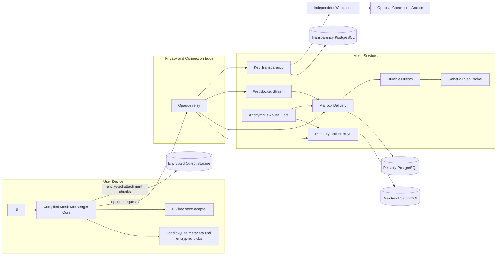
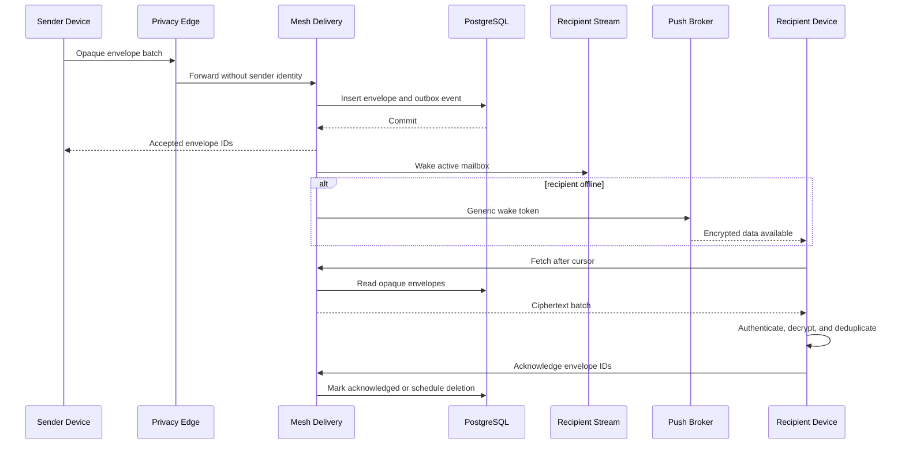

# Data Flow and Trust Boundaries

Whatsdown performs identity, session, ratchet, and message processing on user
devices. Services route public directory data and opaque ciphertext. The first
deployment may combine logical services into one Mesh process and one
PostgreSQL instance with separate schemas; the visibility boundaries remain.

## Identity and prekeys

1. A device generates its account authorization, signing, DH, prekey, mailbox,
   and local-storage material locally.
2. It publishes public account/device credentials, signed and one-time prekeys,
   supported suites, expiry, and transparency evidence.
3. A sender resolves the exact username or scans a QR code, fetches a prekey
   bundle, verifies the credential and signature, and checks available
   transparency evidence.
4. The sender performs the asynchronous handshake and creates the initial
   encrypted envelope locally. Private material never enters the directory.

## Durable send and receive

The envelope and outbox event commit together. Delivery is at least once until
expiry, insertion is idempotent by mailbox and envelope ID, and retrieval is
cursor based. Exactly-once delivery is not claimed. Duplicate display is
prevented on the device using envelope ID, encrypted client message ID, sender
device ID, and conversation-local ordering data.

## Component visibility

| Component | May observe |
|---|---|
| Connection edge | Source IP and connection timing |
| Delivery core | Opaque mailbox token, ciphertext, size, and expiry |
| Directory | Username and public device set |
| Push broker | Wake token and provider token |
| Object store | Random object ID, encrypted bytes, approximate size, timing, and expiry |
| Transparency service and witnesses | Public commitments, proofs, and checkpoints |

Application payloads are canonical binary. WebSocket events carry mailbox
authentication, cursors, acknowledgements, wakeups, rate-limit status, and
shutdown notices; they never carry plaintext or server-interpreted message
types.
